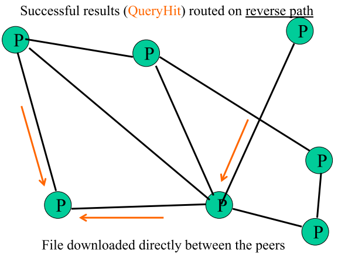
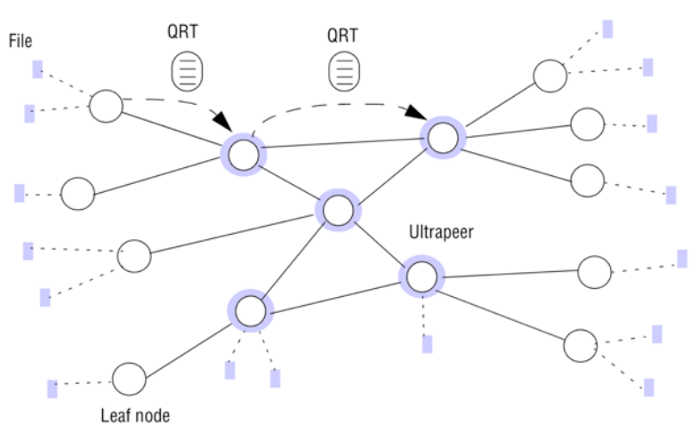
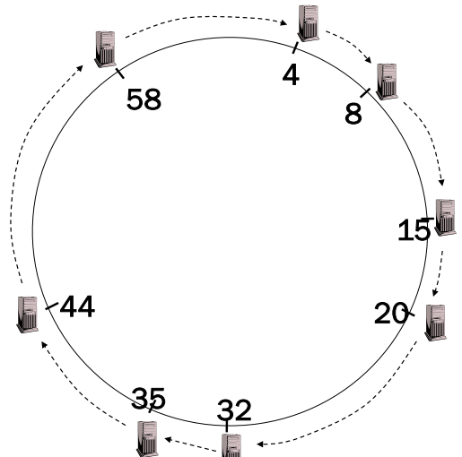
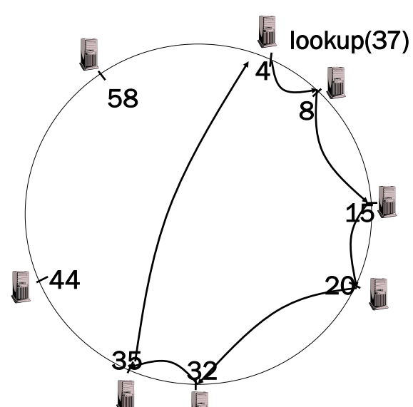
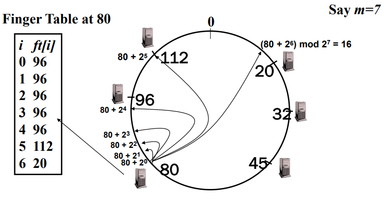
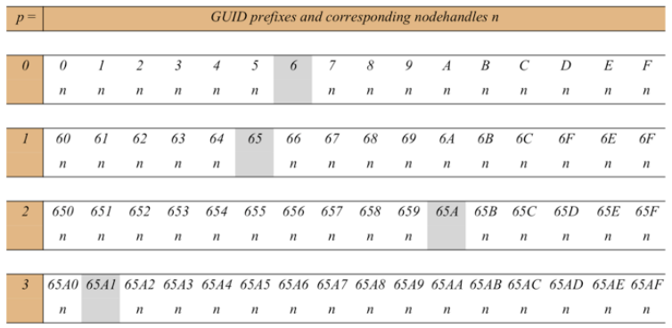
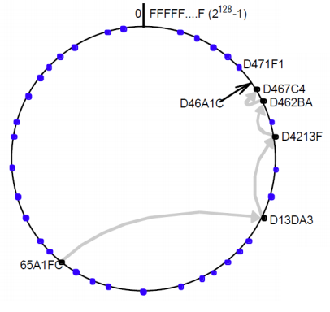
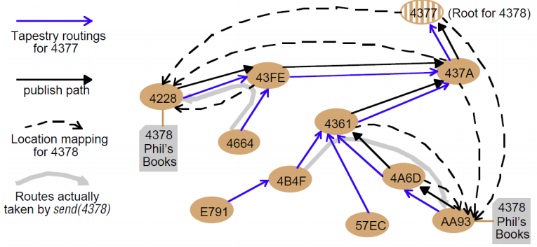

# Question 8: Peer to Peer (Gnutella, Chord)

* Explain the characteristics of peer-to-peer networks
* Describe the initial architecture of Gnutella
* Describe the novel architecture of Gnutella (with super-peers)
* Describe Chord routing approach
* Discuss Pastry/Tapestry, as differences from Chord

## Explain the characteristics of peer-to-peer networks

In a peer-to-peer network -- peers find each other

* Initiates communication with each other
* Direct communication between peers
* No reliance on centralized services or resources
* Highly scalable

* peers can enter and leave the network

**Formal**

* A peer is a node on a P2P network forming fundamental processing unit
* Each peer has unique ID
* Each peer belong to one or several peer groups
* Each peer can communicate with other peers

**Different Purposes**

* **Distributed computing** 
* **File sharing**
* **Collaborative applications** 

## Describe the initial architecture of Gnutella

* Gnutella is unstructured Peer to Peer network

* Peers form overlay network

(**Query flooding**)

**Join**

* on startup, client contacts a few other nodes (learn from bootstrap-node); these become its “neighbors”

No **Publish**

**Search**

* ask “neighbors”, who ask their neighbors, and so on... when/if found, reply to sender.

**Fetch**

* get the file directly from peer

* Its totally decentralized
* Highly robust
* **However**
    * Not scalable -- need to contact all peers for deterministic search
    * Network can be flooded
        * solved with TTL (Time-to-live)

**To avoid excessive traffic**

* Query forwarded to all neighbors except peer from which received
* Each Query (identified by DescriptorID) forwarded only once
    * each peer maintains a list of recently received messages
* QueryHit routed back only to peer from which Query received with same DescriptorID

**Download**

* Choose "best" QueryHit responder
* Download directly with HTTP

## Describe the novel architecture of Gnutella (with super-peers)

* Protocol originally called FastTrack
* some peers designated as super-nodes
    * advantage of “healthier” participants in the system
    * Contain a directory of files
        * `<filename,peer pointer>`
    * can change over time
        * decided with **reputation** -- affected by connectivity and uploads

(**Query Flooding**)

**Join**

* client contacts super-node

**Publish**

* send list of offered files to super-node

**Search**

* send query to super-node
    * super-nodes flood query among themselves

**Fetch**

* get file directly from peer(s)

## Describe Chord routing approach

* a structured Peer-to-Peer network
* GUID based API
    * `put(GUID, data)`
        * store data in replicas responsible for object based on GUID
    * `remove(GUID)`
        * delete references to GUID and data
    * `value = get(GUID)`
        * data retrieved from one responsible node

* Nodes maintain pointer to successor
* Node 8 responsible for GUID in [5,8]
* Node 15 for [9,15]
* Node 20 for [16, 20]
* ...
* Node 4 for [59, 4]

**Lookup**

* Route packet sent to the node responsible for ID using successor pointer

### Robustness

* Nodes periodically sends `stabilize()` messages to successor
* Successor returns its predecessor with `notify(predecessor)` message
* When receiving `notify(predecessor)`
    * if predecessor changed update successor

### Finger Tables

* Increased efficiency using **Finger Tables**

* *i*th entry at peer with id *n* is first peer with $id \geq n+2^i (\mod 2^m)$

* $O(log(N))$ for lookup

## Discuss Pastry/Tapestry, as differences from Chord

* Assigns hexadecimal ids to nodes, just like Chord (using a virtual ring)

* **Leaf Set** - Each node knows its successor(s) and predecessor(s)
* **Routing tables** based on **prefix matching**

* Example of **routing table** -- GUID `65A1...`
* Contains rows for each **combination** each combination with matching **prefix**

* Message can be delivered in $\log_{16} (N)$ hops

### Tapestry

* Works like Pastry
* Main difference: **flexibility** since application can place replicas close (in network distance) to frequent users of resources for:
    * reduced latency
    * minimized network load
    * tolerance of network and host failures

