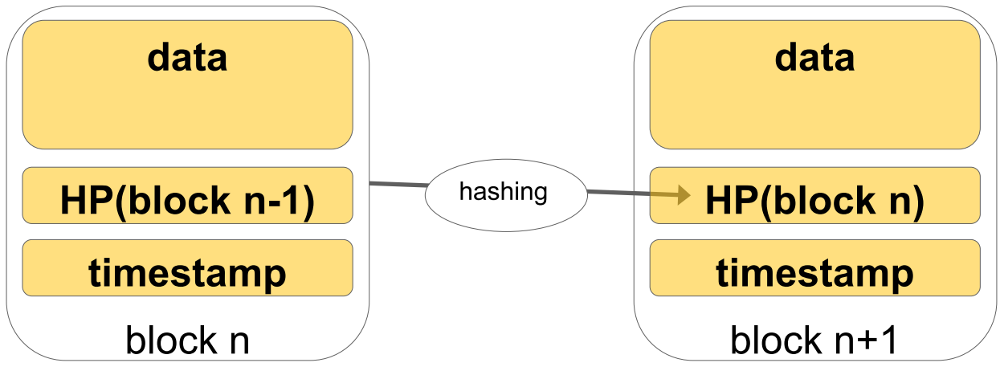
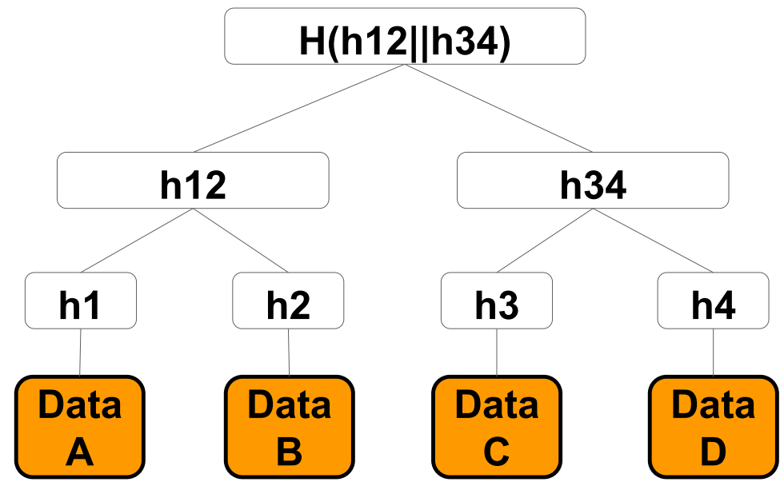

# Question 9 - Blockchain (Tamper-free linked lists, Nakamoto Consensus, proof of work, transactions in Merkle trees)

* Explain the characteristics of the blocks in a blockchain (e.g.: immutability, linear growth)
* Explain how the crypto tools used in blockchain work (hash function, signature, merkle tree, hash pointer) and how they are used in the blockchain
* Explain why Paxos consensus is not enough for a blockchain, e.g.: to protect against the double spending conundrum
* Bitcoin: explain the structure of the transaction and how they are verified by the miner

## Explain the characteristics of the blocks in a blockchain (e.g.: immutability, linear growth)

Blocks in a blockchain are immutable

* if a block is changed -- it can be detected in subsequent blocks easily
* "*tamper-proof linked list*"

Blocks are of the same size and grows linearly

* we only have one chain
* if forks are created -- the longest chain has consensus

## Explain how the crypto tools used in blockchain work (hash function, signature, merkle tree, hash pointer) and how they are used in the blockchain

Cryptographic hash function is basis for the blockchain

* Function that takes input and produces fixed length output
* Small change in input -- completely different output
* Hard to find input that produces given output
* Hard to find 1 input that produces same output as given input
* Hard to find 2 inputs that produces same output
* Commonly used algorithm is SHA-256
* for example used in **proof-of-work puzzle**

Block-chain built around **hash-pointers**

* Contains a pointer to some data as well as hash of that data
* used to verify that data has not changed
* block-chain consists of a chain of blocks connected by hash-pointers
    * if data changes in one block it can be spotted in following blocks

Asymmetric Cryptography used to create digital signatures

* consists of a public and private key
    * private key is kept private
* signature can be created by signing message with private key
    * can then be decrypted with public key
* Used by block-chain to sign transactions
    * if transaction is changed -- signature is no longer valid

Transactions in block is contained in **Merkle Tree**

* Created by first hashing leaves
    * then hashing concatenation of hashes of neighboring leaves
    * then hashing concatenation of those
    * lastly we get Merkle Root
* if leaf is corrupted -- invalidates whole branch
    * detectable at root
* If I have to check a transaction in block
    * only have to calculate hashes of branch instead of all transactions
    * example -- check A
        * hash A -- Hash H1 || H2 -- Hash H12 || H34

## Explain why Paxos consensus is not enough for a blockchain, e.g.: to protect against the double spending conundrum

Double spend conundrum means spending money twice

* I write transaction 100$ to A in block and send to A
* I write transaction 100$ to B in block and send to B

* We need to have only one valid block-chain

If we use Paxos we have a problem

* Paxos based on **majority** of **acceptors**
* Easy to double-spender to create many fake ids after getting product/service from first spend
    * called **sybil attack**
    * gets **majority** -- **distribute** second block-chain -- **double spend**

Instead Bitcoin uses Nakamoto Consensus -- based on proof-of-work

* make it **hard** to **add** new **blocks** to blockchain
* proof of work puzzle
    * insert **nonce** into header
    * need to find **nonce** such that hash of header starts with **n** zeros
        * n defines how hard puzzle is
    * when **nonce** is found new blockchain can be added
* **longest** chain always wins

## Bitcoin: explain the structure of the transaction and how they are verified by the miner

A transaction consists of

* list of input transaction
    * previous transaction transferring money to user 
* list of output identity + amount
* signature
    * messaged signed with users private key

A user is a pair of private key and public key -- only public key is known

When transaction is signed -- broadcast to network of nodes -- saved in **mempool**

* Miners validate transactions by checking previous transactions and verifying signature
* When miner complete puzzle -- add transactions to blockchain

