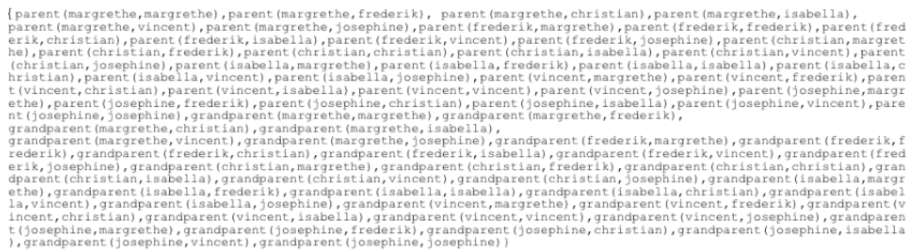

# Semantics of Datalog / Prolog


## Herbrand

Lets consider an example

```
grandparent(X,Y) :- parent(X,Z), parent(Z,X).
parent(magrethe, frederik).
parent(frederik, christian).
parent(frederik, isabella).
parent(frederik, vincent).
parent(frederik, josephine).
```

### Herbrand Universe

The **Herbrand Universe** $U_P$ of a logic program $P$ is the set consisting of all constants that appear anywhere in $P$

The Herbrand Universe of our example is the set:

* `{magrethe, frederik, christian, isabella, vincent, josephine}`


### Herbrand Base

Recall that a ground atom is an atom that contains no variables. The Herbrand base $B_P$ of a logic program $P$ is the set consisting of ground atoms that can be built over $U_P$ using the predicates in $P$ using the correct arity (number of arguments)

The Herbrand base of our example program is the set:




#### What is the Herbrand base?

The Herbrand base contains three kinds of atoms:

1. The immediate facts in the extensional database
    * Here, e.g: `parent(margrethe, frederik)`
2. The derivable facts in the intensional database
    * Here, e.g.: `grandparent(margrethe, isabella)`
3. All other facts - that cannot be derived
    * Here, e.g.: `parent(frederik, margrethe)`


## Interpretations

An **interpretation** $\mathcal I$ is a set of atoms from the Herbrand base.

A subset of the Herbrand base.

For instance the following is an interpretation:

* `{parent(margrethe, frederik), grandparent(margrethe, isabella)}`


### Truth under an interpretation

We define when a clause $\mathcal C$ is true under an interpretation $\mathcal I$. We write $\mathcal I \models \mathcal C $

We have:

* $\mathcal I \models p(k_1, \dots k_n)$ if $p(k_1, \dots, k_n) \in \mathcal I$
* $\mathcal I \models A_0 \Leftarrow A_1, \dots, A_n$ if whenever $\mathcal I \models A_i$ for all $1 \leq i \leq n$ then $\mathcal I \models A_0$

The last condition is equivalent to requiring that either the head is true or every clause in the body is false.