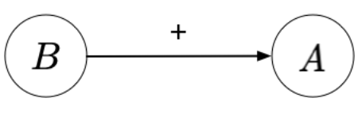
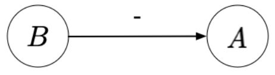
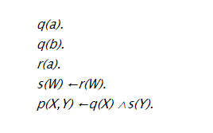
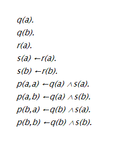

# Datalog and Prolog

## Datalog

### Semantics

[Datalog Semantics](../Logic/semantics.md)

#### Computing Minimal Model

[Problem set 2 - Problem 4](https://www.moodle.aau.dk/pluginfile.php/2162506/mod_resource/content/0/Problem%20set%202%20%28Logic%20programming%29%20-%20Solutions.pdf#page=2)

[Slides 2 - Slide 19-23](https://www.moodle.aau.dk/pluginfile.php/2162381/mod_resource/content/0/Logic%20Programming%202%20%28slides%29.pdf#page=19)

#### Stratification

[Slides 2 - 31-40](https://www.moodle.aau.dk/pluginfile.php/2162381/mod_resource/content/0/Logic%20Programming%202%20%28slides%29.pdf#page=31)

* If there is a rule $A(\cdots) \Leftarrow \cdots B(\cdots) \cdots$ there is a positive edge from B to A (mark it with a +)

* If there is a rule $A(\cdots) \Leftarrow \cdots \textbf{not } B(\cdots) \cdots$ there is a negative edge from B to A (mark it with a -)

* If there are no cycles with a negative edge, the program is stratifiable.

[Topological sort](https://www.geeksforgeeks.org/topological-sorting/)

* Start with a vertex/node with in degree 0
* Think of an edge from node1 to node2, means that node1 must be defined before node2. An edge only descirbes a relationship between the two involved nodes and nothing else

### Syntax

A Datalog program is a finite sequence of Horn **clauses**.

$$
\begin{align*}
    &P \in \textbf{Program}  &&P ::= C_1 ... C_m\\
    &C \in \textbf{Clause} &&C ::= A_0 \Leftarrow A_1 ... A_n\\
\end{align*}
$$

Where $A_0$ is called the head of the clause and $A_1 \dots A_n$ is called the body

If $n=0$ the clause if called a **fact**

$$
    A \in \textbf{Atom}\qquad A ::= p(t_1 ... t_n)
$$

Where $p$ is a predicate symbol, which is an identifier

$$
    t \in \textbf{Term} \qquad t ::= k \mid x
$$

Here $k$ is the set of constants (strings and numerals), while $x$ is the set of variables

#### Ground Atoms and Rules
* An atom is a **ground atom** if it does not contain variables
    * `married(frederik,marie)` is ground, while
    * `married(frederik,X)` is **not** ground
* A rule is a **ground rule** if it does not contain variables
    * `royal(marie) :- married(marie,mary), royal(mary).` is ground, while
    * `royal(X) :- married(X,Y), royal(Y).` is **not** ground

#### Ground Instance

[From artificial intelligence book](https://artint.info/html/ArtInt_285.html) 

A **ground instance** of a clause is obtained by uniformly substituting constants for the variables in the clause. The constants required are those appearing in the knowledge base or in the query. If there are no constants in the knowledge base or the query, one must be invented.

Suppose the knowledge base is:

Then the set of all ground instances is:

## Datalog vs Prolog

* Datalog does **not** have negation while Prolog does
* Datalog does **not** have functions
* Datalog **cannot** have **facts** that are not ground atoms
* (maybe? Based on example exam questions) In Datalog every rule must only contain variables