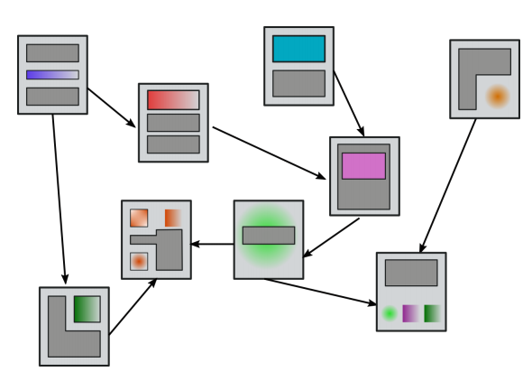
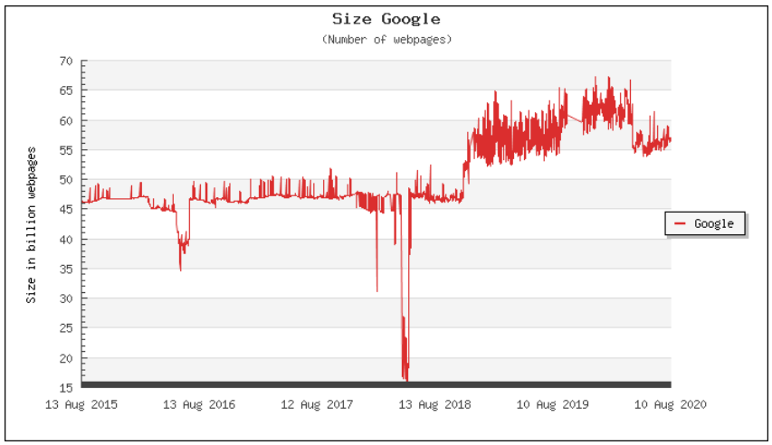
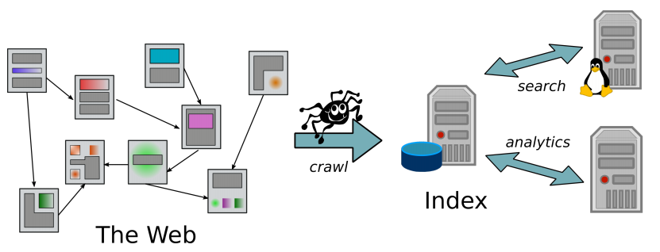
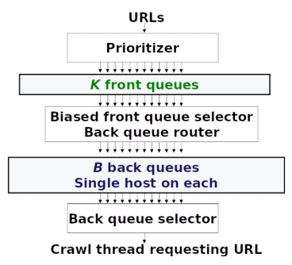
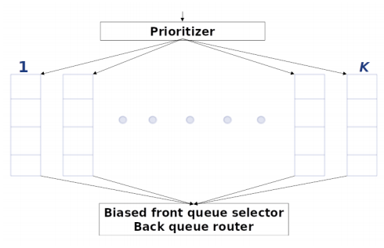
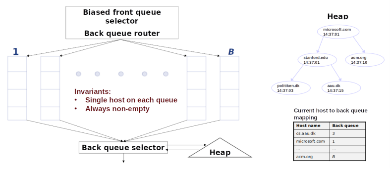

# Introduction and Crawlers


## What is the web?

Simple definition:

Hyper-linked network of web pages



Number of web-pages indexed by Google estimated by https://www.worldwidewebsize.com/




A page may contain multi-media content

We focus on text in this course (we view web pages as documents of texts)

*  Carries the most important information (in most cases)
* Techniques used for dealing with text can be adapted to dealing with other types of data (cf. “visual words” in computer vision).


## What is web intelligence?

Intelligent ways to extract information and knowledge from the web:

* I finding relevant information available on the web
* obtaining new knowledge by analyzing web data: the web itself, but also how it evolves, and how users interact on and with the web

Some applications:

* Intelligent Search
* Recommender Systems
* Business Analytics
* Crowd Sourcing
* Not so nice ones:
    * *Advertising*
    * *Manipulation*
    * *Surveillance* 


## Web Crawlers

Before we can do anything, web data needs to be retrieved and organized:




```pseudocode
Crawl(URL set: seeds):
    frontier = seeds
	while frontier != Ø do
		url = get_url(frontier)	// select next URL from frontier
        doc = fetch(url)		// pages returned as html source text docs
		index(doc)				// send doc to indexer
		frontier.add(extract_urls(doc))
    end
```

Key design issue

* the *frontier* of URLs to be processed
* selection strategy implementing *get_url*


### Two simplistic solutions

* *frontier* as stack
    * leads to depth-first seach
    * **Problem**
        * can get quickly stuck in "dead end" remote corners of the web
* *frontier* as queue
    * leads to breadth-first seach
    * **Problem**
        * slow progress, lacking politeness


Both are too simple because

* a pure sequential, single thread architecture will get stuck once a host does not respond (quickly) to a *fetch(url)* request
* crawler must implement **robustness**
    * not get stuck in *spider traps*, i.e., large, dead-end (uninteresting) web components
* crawler must implement **politeness**
    * not overload a single web server with requests


### Crawler Types and Prioritization

Crawlers can have different purposes:

* *Periodic*
    * maintain an up-to-date general picture of the web
        * the same pages (URLs) should be revisited periodically
* *Focused*
    * map a part of the web pertaining to a particular topic


Implemented by

* `index(doc)`
    * maybe not every fetched document needs to be added to the index
* *frontier.add(extract_urls(doc))*
    * extracted URLs may be added to the frontier with different **priorities**
        * URLs that have already been recently visited have a lower priority (periodic crawling)
        * URLs that are less likely to refer to relevant pages have a lower priority (focused crawling)
        * ...


### Politeness

* Minimum time delay between two request to one host
* Obey `robots.txt` file


#### robot.txt

Text file at top level of domain: `http://domain.com/robots.txt`. Provides instructions to crawlers.

Don’t allow any crawlers to go to `/private/` directory: 

```txt
User-agent: * 
Disallow: /private/
```

Allow all crawlers all access, except `googlebot` is not allowed in `/tmp/`:

```
User-agent: *
Disallow:
User-agent: googlebot
Disallow: /tmp/
```

Non-standard extension of `robots.txt`: request delay between successive visits:

```
User-agent: bingbot
Crawl-delay: 5
```

The interpretation of the delay values can be crawler specific


### Mercator Frontier

> Heydon, A., & Najork, M. (1999). Mercator: A scalable, extensible web crawler. World Wide Web, 2(4), 219-229.



**Front queues**: for prioritization

**Back queues**: for politeness


#### Mercator Front Queues

Fixed number of $K$ FIFO queues:



* Incoming URLs are assigned a priority value between 1 and K, and enqueued in the corresponding front queue.
* URLs are extracted by
    * Selecting (e.g. randomized) one of the front queues; higher priority queues are more likely to be selected
    * Dequeuing the head element from the selected queue


#### Mercator Back Queues

Fixed number of B FIFO queues:



* Each back queue contains URLs from only one host
* Each queue/host has an entry in a priority queue (heap) that determines from which back queue the next URL will be extracted
* Priority value: time stamp at which next request to host can be made at the earliest (following politeness policy)


Getting the next URL:

* Determine highest priority host
* Dequeue head element from corresponding queue
* Update priority value of host

If queue of selected host becomes empty, refill back-queues from front queues as follows

* Get the next URL *url* from front queues
* If *url*'s host already has a back queue: enqueue there
    * otherwise
        * enqueue *url* in the empty queue
        * update heap and host dictionary
* Reapeat until queue non-empty


### Distributed Crawling

In practice: use multiple crawlers

* Each crawler has its own URL frontier
* URLs are distributed over crawlers according to host: each crawler is responsible for a certain set of hosts (e.g. defined by a hash function, or geographically)
* The `frontier.add(extract_urls(doc))` operation must add URLs to the frontier of the relevant crawler