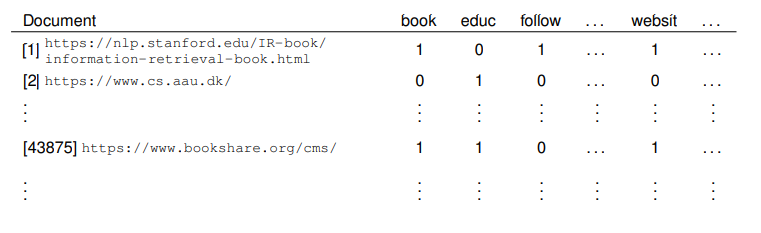
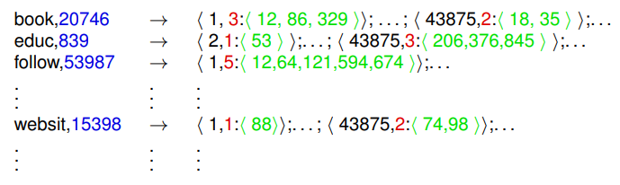

# Index Construction

* [Slides](https://www.moodle.aau.dk/pluginfile.php/2121811/mod_resource/content/1/wi_20_02.pdf)

## Text Preprocessing

How to construct the index?

* Depends on: what type of search (and: analytics) do we want to support?

For now:  think about **Boolean queries** over single search terms:

* (Corona OR Covid) AND vaccination

### From Byte Stream to Index Terms

### Tokenization

Initial heuristic for English (or Danish, German, ...):

* split on whitespace
* delete punctuation characters

But:

* some things should perhaps not be split:

     

* May also need to split where there is no white space:

    

No golden bullet! Lots of language or domain-specific rules and heuristics.

### Normalization

Transform distinct ’equivalent’ tokens into one normalized form. E.g.:

* write all in lower case: `This` $\to$ `this`
* use non-hyphenated forms: `anti-discriminatory ` $\to$ `antidiscriminatory`
* delete periods: `U.S.A` $\to$ `USA` (or `usa`)

Have to balance:

* more normalization:
    * smaller index
    * more permissive search: user searching for ’U.S.A’ also receives results containing ’usa’
* less normalization:
    * supports more specific search: users searching for ’C.A.T.’ don’t receive results for ’cat’. (try Google vs. Bing on this one!)

### Stop word removal

**Stop words:** very frequent words that are not semantically descriptive:

* *the, a, this, and, of, that, ...*

**Stop list:**  list of stop words that are removed. E.g. containing 15-200 stop words.

Problem: stop words may become important as part of an expression:

* *“To be or not to be”*

### Stemming

Similar to normalization: reduce different grammatical variants to their common underlying word “stem”:

**Inflectional Forms:**

* *learn, learns, learned* $\to$ *learn*

**Word types:**

* *organize, organizer, organization* $\to$ *organ*

but also

* *organ, organizer, organic* $\to$ *organ*

**Term**

The strings that result from stemming are the **terms** that will be included in the index

#### Porters Stemming Algorithm

> <https://tartarus.org/martin/PorterStemmer/>

Set of rules for iteratively reducing/removing *suffixes* of words. E.g.

Only the most specific (longest suffix) rule is applied. Other applicable rules are ignored

* rule SS $\to$ SS is not redundant!

Rules may be conditioned on what comes before the suffix:
$$
(m>1)\ \text{EMENT} \to
$$
only applies if the part before suffix EMENT has more than 1 syllable

### Putting it all together

Putting things together, a text is trandformed into a sequence of terms:

**Corpus and Vocabulary**

**Corpus:** collection of documents (e.g., all web-pages that have been crawled)

**Vocabulary**: all terms that appear in the corpus

* We now want to build an index that allows to retrieve documents in the corpus according to (search-) terms in the vocabulary.

## Inverted Index

### Term-document incidence matrix

The occurrence/absence of terms in documents can be represented by a term-document incidence matrix:

0: term does not appear in document 

1: term appears in document

### Inverted Index

Putting the terms in the rows, and reducing incidence (bit-)vectors to sorted lists of postings (= IDs or references of documents):

* This is really just an index; nothing “inverted” about it
* This is only a schematic picture; the actual implementation will be a **dictionary** data structure with terms as **keys**

## Boolean Retrieval

### Simple Boolean Queries

**Single Word Search**

Search "Education"

* Apply normalization and stemming: Education $\to$ educ
* Retrieve postings for key “educ” from inverted index:
    * 2, 15, 7529, 43875, 884903

**Boolean AND**

Search: “Education AND Book”

* Retrieve postings for “educ” and “book”
* Construct intersection using the *merge algorithm*

#### Merge Algorithm

[WI 2 Slides p. 17](https://www.moodle.aau.dk/pluginfile.php/2121811/mod_resource/content/1/wi_20_02.pdf#page=17)

### Other Boolean Operators

**OR**

*term_1* OR *term_2*

Variation of *merge algorithm*: 

* append all postings from two lists to output, without duplicates (very similar to merge step in merge sort).

**NOT**

NOT *term*

In principle simple: 

* construct sorted list of document keys that are not in the list of *term*. But: output intractably large

**AND NOT**

*term_1* AND NOT *term_2*

Variation of *merge algorithm*:

* append to output all postings from *term_1* list that are not found in *term_2* list

### Phrase Queries

Most users don’t want to bother with properly constructed Boolean queries. More popular are **phrase queries**:

​	"*Graduation ceremony at Aalborg University*"

After pre-processing (but no stopword removal!):

​	"*graduat ceremoni at aalborg univers*"

#### N-gram Index

* Create dictionary over *N*-grams of terms instead of dictionary over terms (e.g. *N*=2 or *N*=3)
* Search for
    * *graduat ceremoni AND ceremoni at AND at aalborg AND aalborg univers*
* Can give false positives

#### Positional Index

Augment the inverted index with

* for each term: ${\color{blue}{\text{document frequency}}}$ (=length of posting list for the term)
* for each posting: ${\color{red}{\text{number}}}$ and ${\color{green}{\text{list}}}$ of positions at which term appears in document

**Size**

* $T$: total number of terms (stop words removed) in the corpus
* $K$: average number of occurrences of a given term in a document

Then:

* space for positional index: $\Theta(T)$
* space for non-positional index: $\Theta(T/K)$

In practice: positional index has 30% to 50% the size of the raw corpus

#### Answering Phrase Queries

Query: *graduat ceremoni at*

**Step 1**

retrieve documents for Boolean *query graduat* AND *ceremoni* AND *at* (can be optimized by merging posting lists with low document frequency count first)

* obtain for each retrieved document the position lists (e.g. document 5):

**Step 2**

apply variation of *merge algorithm* to find consecutive occurrences of the terms

* Can also be adjusted to deal with **proximity queries**:

Graduate /5 Ceremony

The two terms are required to occur within 5 positions of each other (any order)