# Content-based Ranking

* [Slides](https://www.moodle.aau.dk/pluginfile.php/2125134/mod_resource/content/1/wi_20_03.pdf)

## Content-based Ranking

### **From Matching to Ranking**

For Boolean or Phrase queries:

* a document matches or does not match a query
* no preference among documents that match the query
* good results depend on well designed queries

Now we aim for:

* ranking of how well a document matches a query

* “soft” matching: no longer a yes/no decision

* robust performance with loosely formulated queries

    * instead of

        * *Graduation AND ceremony AND Aalbog AND University* or
        * *“Graduation ceremony at Aalborg University”*

    * Just write a **free text query**

        * *Graduation ceremony at Aalborg University*

        and retrieve also pages that only contain “Graduation ceremony” and “Aalborg”, but not “University”

### Text Similarity

Ideas:

* Documents and queries are both text documents
* Find documents that are most similar to query

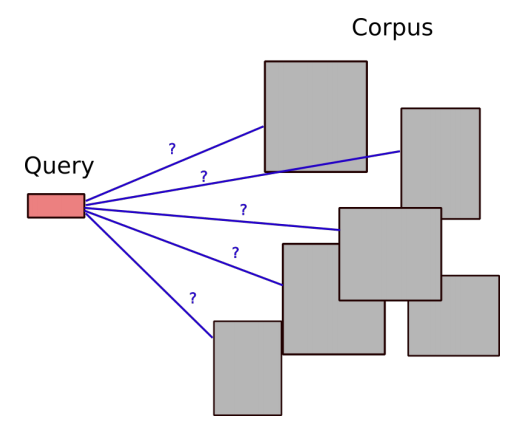

Need:

*  (Feature) representation of documents
* Similarity measure for query Q and document D:
    * $S(Q,D)$

### Jaccard Revisited

For near-duplicate identification, we measured the similarity of documents with the Jaccard coefficient:

$$
S(Q,D)=J(S(Q),S(D))
$$

k-shingles $(k > 1)$ do not make much sense for queries (word order in query can be quite arbitrary). When $S(Q), S(D)$ are just the sets of terms (“1-shingles”), we can write the Jaccard coefficient as:

$$
J(Q,D) = \sum_{t\in \textit{Vocabulary}} I[Q,t] \cdot I[D,t] \  / \  | Q \cup D |
$$

where $I$ is the *term-document incidence matrix* extended with a row for the query.

**Problem:** $J(Q,D)$ will be higher for smaller documents

### Near Duplicates vs Similarity for Relevance

Different requirements for text similarity measure:

| Near duplicate identification                                | Similarity for relevance                                     |
| ------------------------------------------------------------ | ------------------------------------------------------------ |
| “$D_1$ and $D_2$ are near duplicates” is a symmetric relation | “$D$ is highly relevant for $Q$” is not fully symmetric      |
| Need to measure similarity on a common scale for all pairs of documents | $S(Q, D)$ only needs to be a relative measure for different D, for any fixed Q (no need to compare $S(Q_1, D)$ vs. $S(Q_2, D)$) |

### Relevance Score v0.1

Omit the normalization from the Jaccard coefficient:

$$
S_{v0.1}(d,q):=\sum_{t\in \textit{Vocabulary}} I[q,t] \cdot I[d,t]
$$

(= number of query terms contained in $d$)

**Problem**

* No difference whether documents contain a query term only once, or many times.

### Bag of Words

Replace the *term-document incidence* matrix with a *term-document frequency* matrix $F$:

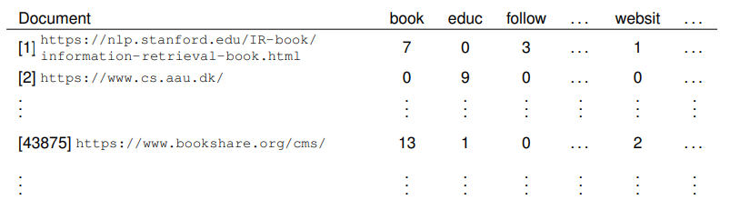

Entries in the matrix: $F[d,t]$: *frequency* of term $t$ in document $d$ 

* (IR book notation: $\text{tf}_{t,d}$)

Modeling a document by the counts of occurrences of words (terms) is known as the **bag of words** model.

### Relevance Score v0.5

$$
S_{v0.5}(q,d):= \sum_{t \in \textit{Vocabulary}} I[q,t] \cdot F[d,t]
$$

* Queries usually contain terms only once. Therefore, no difference whether we write $I[q,t]$ or $F[q,t]$

**Advantage**

* Documents that contain query terms many times are probably more relevant, and score higher

**Problem**

* Consider query  *Siamese cats for sale.*

Relevant part of the $F$ matrix for three documents (assuming *for* removed as stop word):

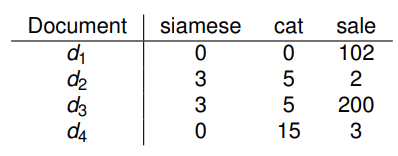

Then

* $S_{v0.5}(q,d_3) > S_{v0.5}(q,d_1) > S_{v0.5}(q, d_4) > S_{v0.5}(q,d_2)$

Is that what we want?

### Term Relevance

**Idea:**

* terms that are more informative should contribute more to the relevance score
* very common terms are not very informative

#### Collection Frequency and Document Frequency

$$
\begin{align*}
&\text{Collection frequency:} & \text{cf}(t) &= \sum_{d\in \textit{Corpus} } F[d,t] \\
&\text{Document frequency:} 	& \text{df}(t) &= \sum_{d\in \textit{Corpus} } I[d,t]
\end{align*}
$$

What to use?

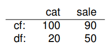

Is *cat* or *sale* more informative/relevant?

* Lower df value means higher "selectivity" at the document level. We want to select documents, so we use df rather than cf!

### From df to idf

$N:$ size of corpus

Then:

* $df(t) \over N$:  fraction of documents containing $N$
* $N \over df(t)$: inverse fraction: less common terms score higher
* "dampening" by taking logarithm

$$
\text{idf}(t) = \log \frac{N}{\text{df}(t)}
$$

#### Example: Reuters

Numbers from Reuters corpus of 806,791 documents (news articles):

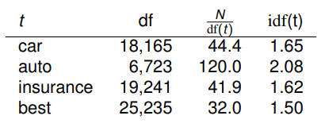

### Relevance Score: tf-idf

Adding term relevance to $S_{v0.5}:$

**tf-idf score**
$$
S_{\text{tf-idf}}(q,d) = \sum_{t \in \textit{Vocabulary}} I[q,t] \cdot F[d,t] \cdot \text{idf}(t)
$$

#### Example

*q = Siamese cats for sale*

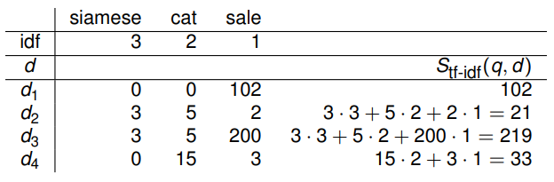

* relative order has not changed in this example ...

**Problem**

* Longer documents will still get a higher score

## Vector Space Model

$M$: size of the vocabulary

Our representations of *documents* and *queries* can be seen as *M*-dimensional, numeric vectors:

Example: Vocabulary = { cat, sale }, *M* = 2:

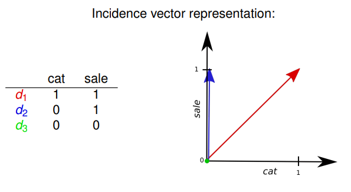

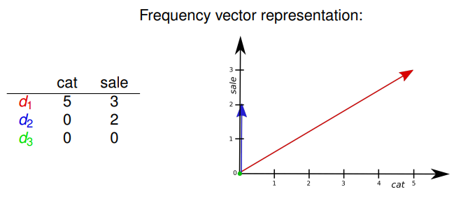

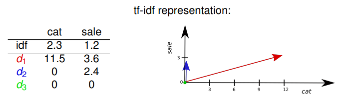

### Dot Product

Two vectors in *n*-dimensional space:

* $\bold x = (x_1, \dots, x_n)$
* $\bold y = (y_1, \dots, y_n)$

Their **dot product**:

* $\bold x \cdot \bold y = \sum_{i=1}^n x_iy_i$

Geometric interpretation: length of projection of one vector onto the other:

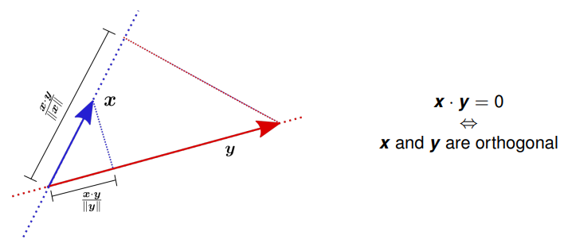

Relationship with cosine:

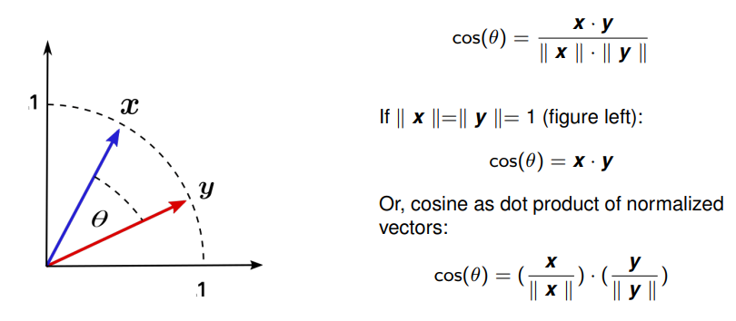

* even if $\bold x, \bold y$ are vectors in a high-dimensional space: two vectors always lie in a 2-d common space
* the pictures on this and previous slide also cover the high-dimensional case

### Cosine Similarity

Back to document vectors:

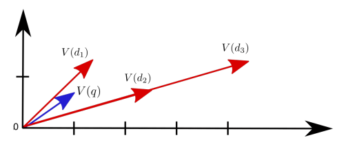

($d_3$ is the concatenation of two copies of $d_2$).

With similarity as dot products we get:

$$
S_{dot}(q,d_3) > S_{dot}(q,d_2) > S_{dot}(q,d_1)
$$

With **cosine similarity**

$$
S_{cosine}(q,d) = \frac {q \cdot d} { || q || \cdot || d ||}
$$

$$
S_{cosine}(q,d_1) > S_{cosine}(q,d_2) > S_{cosine}(q,d_3)
$$

**Intuition**: 

* only the “mix” of terms in documents counts, not the total amount.

#### Normalization

Cosine similarity still is a plain dot product between vector representations, now including a normalization:

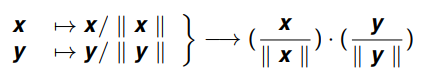

**Example**

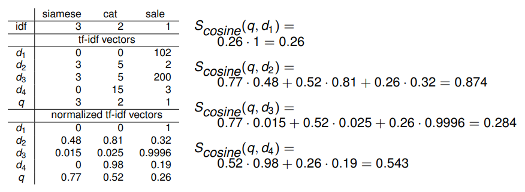

### SMART Notation

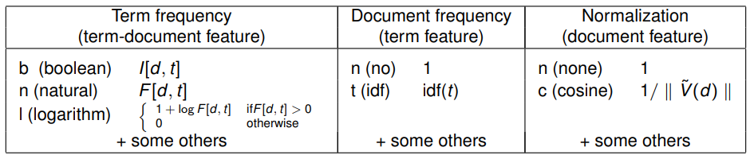

**Document (query) vector representation: **

* select a combination of term-document, term, and document features. 
* Notation: concatenation of one-letter acronyms for each feature. 
* Then
    * Multiply component-wise the M-dimensional term-document and term feature vectors.
        * Result: $\tilde V(d)$
    * Multiply $\tilde V(d)$ with document feature value to get document vector $V(d)$

**Query-Document similarity:**
$$
S(q,d) = V(q) \cdot V(d)
$$
Notation:

* *ddd.qqq*
    * where *ddd, qqq* are the feature combination for the document and query.

**Examples:**

* $S_{v0.1}:$ *bnn.bnn*
* $S_{v0.5}:$ *nnn.bnn*
* $S_{\text{tf-idf}}:$ *ntn.bnn* (or *nnn.btn*)
* cosine or tf-idf: *ntc.bnc* (or *nnc.btc*)

#### Computing Scores

**Observation**

All term-document features $f[d, t]$ are 0 if $I[d, t] = 0$. Therefore

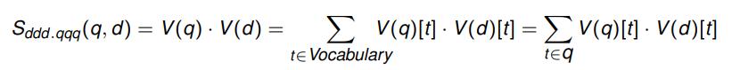

**Skeleton Algorithm**

Retrieving top-scoring documents, for any *ddd.qqq* score (cf. Figure 6.14 in [Manning et al.]):

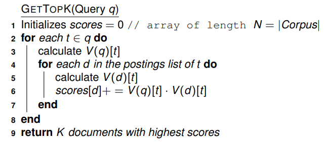

* Line 9 can be implemented using a priority queue for the documents
* The *scores* array can be a bit wasteful: only documents showing up in some posting list in line 4 ever get a score update
*  Line 5:
    * the postings could directly store the $V(d)[t]$ values. 
        * Better: store the 3 features separately (integers instead of floats in posting lists; faster update of term feature values when documents are added to the corpus)
    * instead of calculating full $V(d)[t]$: only calculate here the product of the term feature and term-document feature; multiply score(d) with the document feature once after line 8.

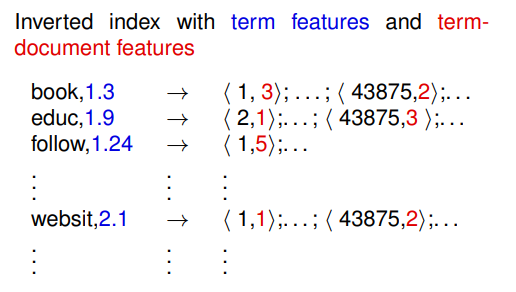

