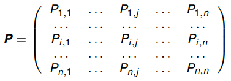

# Structure-based Ranking

## The Value of Links

A tiny web:

Two pages with the same content. *Which one is more relevant?*

* Number 1, since it has more pages referencing it.

## Centrality and Prestige

[Basic Graph-theory](../../3-semester/AD1/10a-graph-theory.md)

### **Degree of a node**

### **Degree Centrality**

For undirected graphs:

In a graph with $n$ nodes:

* $C_D(v)= {d(v) \over n-1}$
* Example:
    * $C_D(a)=C_D(b)= {6\over 27}$
    * $C_D(c)= {3 \over 27}$

$C_D$ is a **local** measure: only depends on local neighborhood of nodes

### Closeness Centrality

* $d(v,u)$: distance (= number of links on shortest connection) between $v$ and $u$
* $C_C(v)= {n-1 \over \sum_{u\in v} d(v,u)}$
* Example:
    * $C_C(a)= {26 \over 54}$
    * $C_C(b) = {26\over 80}$

$C_C$ is a **global** measure: depends on the whole network

Case of **disconnected networks needs special treatment**

Caution: when large networks have a small diameter (*small world phenomenon*), then $C_C$ values will be very similar for almost all nodes

* Social network problem, everyone is connected to everyone in a relatively small path

### Degree Prestige (In-degree Centrality)

For directed graphs

* $P_D(v) = {d_i(v) \over n-1}$
* Example
    * $P_D(a) = P_D(b) = {5 \over 23}$
* $P_D$ is another **local** measure

Local measures can easily manipulated by link spamming:

* More difficult (but still possible) to manipulate global measures

## Page Rank

First reported in:
*Brin, S., & Page, L. (1998). The anatomy of a large-scale hypertextual web search engine.*

* PageRank originally defined for ranking we pages
* Inspired by earlier works in link analysis (web and citation analysis)
* The ideas/principles of PageRank have been adpoted to measure node centrality/importance in many contexts

* $a$ and $b$ have the same degree prestige
* The pages linking to $a$ have a higher prestige than the pages linking to $b$

### Rank Prestige

$$
P_R(v)= \sum_{u:u\to v} P_R(u)
$$

* This does not directly define $P_R$
* Only defines mutual relationships between $P_R$ values
* Can we find and compute a $P_R$ measure that satisfies these relationships?

Web surfer: [slides 13-](https://www.moodle.aau.dk/pluginfile.php/2131622/mod_resource/content/1/wi_20_04.pdf#page=16)

Example: 10.000 random web surfers:

PageRank idea: the rank (prestige) of a web-page is proportional to

* the proportion of random web-surfers that will be visiting the page at a given point in time
* = the probability that a random web-surfer is at this page at any point in time

### Markov Chain Model

The random surfer is described by

* a probability distribution

    * $\bold q^{(0)}=(q_1^{(0)}, \dots, q_n^{(0)})$

    over all web-pages. $q_i^{(0)}$ : probability of starting to surf on page $i$

* a transition probability matrix

    $P_{i,j}$ : probability of moving to page $j$ given we are currently on page $i$: $=0$ if there is no link from $i$ to $j$, otherwise 

$$
P_{i,j}= {1 \over d_O(i)}
$$

​	compactly:

$$
\bold P = D_O^{-1}A
$$

​	with $D_O$: diagonal out-degree matrix, $A$: adjacency matrix

#### Example

For a random surfer starting at page 1:

* $\bold q^{(t)} = (q_1^{(t)}, \dots, q_n^{(t)})$ probability distribution over web pages at time $t$

Collected for all j, in matrix notation:

#### Stationary Distribution

* $\bold q$ is **stationary** if 
    * $\bold q = \bold q \bold P$
    * I.e.: $\bold q$ is eigenvector of $\bold P$ with eigenvalue 1

Under *some conditions*\* 

* a Markov chain has a unique stationary distribution $\bold q ^*$
* for any $\bold q^{(0)}$

##### Example

* We get the same vector back again

#### Irreducibility

\*First condition.

Not irreducible:

* the limiting distribution depends on the initial distribution (starting point)

A Markov chain is **irreducible** if every state is reachable from every other state

#### Aperiodicity

\*Second condition

Not aperiodic:

* A state $i$ in a Markov chain is **periodic** if starting from one $i$ one can only return to $i$ in 
    $$
    k,2k,3k,\dots,nk, (n+1)k,\dots
    $$
    many steps, where $k>1$

* Above: all states periodic with $k=3$

* A Markov chain is **aperiodic** if it has no periodic states

#### Summary

If a Markov chain is irreducible and aperiodic, then it

* has a unique stationary distribution $\bold q^*$
* for any $\bold q^{(0)}$:
    * $\lim_{t\to \infty} \bold q(t)=\bold q^*$

### Problems

A small web:

Transition matrix:

**Problem 1**

* No proper transition matrix, because **dangling pages** (ex: page 5) have no defined transitions

**Solution 1**

* Add transitions from dangling pages to all other pages:

* "random restart" of the web searching if ending up at dangling edge

* Transition matrix

    

**Problem 2**

* Markov chain not irreducible (and maybe not aperiodic)

**Solution 2**

* Add additional transitions from all states to all other states, so that total probability of these extra transitions is $1- d$

* New transition matrix:

    * $\bold P_{PR}=$

        

        

### PageRank Defined

The page rank of webpage $i$ is 

$$
n \cdot q_i^*,
$$

where $\bold q^*$ is the limit distribution of the Markov chain defined by $\bold P_{PR}$

It is computed (approximately) by iterating

until $\bold q^{(t)}$ does not change very much

### The Undirected Case

Let

Then

**Proof**

## HITS Algorithm

*J. Kleinberg: Authoritative Sources in a Hyperlinked Environment. J. of the ACM, 1999*

Alternative to PageRank

2 different types of important nodes

* **Hubs** (red): Web pages pointing to many (relevant) pages
    * Example: Business listings (yellow pages)
* **Authorities** (blue): Web pages linked to by many other pages
    * Example: Important company homepages

### Algorithm

**Step 1**

Retrieve top $t$ of webpages for query (mostly content-based):

* Result: the **root** set

**Step 2**

Add all neighbors (up to a maximum number) of the pages in the root set:

* Result: the **base** set

**Step 3**

Compute the **hub** and **authority scores** for all pages $v$ in the base set, implicitly defined by:

In matrix notation:

where $\bold L$: link matrix.

Alternatively (separating $\bold a$ and $\bold h$):

* Solutions  $\bold a$, $\bold h$ are found by the same iterative approximation as used for q ∗ computation ([slide 26](https://www.moodle.aau.dk/pluginfile.php/2131622/mod_resource/content/1/wi_20_04.pdf#page=64))

* Since $\bold L^T \bold L$ and $\bold {LL}^T$ are not irreducible, aperiodic Markov chains, solutions  $\bold a$, $\bold h$ need not be unique

