# Recommender Systems

## Data Scenarios

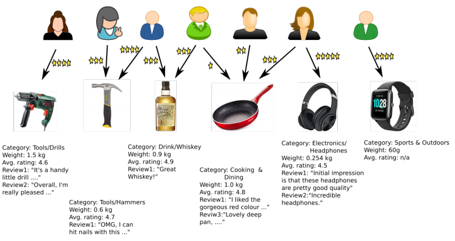

* Rich user data
* Rich item data
* Explicit rating data

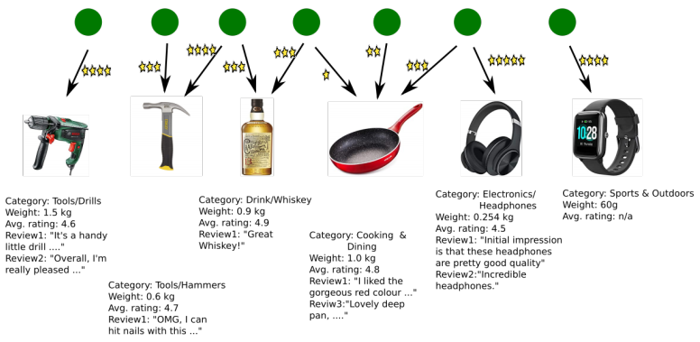

* Rich item data
* Explicit rating data

* Explicit rating data

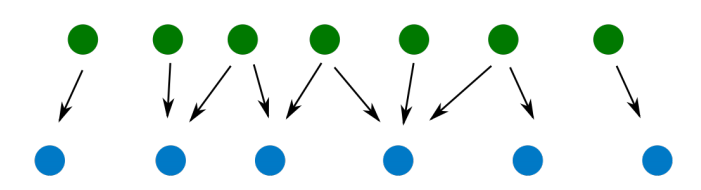

## Problem Dimensions

**Problem Settings**

* **Users**
    * with/without features
        * context information
        * attributes
        * metadata
        * ...
* **Items**
    * with/without features
        * context information
        * attributes
        * metadata
        * ...
* **Interaction**
    * Explicit feedback (ratings)
    * Implicit feedback (positive only)

**Problem Statement**

Given a user $u$, what new items $i$ (not previously rated, bought, seen, ... by $u$) should be recommended to $u$, so that $u$ is likely to interact (buy, view, rate, ...) with $i$

## Challenges

### **Cold Start**

* **User cold start**
    * what to recommend to a new user, for whom there is no (feature, feedback) data?
* **Item cold start**
    * to whom to recommend a new item that no one has bought before?

### Serendipity

From Oxford English Dictionary:

> The faculty of making happy and unexpected discoveries by accident. Also, the fact or an instance of such a discovery

Example Usage:

> *”Columbus and Cabot..(by the greatest serendipity of history) discovered America instead of reaching the Indies.”*

It is hard for recommender systems to recommend something unexpected

#### Problem: Boring Recommendations

#### Problem: Information Filter Bubbles

Wikipedia:

> A filter bubble [...] is a state of intellectual isolation that allegedly can result from personalized searches when a website algorithm selectively guesses what information a user would like to see based on information about the user, such as location, past click-behavior and search history. As a result, users become separated from information that disagrees with their viewpoints, effectively isolating them in their own cultural or ideological bubbles. . . .

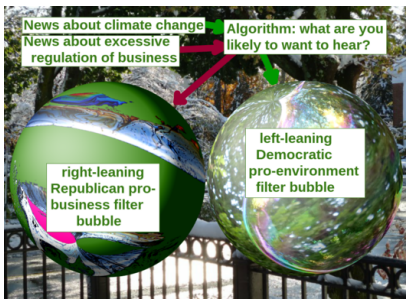

From <https://en.wikipedia.org/wiki/Filter_bubble>

## Netflix Prize

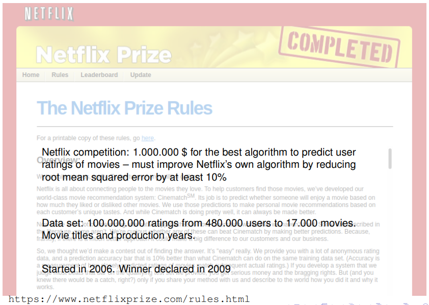

* A big driver for research in recommender technology

## Content-based Recommendation

We assume that we have some content

* Here on items

### Item Content, Explicit Feedback

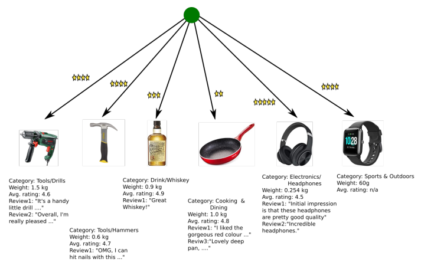

Scenario:

* Item features available
* No user features
* Explicit feedback

Note: picture only shows one user; there still are many users, but we treat them one at at time!

#### User Classifier

Items rated by user $u$ described by feature vectors:

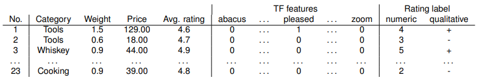

Recommendation: predict ratings of new items based on the item feature vector.

* Standard machine learning **regression** (numeric label) or **classification** (categorical label) task
* Can build standard prediction model (Naive Bayes, Decision tree, ...) *for each user*

#### Naive Bayes Classifier

##### Notation

* Assume qualitative rating labels: rating of user user $u$ for item $i$: $r_{u,i} \in \{+,-\}$
* $f_i$ denotes the feature vector of item $i$, and $\bold f$ a particular value for this feature vector

In example from previous table:

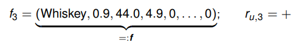

##### Bayesian Classification

**Bayes Rule:**

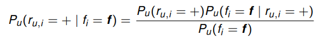

Same for $P_u(r_{u,i}= - \mid f_i=\bold f)$

Both conditional probabilities have the factor $1/P_u(f_i=\bold f)$ in common

* For classification can ignore this factor and can write:

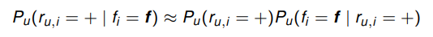

(“$=$” in equation (4.6) in Ch.4 of Rec.Sys. Handbook should also be “$\approx$”)

**Key Question**

What is:

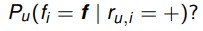

Naive Bayes assumption:

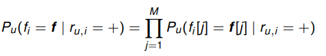

where $M$ is the number of components in $f_i$

**Example**

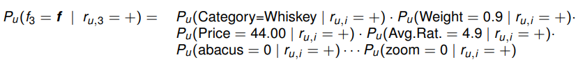

* Large number of term feature factors (= size of vocabulary) may dominate this product
* mitigated by: for most terms $t: P_u(t=0 \mid r_{u,i}=+)$ and $P_u(t=0 \mid r_{u,i}=-)$ will be very similar, and therefore have little impact on $P_u(t=\bold f \mid r_{u,i}=+)/P_u(t= \bold f \mid r_{u,i}=-)$
* May need to make some adjustments to handle "hybrid" item feature data as in this example

**Still to determine**

For a single term $t$ what is:

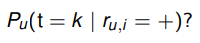

**Bernouli model**

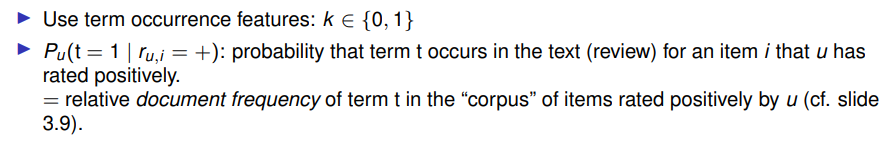

**Multinomial model**

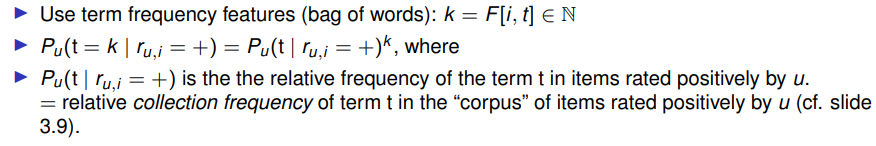

 

#### User Classifier Pros and Cons

Pros

* Makes use of item features
* Can handle item cold start (assuming features of new items known)

Cons

* Requires explicit feedback
* Does not handle user cold start
    * ... or even users with relatively small data set

### Item Content, Implicit Feedback

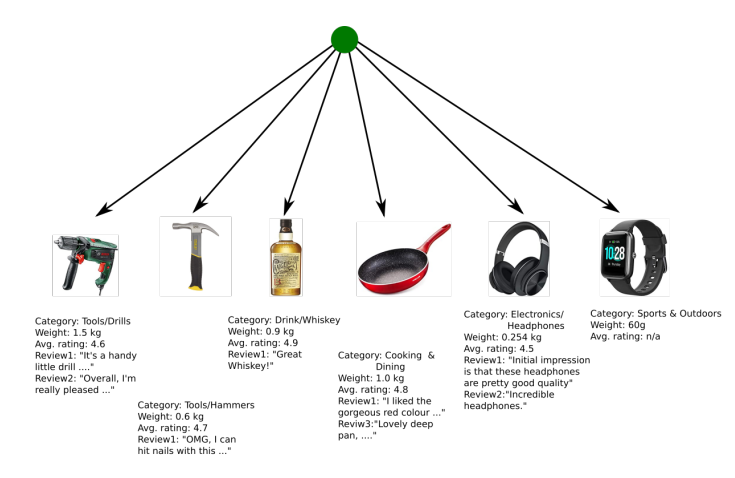

Scenario

* Item features available
* No user features
* Implicit feedback

A partial analogy to Information Retrieval (IR):

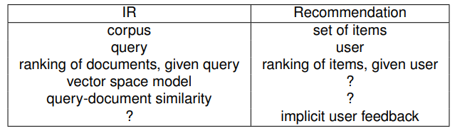

#### User Profile

**Idea**

represent user by a vector in the same space as the item feature vectors by *summarizing the feature vectors of items for which there is implicit feedback.*

**Example**

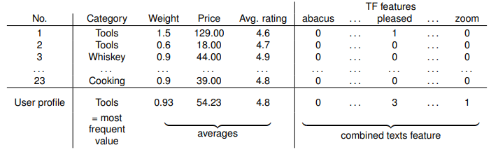

Then: rank candidate items according to similarity with user profile. Similarity can be defined as (weighted) sum of component-specific similarity measures:

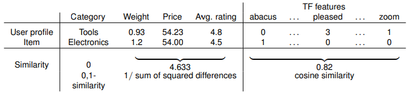

**Illustration**

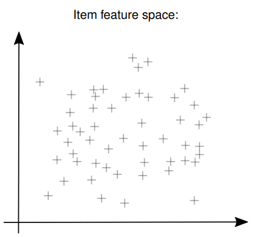

All items

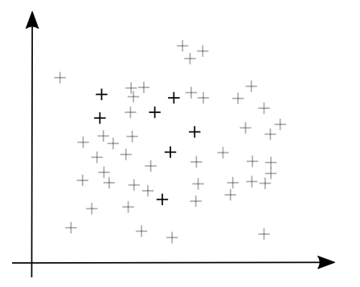

Items with implicit rating by user $u$

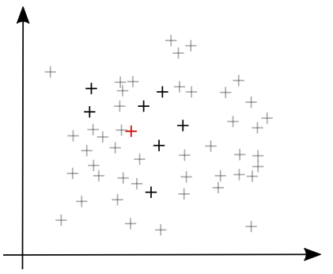

User profile of $u$ (= item prototype)

Ranking of new (gray) items for recommendation

## Evaluation

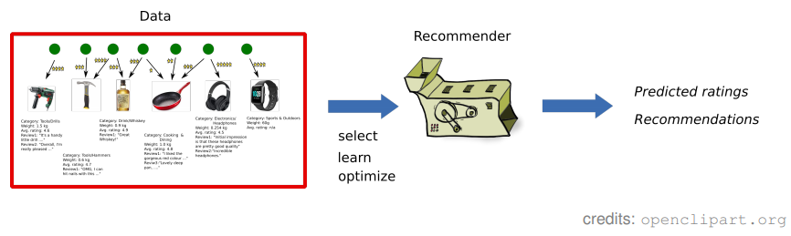

How good is the recommender we have designed?

### Explicit Feedback

* Split data into training and test set:

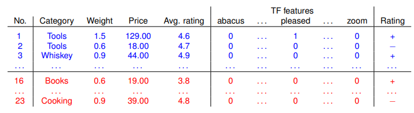

* Design/learn/configure recommender using the training data
* Compare true and predicted ratings on test cases:

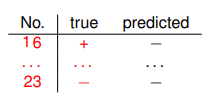

Quantify performance using e.g. $\text{accuracy}:{\text{#correct predictions} \over \text{#all predictions}}$ (or root mean squared error RMSE for numeric predictions).

### Implicit Feedback

* Split data into training and test set:

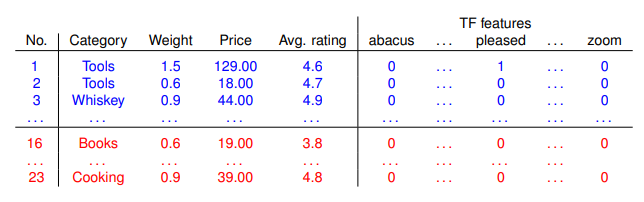

* Build/learn/configure recommender using the training data
* Determine positions of test items in ranked list of all items (or: test items plus random selection of some other items):

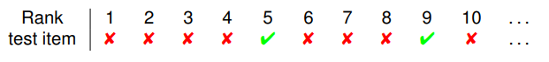

* Quantify performance

**Mean reciprocal rank:**

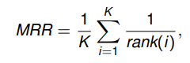

where $K$: number of test items; $rank(i)$: the rank of the $i$th test item.

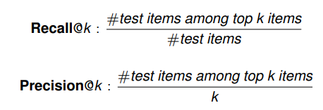

* All metrics make the implicit assumption that non-test items are not relevant for the user
* To go beyond the limitations of this implicit assumption: need **user studies**

## Collaborative Filtering

**Pure interaction data**

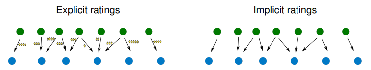

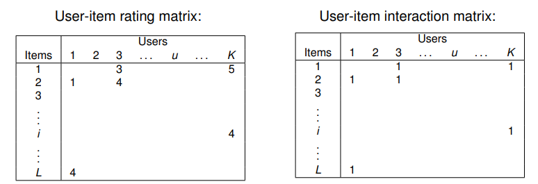

* Very sparse matrices

Some key techniques

* Neighborhood methods (this session)
* Random walk based (next session)
* Matrix factorization (next session)

!!!todo
    finish notes [slides 25-](https://www.moodle.aau.dk/pluginfile.php/2134534/mod_resource/content/2/wi_20_05.pdf#page=36)