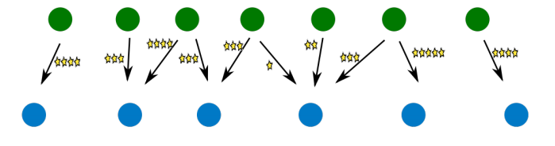
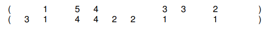
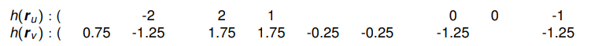

# Recommender Systems

* [Slides](https://www.moodle.aau.dk/pluginfile.php/2134534/mod_resource/content/2/wi_20_05.pdf)
* [Exercises](https://docs.google.com/document/d/1ZXyItz3hHcNA6sAY12_FbViZClMm4tMMECQZzv20LpQ/edit)

## Data Scenarios

* Rich user data
* Rich item data
* Explicit rating data

---

* Rich item data
* Explicit rating data

---

* Explicit rating data

---

## Problem Dimensions

**Problem Settings**

* **Users**
    * with/without features
        * context information
        * attributes
        * metadata
        * ...
* **Items**
    * with/without features
        * context information
        * attributes
        * metadata
        * ...
* **Interaction**
    * Explicit feedback (ratings)
    * Implicit feedback (positive only)

**Problem Statement**

Given a user $u$, what new items $i$ (not previously rated, bought, seen, ... by $u$) should be recommended to $u$, so that $u$ is likely to interact (buy, view, rate, ...) with $i$

## Challenges

### **Cold Start**

* **User cold start**
    * what to recommend to a new user, for whom there is no (feature, feedback) data?
* **Item cold start**
    * to whom to recommend a new item that no one has bought before?

### Serendipity

From Oxford English Dictionary:

> The faculty of making happy and unexpected discoveries by accident. Also, the fact or an instance of such a discovery

Example Usage:

> *”Columbus and Cabot..(by the greatest serendipity of history) discovered America instead of reaching the Indies.”*

It is hard for recommender systems to recommend something unexpected

#### Problem: Boring Recommendations

#### Problem: Information Filter Bubbles

Wikipedia:

> A filter bubble [...] is a state of intellectual isolation that allegedly can result from personalized searches when a website algorithm selectively guesses what information a user would like to see based on information about the user, such as location, past click-behavior and search history. As a result, users become separated from information that disagrees with their viewpoints, effectively isolating them in their own cultural or ideological bubbles. . . .

From <https://en.wikipedia.org/wiki/Filter_bubble>

## Netflix Prize

<https://www.netflixprize.com/rules.html>

* A big driver for research in recommender technology

## Content-based Recommendation

We assume that we have some content

* Here on items

### Item Content, Explicit Feedback

Scenario:

* Item features available
* No user features
* Explicit feedback

Note: picture only shows one user; there still are many users, but we treat them one at at time!

#### User Classifier

Items rated by user $u$ described by feature vectors:

Recommendation: predict ratings of new items based on the item feature vector.

* Standard machine learning **regression** (numeric label) or **classification** (categorical label) task
* Can build standard prediction model (Naive Bayes, Decision tree, ...) *for each user*

#### Naive Bayes Classifier

##### Notation

* Assume qualitative rating labels: rating of user user $u$ for item $i$: $r_{u,i} \in \{+,-\}$
* $f_i$ denotes the feature vector of item $i$, and $\bold f$ a particular value for this feature vector

In example from previous table:

##### Bayesian Classification

**Bayes Rule:**

Same for $P_u(r_{u,i}= - \mid f_i=\bold f)$

Both conditional probabilities have the factor $1/P_u(f_i=\bold f)$ in common

* For classification can ignore this factor and can write:

(“$=$” in equation (4.6) in Ch.4 of Rec.Sys. Handbook should also be “$\approx$”)

**Key Question**

What is:

Naive Bayes assumption:

where $M$ is the number of components in $f_i$

**Example**

* Large number of term feature factors (= size of vocabulary) may dominate this product
* mitigated by: for most terms $t: P_u(t=0 \mid r_{u,i}=+)$ and $P_u(t=0 \mid r_{u,i}=-)$ will be very similar, and therefore have little impact on $P_u(t=\bold f \mid r_{u,i}=+)/P_u(t= \bold f \mid r_{u,i}=-)$
* May need to make some adjustments to handle "hybrid" item feature data as in this example

**Still to determine**

For a single term $t$ what is:

**Bernouli model**

* Use term occurrence features: $k \in \{0,1\}$
* $P_u(\text{t}=1 \mid r_{u,i} = +)$: probability that term t occurs in the text (review) for an item $i$ that $u$ has rated positively
    * = relative *document frequency* of term t in the "corpus" of items rated positively by *u* (cf. slide 3.9)

**Multinomial model**

* Use term frequency features (bag of words): $k= F[i,t] \in \N$
* $P_u(t=k \mid r_{u,i} = +) = P_u(t \mid r_{u,i} = +)^k$, where
    * $P_u(t \mid r_{u,i} = +)$ is the relative frequency of the term t in items rated positively by $u$.
        * = relative *collection frequency* of term t in the "corpus" of items rated positively by $u$ (cf. slide 3.9)

 

#### User Classifier Pros and Cons

Pros

* Makes use of item features
* Can handle item cold start (assuming features of new items known)

Cons

* Requires explicit feedback
* Does not handle user cold start
    * ... or even users with relatively small data set

### Item Content, Implicit Feedback

Scenario

* Item features available
* No user features
* Implicit feedback

A partial analogy to Information Retrieval (IR):

#### User Profile

**Idea**

Represent user by a vector in the same space as the item feature vectors by *summarizing the feature vectors of items for which there is implicit feedback.*

**Example**

Then: rank candidate items according to similarity with user profile. Similarity can be defined as (weighted) sum of component-specific similarity measures:

**Illustration**

All items

---

Items with implicit rating by user $u$

---

User profile of $u$ (= item prototype)

---

Ranking of new (gray) items for recommendation

## Evaluation

How good is the recommender we have designed?

### Explicit Feedback

* Split data into training and test set:

* Design/learn/configure recommender using the training data
* Compare true and predicted ratings on test cases:

Quantify performance using e.g. $\text{accuracy}:{\text{#correct predictions} \over \text{#all predictions}}$ (or root mean squared error RMSE for numeric predictions).

### Implicit Feedback

* Split data into training and test set:

* Build/learn/configure recommender using the training data
* Determine positions of test items in ranked list of all items (or: test items plus random selection of some other items):

* Quantify performance

**Mean reciprocal rank:**

where $K$: number of test items; $rank(i)$: the rank of the $i$th test item.

* All metrics make the implicit assumption that non-test items are not relevant for the user
* To go beyond the limitations of this implicit assumption: need **user studies**

## Collaborative Filtering

**Pure interaction data**

* Very sparse matrices

Some key techniques

* Neighborhood methods (this session)
* Random walk based (next session)
* Matrix factorization (next session)

### Neighborhood Methods

**Scenario**

* No item features
* No user features
* Explicit feedback

**Example**

Here: explicit numeric feedback; could also be explicit categorical (+, −) feedback

#### User Based

To predict Eric's rating for Titanic:

* Find users similar to Eric who have rated Titanic
* Predict by taking average of similar users’ ratings

#### Item Based

To predict Eric's rating for Titanic:

* Find items that Eric has rated which are similar to Titanic
* Predict by taking average of Eric’s ratings for similar items

#### User vs Item Based

User- and item-based completely analogous: just transpose the matrix.

Differences due to rating distribution in matrix:

**User cold start:**  for a user $u$ with very few ratings (suppose exactly one rating):

* *User-based*
    * Many equally (and highly similar) other users.
    * Prediction for $r_{u,i}$ for item $i$ close to global average of ratings for $i$
* *Item-based*
    * Only one candidate similar item.
    * Prediction for $r_{u,i}$ for item $i$ equal to the only previous rating of $u$

Similarly for **item cold start** (everything transposed ...)

#### Normalization

Suppose

are user vectors.

Two different users may use somewhat different semantics for their ratings: user 1 gives 5 stars whenever he likes a movie, user 2 gives 5 stars only once in a lifetime.

##### Mean Centering

Let $\overline r_u$ denote the mean value of all ratings of user $u$.

Define the *user mean centered* ratings as

$$
h(r_{u,i})=r_{u,i} - \overline r_u
$$

Example:

* $\overline r_u = 3, \quad \overline r_v = 2.25$

(note the 0s!)

#### Similarity

**Problem**: measure similarity between two partial integer vectors:

* these can be either a *user* (column) or *item* (row) vectors.
* in a sparse vector, the “blank” entries would be equal to 0.

Only consider the components that are present in both vectors:

* $(1, 5, 4, 3, 2) \quad (1, 4, 4, 1, 1)$

Then what...

* Dot product?
* Cosine similarity?

##### User-User Similarity

* Center full user vectors

* Calculate similarity $w_{u,v}$ as the cosine of the sub-vectors of commonly rated items:

$$
\cos((−2, 2, 1, 0, −1), (−1.25, 1.75, 1.75, −1.25, −1.25))
$$

> (this is equivalent to Equation (2.19) in Rec. Sys. Handbook, Ch. 2)

##### Significance

Problem with $w_{u,v}$: may obtain large similarity values from very small sets of common ratings:

* $\cos((1),(1)) = 1$
* $\cos((1, −1, 0, 2, 2, 0, −1, −2), (1, −1, 0, 1, 2, 0, −1, −2)) < 1$

We can apply a penalty for 'short vectors':

$$
w'_{u,v} = \frac {\min(\text{#common ratings}, \gamma)} {\gamma} w_{u,v}
$$

* e.g. $\gamma =25$

#### Putting Things Together

User-based prediction of $r_{u,i}$:

* Let $\mathcal N_i$ be the set of users that have rated $i$
* Predict

* Or use $w'_{u,v}$
* Instead of summing over all users in $\mathcal N_i$, may only sum over the $k$ users that are most similar to $u$ denoted $\mathcal N_i(u)$

