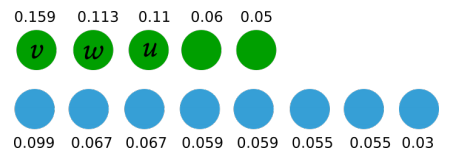
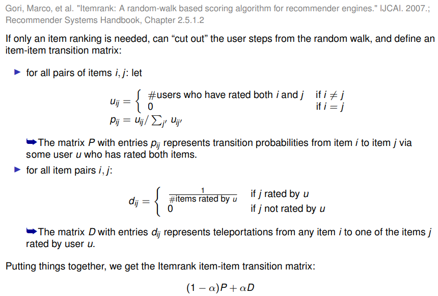

# Recommender Systems 2

* [Slides](https://www.moodle.aau.dk/pluginfile.php/2137621/mod_resource/content/3/wi_20_06.pdf)

## Random Walk Methods

Scenario

* No item features
* No user features
* Implicit feedback

Idea

* users similar to $u$ and items liked by $u$ are more likely to be encountered on the random walk

Problem

* in the long run the starting point will have little influence on the random walk

[See random walker example on slides 2-](https://www.moodle.aau.dk/pluginfile.php/2137621/mod_resource/content/1/wi_20_06.pdf#page=3)

### Random Walk Teleportation (Reboot)

Teleport to user-of-interest node

[Example on slides 3-](https://www.moodle.aau.dk/pluginfile.php/2137621/mod_resource/content/1/wi_20_06.pdf#page=14)

* Leads to irreducible and aperiodic Markov chain (assuming connected graph)

Use stationary probabilities of users and items as measure for:

* similarity of users
* relevance of items

**Transitivity**

* A user $w$ can be (more or less) similar to $u$, even if $u$ and $w$ do no have any common ratings/interactions

Is called **Personalized PageRank**

### Personalized PageRank

Let $K$ users be index $1,\dots,K$, and $L$ items $K+1, \dots , K+L$

Then construct $(K+L) \times (K+L)$ transition matrix:

$$
P_{RW}=(1-\alpha)P_G + \alpha P_T
$$

where 

* $P_G$ is the graph transition matrix
    * for any user or item node, make a uniform random choice over the incident edges
* $P_T$ is the teleportation matrix
    * move to user node $u$ with probability 1
* $a<1$ teleportation probability

The stationary probabilities (of user and item nodes) define a **Personalized PageRank**.

It is **personalized** for user $u$

### User and Item Rankings

The computed personalized PageRanks define a ranking of users and items $(\alpha = 0.1)$

Use:

* Use user rankings to find similar users and proceed as in neighborhood method
* Use item ranking directly to recommend items

### Itemrank

[From slides](https://www.moodle.aau.dk/pluginfile.php/2137621/mod_resource/content/3/wi_20_06.pdf#page=28)

### Matrix Factorization

[Slides (pdfpage 29-)](https://www.moodle.aau.dk/pluginfile.php/2137621/mod_resource/content/3/wi_20_06.pdf#page=29)