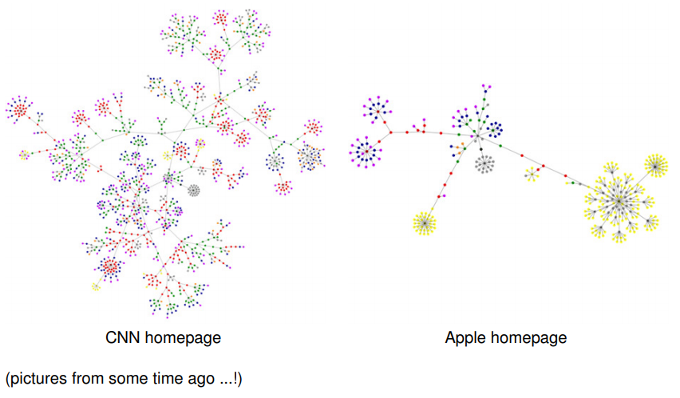
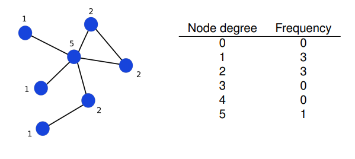
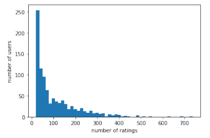
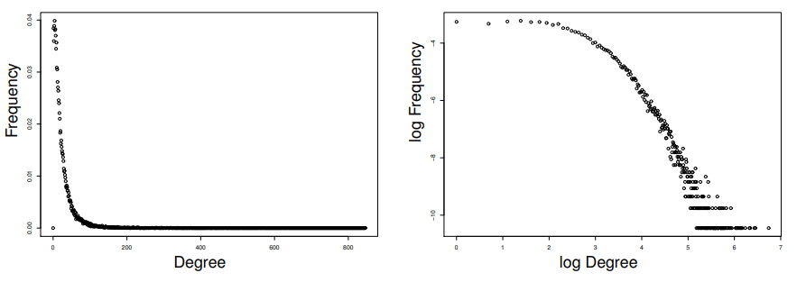
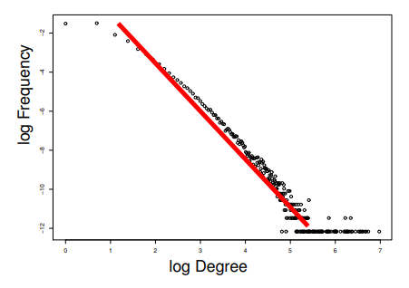
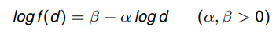
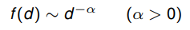
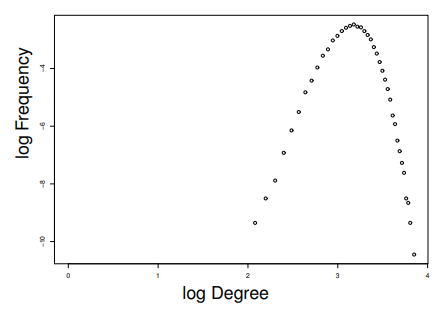
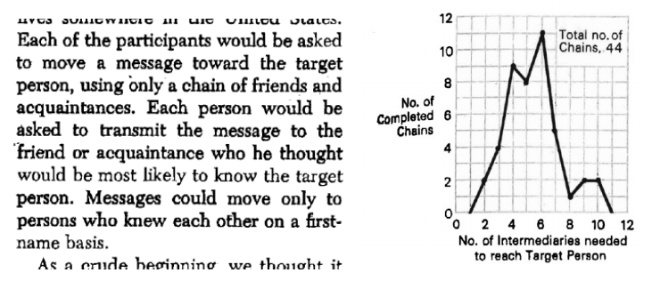
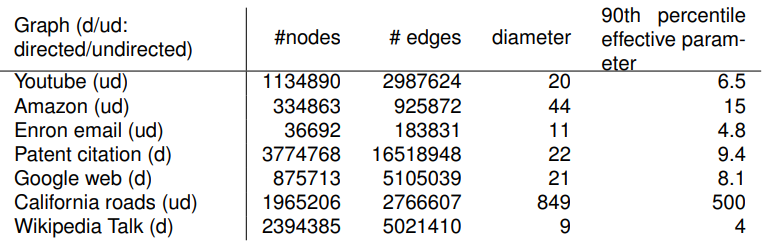

# Network Structure and Communities

!!!todo
fix image paths

Networks of very different types have many things in common:

- the mathematical graph model
- typical structural properties
- fundamental network (data) analysis problems, e.g.:
  - community detection
  - node classification and link prediction

**Network science** investigates modeling and analysis problems for networks in general

## Degree distribution

A small network and its degree distribution:

Degree distribution in Movielens user-movie rating graph (user nodes only):

Source: Stanford Large Network Dataset Collection:
http://snap.stanford.edu/data/index.html

Nodes: 34546 papers in the Arxiv High Energy Physics category

Edges: 421578 citation links between the papers (directed)

[More examples on slides 12-](https://www.moodle.aau.dk/pluginfile.php/2142008/mod_resource/content/1/wi_20_07.pdf#page=15)

### Power Law

Observation: in many real networks there is a linear relationship

between the logarithms of the degree $d$, and its relative frequency $f (d)$. Thus:

$\sim$ : proportional

#### Erdös-Rényi random graph model

For all pairs of nodes, $v,w$: edge $v\to w$ is included in the graph with probability $p$ (same for all pairs)

Degree distribution in an ER-random graph:

- Not like the Power Law
- Real networks evolve by more complex mechanisms than represented by ER model

## Diameters and Distances

**Milgram's Experiment**

- How many links via personal acquaintance are needed to connect a random pair of US citizens?
- Approximate measurement by passing a message from random starting persons in Omaha, Nebraska to target person in Boston, Massachusetts.
- Total number of initiated chains: 160. No. of completed chains: 44.

> S. Milgram: The small-world problem. Psychology Today, 1967

### Diameter and Distance

- $dist(u,v)$ length (# edges) of shortest path connecting $u$ and $v$
- diameter of graph $\max_{u,v\in G}dist(u,v)$

Distance statistics in some real networks, collected from Stanford Large Network Dataset Collection http://snap.stanford.edu:

- 90'th percentile effective diameter:
  - 90 percent of pairs of nodes are connected with a dist of this.
  - says parameter on the figure which is a mistake
