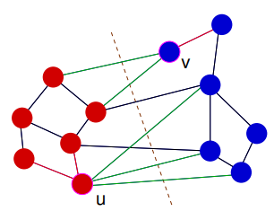

# Network Structure and Communities

Networks of very different types have many things in common:

- the mathematical graph model
- typical structural properties
- fundamental network (data) analysis problems, e.g.:
  - community detection
  - node classification and link prediction

**Network science** investigates modeling and analysis problems for networks in general

## Degree distribution

A small network and its degree distribution:

Degree distribution in **Movielens** user-movie rating graph (user nodes only):

**Citation Network**

Source: Stanford Large Network Dataset Collection:
http://snap.stanford.edu/data/index.html

Nodes: 34546 papers in the Arxiv High Energy Physics category

Edges: 421578 citation links between the papers (directed)

[More examples on slides 12-](https://www.moodle.aau.dk/pluginfile.php/2142008/mod_resource/content/1/wi_20_07.pdf#page=15)

### Power Law

Observation: in many real networks there is a linear relationship

between the logarithms of the degree $d$, and its relative frequency $f (d)$. Thus:

$\sim$ : proportional

#### Erdös-Rényi random graph model

For all pairs of nodes, $v,w$: edge $v\to w$ is included in the graph with probability $p$ (same for all pairs)

Degree distribution in an ER-random graph:

- Not like the Power Law
- Real networks evolve by more complex mechanisms than represented by ER model

## Diameters and Distances

**Milgram's Experiment**

- How many links via personal acquaintance are needed to connect a random pair of US citizens?
- Approximate measurement by passing a message from random starting persons in Omaha, Nebraska to target person in Boston, Massachusetts.
- Total number of initiated chains: 160. No. of completed chains: 44.

> S. Milgram: The small-world problem. Psychology Today, 1967

### Diameter and Distance

- $dist(u,v)$ length (number of edges) of shortest path connecting $u$ and $v$
- diameter of graph $\max_{u,v\in G}dist(u,v)$

Distance statistics in some real networks, collected from Stanford Large Network Dataset Collection http://snap.stanford.edu:

- 90'th percentile effective diameter:
  - 90 percent of pairs of nodes are connected with a dist of this.
  - says parameter on the figure which is a mistake

## Clustering Coefficients

Two graphs with 20 nodes and 35 edges:

Intuition/empirical observation: 

* real networks exhibit significant clustering:
    * two acquaintances of mine are more likely to know each other than two random people.

How to measure the amount of clustering?

Consider $G=(V,E)$ undirected.  For $v \in V$ with $d(v) \geq 2$:

* $\tau_3(v):= \frac{d(v)(d(v)-1)}{2}$ 
    * number of pairs of neighbors of $v$
* $\tau_\triangle := |\{\{u,w\}:\{u,v\}, \{w,v\},\{u,w\} \in E\}|$
    * number of triangles containing $v$

**Local clustering coefficient:**

* $cl(v):= {\tau_\triangle(v) \over \tau_3(v)}$ (for $v$ with $degree(v) \geq 2$)

**Global clustering coefficient:**

* $cl(G):= {1\over|V'|} \sum_{v\in V'} cl(v)$, where $V':= \{v \in V(G) | d(v) \geq 2\}$

Clustering coefficients and comparison with

## Communities

**Zachary Karate Club**

Nodes: members of a karate club at a U.S. university. 

Edges: social interactions outside the club.

How the network looked at some point in time:

Eventually, the club broke up into two. Membership in new clubs indicated by color.

### What are Communities

**Intuitive**

*Informally, a community in a network is a group of nodes with greater ties internally than to the rest of the network. [Parathasarathy et al., 2011]*

*The actors in a network tend to form groups of closely-knit connections. The groups are also called communities, clusters, cohesive subgroups or modules in different context. Roughly speaking, individuals interact more frequently within a group than between groups. [Tang et al., 2010]*

**Communities and Clustering Coefficient**

* Large value of cl(v): v is embedded in a closely connected neighborhood
*  Large value of cl(G): most nodes lie within a closely connected component

## Graph Clustering

A clustering of $G= (V,E)$ is a partitioning $\mathcal C = \{C_1, \dots, C_k\}$ of $V$

**Method Skeleton**

* Pick a quality measure for clusterings
* Find an algorithm to (approximately) determine the clustering with optimal quality

### Cut

Quality of a 2-clustering (aka. a *cut*):

* number of edges that connects vertices in different clusters
    * generalizes to weighted edges, and *k*-clusterings

Minimum weight cuts can be computed efficiently (but not for the more general $k > 2$ case)

**Problem**: optimal clusterings may contain very small clusters:

### Quality Measure - Kernighan, Lin 1970

Quality Measure: Cut weight, subject to size constraints $n_1 ≤|C_i |≤ n_2$ for all $i$.

Algorithmic paradigm: greedy optimization, based on local modification operations (“shifting method” [Brandes et al., Ch.8]):

Kernighan, Lin local modifications:

Swap cluster membership of pairs of nodes. Gain (decrease in cut weight) from swapping u, v:

* $(2-1) + (3-2)=2$

Swaps maintain size constraints

> B.W. Kernighan, S. Lin: An efficient heuristic procedure for partitioning graphs. Bell System Tech. J., 1970

### Quality Measure - Newman, Girvan 2004

Quality Measure: *Modularity* (see below). No strong link between quality measure and algorithmic approach.

Algorithmic paradigm: divisive hierarchical clustering

Newman, Girvan:

* Division in line 3 is effected by sequence of edge deletions
* Not only internal edges of $C_i$ will be deleted.

> M.E.J. Newman and M. Girvan: Finding and evaluating community structure in networks. Physical Review, 2004

### Edge Betweenness

Intuition: edges connecting communities will be used on many shortest paths connecting nodes:

Many more shortest path traverse edge $e_1$ than $e_2$

Shortest path betweenness:

$$
\beta(e):= \sum_{e,v \in V} \frac {\text{# shortest path connecting } u,v \text{ going through } e} {\text{# shortest paths connecting } u,v}
$$

Other formalizations of "betweenness": random walk betweenness, current-flow betweenness.

### Newman-Girvan Algorithm

Line 11 can be implemented in time $O(mn)$ (modification of standard shortest path computations by breadth first search)

Total time: $O(m^2n)$

### Modularity

Newman-Girvan algorithm produces a hierarchy of $n$ clusterings. Which one is most meaningful?

* $e_{i,j} = e_{j,i}$: proportion of edges that connect nodes in clusters $i$ and $j$
    * Example: $e_{1,3} = 2/24,\quad e_{1,1}=6/24$
* $a_i := e_{i,i} + \sum_{j \neq i} e_{i,j}/2$
    * $\sum_i a_i = 1$
    * Example: $a_1 = 6/24 + 1/48 + 2/48$

In matrix form with marginal sums:

$a_i$: normalized sum of degrees of nodes in cluster $i$

### Modularity Random Graph Model

Given:

* $n$ nodes partitioned into $k$ clusters $C_1, \dots, C_k$
* Number $m$ of edges
* Probabilities $a_1,\dots a_k$ (or degrees $d_1,\dots, d_n$ of all nodes)

construct random graph by selecting for each of the $m$ edges randomly start and end node by 

* randomly picking a cluster $C_i$ according to probability $a_i$, and then select a node in $C_i$ with uniform probability distribution

or

* randomly pick a node with a probability proportional to the degree of the node

Either way: the expected proportion of edges inside cluster $C_i$ is $a_i^2$

* Note: multiple edges possible; cf. PA model

The modularity score compares the actual proportion of intra-cluster edges with the expected number under the random graph model:

$$
Q(C_1, \dots, C_k) := \sum_i (e_{i,i} - a_i^2)
$$

### Newman-Girvan Zachary Result

### Modularity Optimization

Can one try to optimize modularity directly?

* Exact solution: NP Hard
* Approximation heuristics: greedy agglomerative hierarchical clustering (no quality of approximation guarantees)

Modularity optimal clustering of Zachary (Q = 0.419):

> [U. Brandes et al.: On Modularity Clustering. IEEE Transactions on Knowledge and Data Engineering, 2008.]