# Communities and Information Diffusion

## Influence Maximization

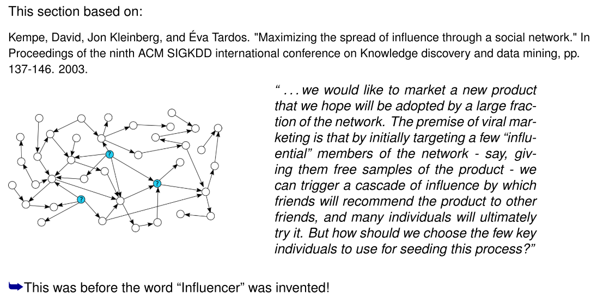

### Diffusion Models

Model-based analysis:

* Define (realistic) stochastic model for the diffusion of information in a network
* Formulate precise objective
* Optimize objective under the assumptions of the model

Terminology:

* Distinguish *active* and *inactive* users
* In the diffusion process, inactive graph neighbors of active nodes can become active

### Linear Threshold Model

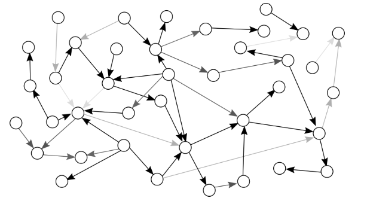

* Assume: edges u → v are associated with **weights** $b_{u,v}$, such that for all v

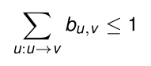

* Edge weights indicated by grayscale values in picture.

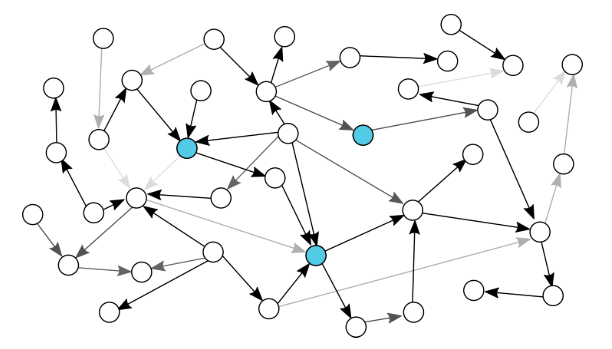

* At time t = 0 an initial set A0 of nodes is active
    * indicated by blue colors

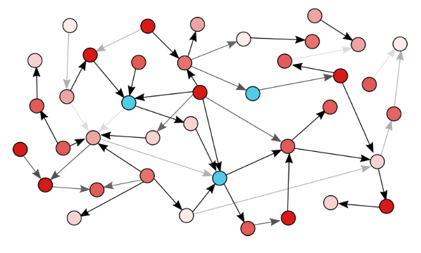

* Every node $v$ randomly chooses a **threshold** $θ_v$ uniformly from the interval $[0,1]$. 
    * Thresholds indicated by redscale values in picture

* For $t = 1, 2, \dots>:$ the set of nodes *active at time* $t$ is

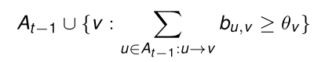

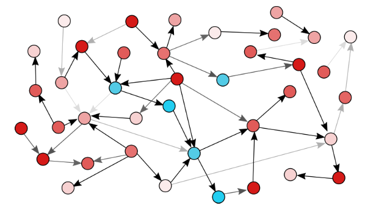

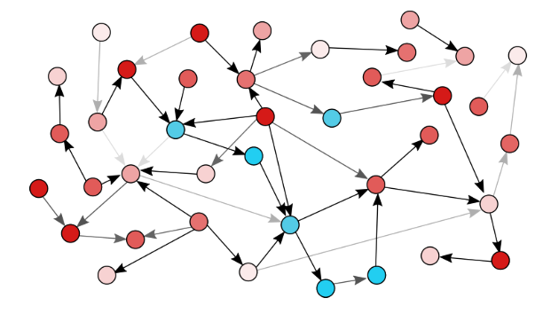

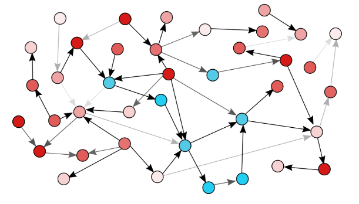

### Independent Cascade Model

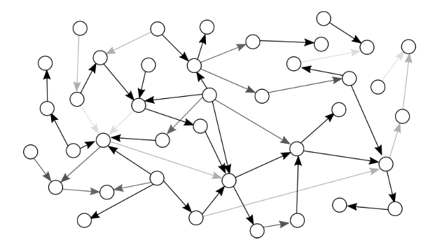

* Assume: edges $u\to v$ are associated with probabilities $p_{u,v} \leq 1$. 
    * Edge probabilities indicated by grayscale values in picture.

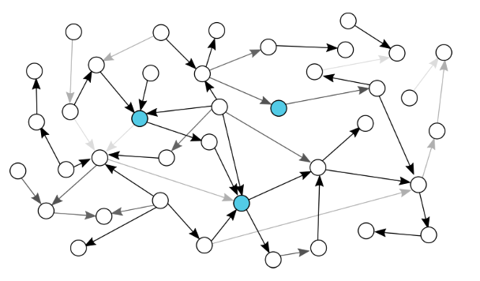

* At time $t=0$ an initial set $A_0$ of nodes is *active*
* For $t=1,2,\dots$: each node $u\in A_{t-1} \backslash A_{t_2}$ (but not $A_{T_2}$) *activated at time* $t-1$ activates its inactive neighbors with probability $p_{u,v}$ $A_t=A_{t-1} \cup \{v : v \text{activated at time } t\}$ 

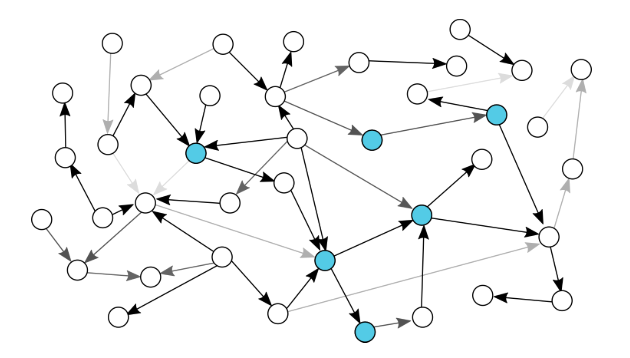

* Nodes cannot "keep trying" to activate nodes

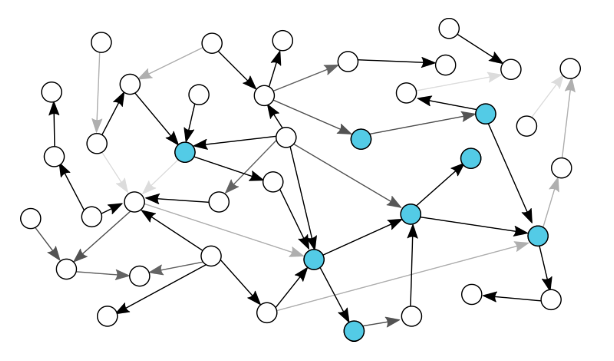

### Similarities and Differences

**Edge Parameters**

* Both models assume weights/probabilities on the edges
* These numbers will not be explicitly given by the network, but can potentially be learned from observations of information cascades
    * E.g. in social network, no-one has labeled edges with numbers
        * Facebook or Twitter would know, e.g. how much a user retweets from another user
* Otherwise, run the models with default parameters

**Activating the neighbors**

* Independent cascade: one-shot opportunity of a newly activated node to also activate its neighbors
    * The more of your neighbors get active, the higher the chance of you becoming active
* Linear threshold: a node can always contribute to the activation of neighbors if sufficiently many other nodes become active.

### Influence

Both diffusion models lead to a final set of activated nodes at the time t where:

$$
A_{final}:=A_t=A_{t-1}
$$

Each seed set A induces a probability distribution over $A_{final}$ sets obtained in random cascades:

* Linear Threshold: randomness induced by random choice of thresholds (new in every run)
* Independent Cascade: randomness induced by random propagation according to edge probabilities

For any diffusion model:

**Influence: Definition**

For seed set $A\subset V$ define *influence* $\sigma(A)$ as the *expected size of* $A_{final}$ *in cascade started with* $A_0=A$

**Influence: Computation**

For a given $A$, $\sigma(A)$ can be hard to compute. 

* Typically approximate by simulations.

**Influence: Optimization**

The *influence maximization problem*: find the set $A_{opt}$ with $|A_{opt}|=k$, such that $\sigma(A_{opt})$ is maximal among all size $k$ sets

* Inputs:
    * Graph $(V,E)$,
    * Edge weights/probabilities
    * $k$

### Influence Maximization Problem

The influence maximization problem for the independent cascade model is NP-hard.

#### Set Cover Problem

The Set Cover problem is a known NP-complete problem: given 

* a set $U$ of size $n$
* a collection of $m$ subsets $S_1, \dots, S_m$ of $U$
* a number $k\leq m$

do there exist $k$ of the subsets $S_i$ such that their union is $U$?

#### Reduction

The Set Cover problem can be reduced to influence maximization: given an instance of the Set Cover problem, construct bipartite graph

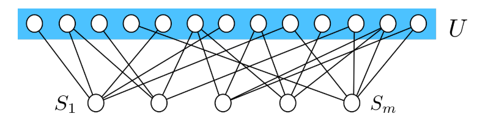

Edges directed from sets $S_i$ to elements of $U$ they contain. All probabilities set to $p_{u,v}$ = 1.

Then: exists size $k$ set cover, if and only if $\sigma(A_{opt})=n+k$

* Similar result for linear threshold model

#### Greedy Optimization

Heuristic approximation technique (either linear threshold or independent cascade):

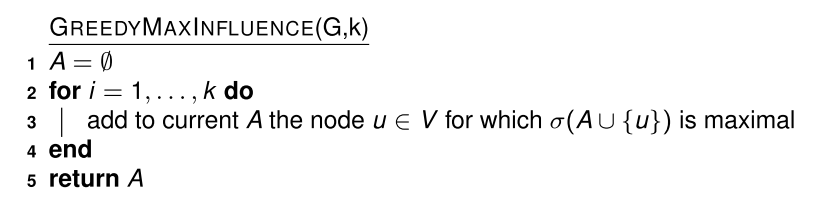

##### Approximation Guarantee

The influence value $\sigma(A_{greedy})$ obtained via greedy optimization is at least:

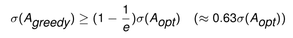

* General guarantee for optimization of submodular functions:
    * if $A \subset A'$ then for all $u$:

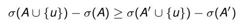

* ("law of diminishing returns")

#### An Experiment

**Data**: collaboration network (arXiv high energy physics): 10748 nodes, 53000 edges)

Comparing values σ(A) in linear threshold model obtained by greedy optimization vs. simpler alternatives:

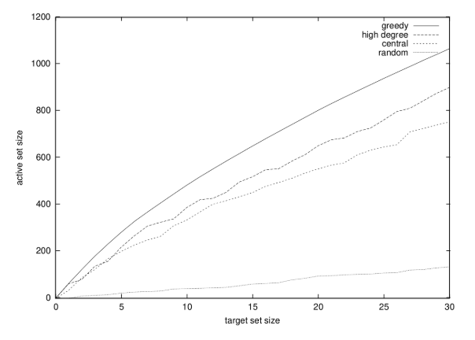

* high degree: select nodes with highest out-degree 
* central: select nodes according to minimal average distance to other nodes 
* random: random