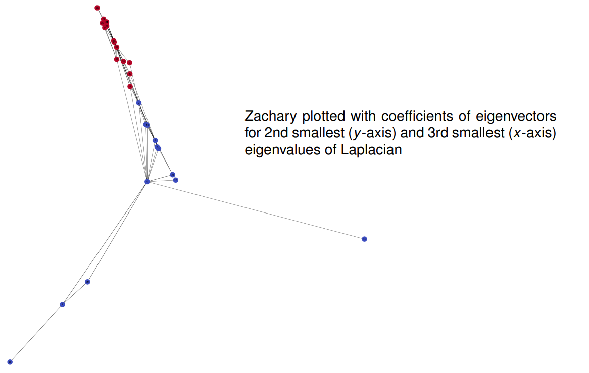

# Communities and Information Diffusion

* [Slides](https://www.moodle.aau.dk/pluginfile.php/2145324/mod_resource/content/1/wi_20_08.pdf)

## Latent Space Embeddings

### Graph Drawing

Graph drawing/layout algorithms: map vertices to (x, y)-coordinates, so that graph plotted with nodes at coordinates “looks nice”, “reveals structure”, etc.

A standard clustering algorithm (e.g. kmeans) applied to the x, y-coordinates of the nodes will return clusters that correlate with communities

### Problem Transformations

#### From Graph Clustering to Euclidean Clustering

Given graph $G$,

* find embedding of nodes in d-dimensional Euclidean Space $\R^d$
* apply clustering algorithm for $\R^d$-data

#### From Any Clustering to Graph Clustering

Given data points $x_1, \dots, x_N$ (any data space),

* define a distance measure $d(x_i, x_j)$ between data points
* construct distance matrix $D=(d(x_i, x_j))_{i,j}$ or some variant
* graph-cluster $D$ (possibly via embedding in Euclidian space: **Spectral Clustering**)

#### From Graph Clustering to Distance-based clustering

Given graph $G$,

* Define a graph-distance measure $d(v_i , v_j)$ between vertices
*  Apply any clustering algorithm that operates on a distance matrix (e.g., hierarchical clustering)

## Clustering by Matrix Factorization

### **Adjacency Matrix**

$$
A=(a_{i,j})_{i,j}\quad \text{where } a_{i,j} = \left\{
\begin{array}\
1 & \text{if } (v_i, v_j) \in E\\
0 & \text{if } (v_i, v_j) \notin E
\end{array} \right.
$$

* $G$ is directed or undirected.
* $A$ symmetric if $G$ undirected.

Interpretation as linear mapping:

$$
A: \R^n \to \R^n
$$

A (column) vector $\bold x \in \R^n$ can be interpreted as a *potential or weight function* on nodes.
The mapping $A: \bold x \mapsto A \bold x$ transforms the potential:
$$
(A\bold x)_i = \sum _{j:(i,j) \in E} x_j
$$

Alternatively for row vector $\bold x^T$:

$$
(\bold x^TA)_i = \sum_{j:(j,i) \in E} x_j
$$

### Illustration

Potentials (non-negative) represented by colored boxes:

### Eigenvectors and Eigenvalues

$\bold x$ is eigenvector with eigenvalue $\lambda$ if $A\bold x = \lambda \bold x$

**Example**

Eigenvectors and -values for triangle graph:

**Example**

Collection of cliques:

* The largest eigenvalue is the size (degree) of the largest clique minus one. The corresponding eigenvector is the indicator vector for the clique.
* Indicator vectors for other cliques are eigenvectors with eigenvalues equal to the size of the cliques minus one.

### Laplacian Matrix

**The Graph Laplacian**

* $A$: adjacency matrix of undirected graph
* $D$: diagonal *degree matrix*: $d_{i,i} = \sum_{j=1}^n a_{i,j}$

the (unnormalized) Laplacian is

$$
L = D - A
$$

**Properties**

* $L$ is symmetric, and $\sum_{j=1}^n l_{i,j} = \sum_{j=1}^n l_{j,i} = 0$

* The constant vector $\bold e = (1,\dots,1)$ is an eigenvector of $L$ with eigenvalue 0.

* If $V' \subset V$ is a connected component, then the  indicator vector for $V'$

    * $(\bold e_{V'})_i = \left\{ \begin{array}\ 1 & \text{if } v_i \in V' \\ 0 & \text{if } v_i \notin V' \end{array} \right .$

    is an eigenvector of $L$ with eigenvalue 0

* $L$ is positive semi-definite

> [U. von Luxburg: A tutorial on spectral clustering. Stat. Comput., 2007 ]

### Connected Components

Connected components and eigenvectors:

* $L$: Laplacian, arranged so that connected components are contiguous blocks
* $\bold e_{V'}$: indicator vector of "middle" component
* $\bold 0$: 0-vector

### SVD for L

SVD for Laplacian matrix (special case for quadratic, symmetric, positive semi-definite matrices):

* $V$: matrix of orthogonal eigenvectors
* $D$: diagonal, containing non-negative eigenvalues (in increasing order)

### Zachary Example: Laplacian

### Zachary Example: Adjacency

## Information Diffusion

**Information diffusion** in a (social) network:

Network: possibly heterogeneous with web page nodes, user nodes, . . .

Information:

* retweets
* hashtags
* internet rumours

Some assumptions:

* can identify the “same piece of information” being adopted/shared/propagated across the network
* information “spawned” at one or several nodes, and then propagated along links

### Prediction Problems

Given the trace of an **information cascade** so far: 

How far is this going to spread?

> [Cheng, Justin, Lada Adamic, P. Alex Dow, Jon Michael Kleinberg, and Jure Leskovec. "Can cascades be predicted?." In Proceedings of the 23rd international conference on World wide web, pp. 925-936. 2014.]

Which are the most effective spawning nodes for spreading a piece of information?

> [Kempe, David, Jon Kleinberg, and Éva Tardos. "Maximizing the spread of influence through a social network." In Proceedings of the ninth ACM SIGKDD international conference on Knowledge discovery and data mining, pp. 137-146. 2003.]

## Cascade Prediction

> This section based on:
>
> Cheng, Justin, Lada Adamic, P. Alex Dow, Jon Michael Kleinberg, and Jure Leskovec. "Can cascades be predicted?." In Proceedings of the 23rd international conference on World wide web, pp. 925-936. 2014.

**Data**

From Facebook: “Sharing cascades” of images observed over a 28 day period in 2013

* at least 5 reshares for each photo
* initial node can be either:
    * "page" (81%): company etc. accounts
    * "user" (19%): individual users

One cascade:

> Image source: [Cheng et al., 2014]

* $\hat G$: cascade graph - nodes and edges along which information was transmitted
* $G'$:  induced sub-graph – same nodes as $\hat G$, but also including the edges on which information was not transmitted.

### Wiener Index

For any graph $G = (V,E)$ with $|V|=n$

$$
d_w(G) = {2 \over n(n-1)} \sum _{u,v \in V} d(u,v) \quad \text{(average node distance)}
$$

> Image source: [Cheng et al., 2014]

Interpretation: higher Wiener index ∼ more viral cascade (passes across different communities)

### Data Statistics

Complementary cumulative distribution functions for size and Wiener index of cascades:

> Image source: [Cheng et al., 2014]

$CCDF(x) = $ fraction of cases (=cascades) that have a value (of Cascade size, Wiener index) above $x$.

* We observe power laws for both distributions
* I Page induced cascades are larger but less viral than user induced cascades.

### Predicting Cascade Growth

**Given**

* the observation of a cascade of current size $k$

**Question**

* how big will it grow?

* Problem: default answer “not much bigger than it is now” has high accuracy

**Question Adapted**

* Will it reach size $2k$? (about half of cascades of size $k$ will reach size $2k$.)

**Approach**

* Define a number of *features* $f_1, f_2, \dots, f_m$ describing the currently observed size $k$ cascade
* Use standard logistic regression model to predict $≥ 2k$ target
* Separate prediction model for each $k$

**Logistic Regression**

Learn weights $w_0, \dots, w_m$, and predict $\geq 2k$ to be true for cascade $C$ if 

* $w_0 + w_1f_1(C) + \dots + w_mf_m(C) > 0$

* the absolute values of the weights are a measure for the *importance* of the features.

#### Image Features

#### Poster Features

* Page vs. user poster
* Number of friends
* Demographic info and Facebook use statistics
* ...

#### Resharer Features

Similar features for the re-sharers up to now

#### Cascade Structure

* Out-degree of $i$th re-sharer in cascade graph $\hat G(i=1, \dots, k)$
* Out-degree of $i$th re-sharer in induced graph $G'(i=1, \dots, k)$
* Number of edges in $G'$
* ...

#### Temporal Features

* Various features derived from the time stamps of the first $k$ re-shares

All features only depend on the observed cascade, not the network structure beyond the cascade.

### Results - Predicting Size

Results with logistic regression for $k = 5$ using different feature sets:

* Temporal features most informative

Further results:

* Accuracies improve (slightly) for larger k
* For larger k, relevance of cascade features increases, relevance of content/user features decreases.

### Results - Predicting Wiener Index

**Task** 

* given cascade of size k = 5, predict whether Wiener index of final cascade is above the median value

**Results**

* Obtained accuracy of $0.725$
* Temporal and structural features most informative

## Influence Maximization

### Diffusion Models

Model-based analysis:

* Define (realistic) stochastic model for the diffusion of information in a network
* Formulate precise objective
* Optimize objective under the assumptions of the model

Terminology:

* Distinguish *active* and *inactive* users
* In the diffusion process, inactive graph neighbors of active nodes can become active

### Linear Threshold Model

* Assume: edges $u \to v$ are associated with **weights** $b_{u,v}$, such that for all $v$

* Edge weights indicated by grayscale values in picture.

* At time t = 0 an initial set A0 of nodes is active
    * indicated by blue colors

* Every node $v$ randomly chooses a **threshold** $θ_v$ uniformly from the interval $[0,1]$. 
    * Thresholds indicated by red-scale values in picture

* For $t = 1, 2, \dots>:$ the set of nodes *active at time* $t$ is

### Independent Cascade Model

* Assume: edges $u\to v$ are associated with probabilities $p_{u,v} \leq 1$. 
    * Edge probabilities indicated by grayscale values in picture.

* At time $t=0$ an initial set $A_0$ of nodes is *active*
* For $t=1,2,\dots$: each node $u\in A_{t-1} \backslash A_{t_2}$ (but not $A_{T_2}$) *activated at time* $t-1$ activates its inactive neighbors with probability $p_{u,v}$ $A_t=A_{t-1} \cup \{v : v \text{activated at time } t\}$ 

* Nodes cannot "keep trying" to activate nodes

### Similarities and Differences

**Edge Parameters**

* Both models assume weights/probabilities on the edges
* These numbers will not be explicitly given by the network, but can potentially be learned from observations of information cascades
    * E.g. in social network, no-one has labeled edges with numbers
        * Facebook or Twitter would know, e.g. how much a user retweets from another user
* Otherwise, run the models with default parameters

**Activating the neighbors**

* Independent cascade: one-shot opportunity of a newly activated node to also activate its neighbors
    * The more of your neighbors get active, the higher the chance of you becoming active
* Linear threshold: a node can always contribute to the activation of neighbors if sufficiently many other nodes become active.

### Influence

Both diffusion models lead to a final set of activated nodes at the time t where:

$$
A_{final}:=A_t=A_{t-1}
$$

Each seed set A induces a probability distribution over $A_{final}$ sets obtained in random cascades:

* Linear Threshold: randomness induced by random choice of thresholds (new in every run)
* Independent Cascade: randomness induced by random propagation according to edge probabilities

For any diffusion model:

**Influence: Definition**

For seed set $A\subset V$ define *influence* $\sigma(A)$ as the *expected size of* $A_{final}$ *in cascade started with* $A_0=A$

**Influence: Computation**

For a given $A$, $\sigma(A)$ can be hard to compute. 

* Typically approximate by simulations.

**Influence: Optimization**

The *influence maximization problem*: find the set $A_{opt}$ with $|A_{opt}|=k$, such that $\sigma(A_{opt})$ is maximal among all size $k$ sets

* Inputs:
    * Graph $(V,E)$,
    * Edge weights/probabilities
    * $k$

### Influence Maximization Problem

The influence maximization problem for the independent cascade model is NP-hard.

#### Set Cover Problem

The Set Cover problem is a known NP-complete problem: given 

* a set $U$ of size $n$
* a collection of $m$ subsets $S_1, \dots, S_m$ of $U$
* a number $k\leq m$

do there exist $k$ of the subsets $S_i$ such that their union is $U$?

#### Reduction

The Set Cover problem can be reduced to influence maximization: given an instance of the Set Cover problem, construct bipartite graph

Edges directed from sets $S_i$ to elements of $U$ they contain. All probabilities set to $p_{u,v}$ = 1.

Then: exists size $k$ set cover, if and only if $\sigma(A_{opt})=n+k$

* Similar result for linear threshold model

#### Greedy Optimization

Heuristic approximation technique (either linear threshold or independent cascade):

##### Approximation Guarantee

The influence value $\sigma(A_{greedy})$ obtained via greedy optimization is at least:

* General guarantee for optimization of submodular functions:
    * if $A \subset A'$ then for all $u$:

* ("law of diminishing returns")

#### An Experiment

**Data**: collaboration network (arXiv high energy physics): 10748 nodes, 53000 edges)

Comparing values σ(A) in linear threshold model obtained by greedy optimization vs. simpler alternatives:

* high degree: select nodes with highest out-degree 
* central: select nodes according to minimal average distance to other nodes 
* random: random