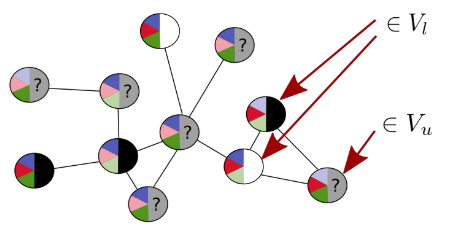
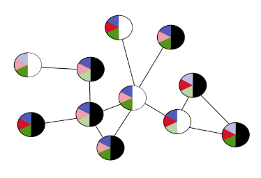
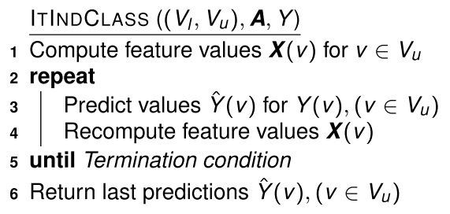

# Node Classification

## Node Classification

Things we can (try to) predict in networks:

**Node Classification**

* Is a user in a social network going to vote democrat or republican?
* Is a sensor in a sensor network going to fail within the next 30 days?
* Has a computer in a computer network been hacked?
* Is a poster a person or a robot?

**Link Prediction**

* Are two proteins interacting?
* Will customer A buy product B?
* Is user A going to become a follower of user B?

**Network Classification**

* Is a molecule a mutagen?

We focus on node classification now.

### Node Attributes

Graph with node attributes:

$$
G=(V,E,\bold A)
$$

where $\bold A = (A_1, \dots, A_m)$ are **node attributes**

**Example - Lazega Lawyers**

Attributes:

* $A_1$: status ∈ { partner, associate } 
* $A_2$: gender ∈ { male, female } 
* $A_3$: office ∈ { Boston, Hartford, Providence } 
* $A_4$: years with firm ∈ $\R$ 
* $A_5$: age ∈ $\R$ 
* $A_6$: practice ∈ { litigation, corporate } 
* $A_7$: law school ∈ { Harvard, Yale, Ucon, Other }

**Example - User-Product Network**

Attributes

* $A_1$: type ∈ { user, product } 
* $A_2$: gender ∈ { male, female } 
* $A_3$: category ∈ { Tools, Cooking, Drink, . . . } 
* $A_4$: weight ∈ $\R$ 
* $A_5$: avg. rating ∈ $\R$ 
* $A_6$: reviews ∈ *text∗*
    * All reviews as a sequence of text

### Class Label

Not all attributes have known values for all nodes. One incompletely known attribute is the designated **class label** Y. We can write:

$$
G=((V_l, V_u), E, \bold A, Y)
$$

with

* $V_l$: the *labeled* nodes (value of Y known)
* $V_u$: the *unlabeled* nodes (value of Y unknown)

We want to predict the value of Y for the unlabeled nodes.

**Schematic picture:**

* Attributes: blue,red,green ∈ { light,dark }
* Class: Y ∈ { white, black }

### Transductive vs Inductive 

#### Transductive

* The graph $((V_l, V_u), E, \bold A, Y)$ is fixed, and the same when learning and predicting
    * all nodes $V_u$ that need to be classified already known when learning the classifier
* Examples: techniques based on matrix factorization

#### Inductive

* Graph $G = ((V_l, V_u), E, \bold A, Y)$ used for training (possibly $V_u = ∅$, as in figure).
* Nodes that are classified can be new nodes added to G, or even nodes in a different graph G'

### Independent vs Collective

**Independent Classification**

* The classification of $v \in V_u$ is independent of the classification of other nodes $v' \in V_u$
* This corresponds to the standard classification scenario in machine learning

**Collective Classification**

* All nodes in $V_u$ are classified jointly: the classification of $v \in V_u$ may depend on the classification of $v' \in V_u$
* Specific for classification in network (or other "inter-connected") data

## Homophily

*Homophily, also known informally as “birds of a feather”, is when a link between individuals (such as friendship or other social connection) is correlated with those individuals being similar in nature. For example, friends often tend to be similar in characteristics like age, social background, and education level.*

> [S. Bhagat, G. Cormode, S. Muthukrishnan: Node Classification in Social Networks]

Mechanisms leading to homophily:

* *Social influence*: This indicates that people tend to follow the behaviors of their friends. The social influence effect leads people to adopt behaviors exhibited by their neighbors
* *Selection*: This indicates that people tend to create relationships with other people who are already similar to them;
* *Confounding variables:* Other unknown variables exist, which may cause friends to behave similarly with one another.

> [J. Sun and J. Tang: A Survey of Models and Algorithms for Social Influence Analysis]

### Homophily in Lazega Network

Collaborating lawyers are more likely to have the same Practice:

> Image from: E.D. Kolaczyk: Statistical Analysis of Network Data

Prediction

$$
Practice(i) = mode\{Practice(j) \mid j : Collaborate(i,j)\}
$$

only makes 5/34 errors assuming that when predicting Practice(i), the Practice of all other nodes j is known.

* Class memberships of nodes $u ∈ V_l$ can be a strong predictor for class membership of $v ∈ V_u$

## Independent Classification

### A generic approach

* Define a set of **node features** $X_1, \dots , X_k$
* For each node $v \in V_l$, construct the **training example**
    * $(\bold X(v), Y(v)) = (X_1(v), \dots, X_k(v), Y(v))$
* Use standard machine learning approach to lean a classifier from the training examples.
* For nodes $u \in V_u$: calculate feature vector $\bold X(u)$, and predict $Y(u)$

Essentially inductive, but could also be used in a transductive situation.

### Node feature constructions

Some ways to construct node features:

* $X(v)=A(v)$ with $A$ a node attribute.
    * E.g. $X = location$
* $X(v) = d(v)$ (in/out degree)
* $X(v) = aggr\{A(u) \mid u: (v,u) \in E\}$
    * Aggregate of attribute values of linked nodes.
    * E.g. Most frequent practice type among collaborating colleagues (*aggr=mode*); average age of collaborating colleagues (*aggr=average*)
* $X(v)$: Boolean function for a property of graph neigborhood
    * E.g. At most 2 friendship links away, there is a node $u$ with $location(u)=\text{Hartford}$
* $X(v)= PageRank(v)$ (in transductive setting)
* $X(v) =$ coefficient of v in vectors of SVD (in transductive setting)
* ... infinitely many possibilities!

Some node attributes may be unknown (especially class label). This may lead to undefined or inaccurate feature values.

## Collective Classification

Nodes with class label black or white (no further attributes):

* Looking only at node a, predict it to be black or white?
* Looking only at node b, predict it to be black or white?
* Looking at all unlabeled nodes together, which color to predict?

### Iterative Independent Classification

We assume a transductive scenario

**Given**

* $((V_l, V_u), \bold A, Y): \bold A$ observed for all nodes, class label Y observed for nodes in $V_l$
* Set of node features $\bold X_i$
    * May include features dependent on Y
* Classifier for predicting $Y(v)$ given $\bold X(v)$

* We use $\hat Y(v)$ to denote the predicted value for the true but unknown value $Y(v)\quad (v\in V_u)$
* The iterative method only makes sense if the features $\bold X(v)$ include features dependent on labels $Y(u)$ for some nodes $u \neq v$

#### Example

* $\bold E = (Collaborate),\quad \bold A = \empty,\quad Y = Practice$
* $X(v)$: fraction of $v$'s neighbors with $Practice=corporate$ (undefined if $Practice$ unknown for all neighbors).
* Prediction model

$$
\hat Y(v) = \left\{ 
\begin{array}{}
corporate  & \text{if } X(v) \geq 0.5 \\
litigation & \text{if } X(v) < 0.5 \\
?					 & \text{if } X(v) \text{ undefined}
\end{array}
\right.
$$

$\color{darkblue} \text{Blue}$: *Practice*=*corporate*, 

$\color{darkgreen}\text{Green}$: Practice=*litigation*

White: *Practice*=?, 

Red border: node in $V_u$.

#### Adding Learning to the Loop

**Given**

* $((V_l, V_u), \bold A, Y)$: $\bold A$ observed for all nodes, class label $Y$ observed for nodes in $V_l$
* Set of node features $\bold X_i$.
    * May include features dependent on $Y$
* Learnable prediction model for class $Y(v)$ given $\bold X(v)$

!!! example
    Example on [slides 10.7](https://www.moodle.aau.dk/pluginfile.php/2150716/mod_resource/content/1/wi_20_10.pdf#page=11)

## Label Propagation

Similar to iterative independent classification based on neighbor majority vote. 

Difference:

* maintain predictions as probability distribution over all class label values

Probability distribution over labels for unlabeled nodes:

> [S. Bhagat, G. Cormode, S. Muthukrishnan: Node Classification in Social Networks, in: C.C. Aggarwal Ed.: Social Network Data Analytics, 2011.]

> [S.A. Macskassy, F. Provost: A Simple Relational Classifier. Workshop on Multi-Relational Data Mining (MRDM-2003)]

### Algorithm

Choose indexing where $V_l = \{1, \dots, n_0\}$ and $V_u=\{n_0+1, \dots, n\}$

Define $n_0 \times k$ label matrix $Y_l$:

$$
Y_l[i,j] = \left \{ 
\begin{array}{}
1 & \text{if } Y(i) = y_j \\
0 & \text{if } Y(i) \neq y_j
\end{array}
\right .
$$

**Iterative Formulation**

For each node $v \in V_u$, maintain a probability distribution $Q(v)$ over the set $\mathcal y = {y_1, \dots, y_k}$ of different possible class label values $Y(v)$:

* $Q^0(v) = \frac {1} {|V_l|} \sum_{u\in V_l} Y_l[u, \bullet]$ ("class prior")
* Iteratively update $Q(v)$:

$$
Q^{t+1}(v) = \frac {1} {|N_v|} \left( \sum_{u\in N_v \cap V_l} Y_l[y, \bullet] + \sum_{u\in N_v \cap V_u} Q^t(u) \right)
$$

$N_v$: set of graph neighbors of $v$.

* Prediction: most probable label according to $Q^\infty(v)$ (assuming convergence)

!!! example
    Example on [slides 10.10](https://www.moodle.aau.dk/pluginfile.php/2150716/mod_resource/content/1/wi_20_10.pdf#page=23)

### Random Walk

Define a random walk on the graph:

* from any unlabeled node, randomly chose a neighbor
* at labeled nodes: stay at node with probability 1 (labeled nodes are *sink* nodes) .

The transition matrix then can be written as:

$$
P= \begin{pmatrix} 
l 		 & 0 \\
P_{ul} & P_{uu}
\end{pmatrix}
$$

where 

* $l$ is $n_0 \times n_0$ identity matrix
* $P_{ul}$ is $(n-n_0) \times n_0$
* $P_{uu}$ is $(n-n_0) \times (n-n_0)$

k-step transition probabilities: $P^k = P \cdot P^{k-1}$ in the limit:

$$
P^\infty = \begin{pmatrix}
l 						& 0\\
P^\infty_{ul} & P^\infty_{uu}
\end{pmatrix}
$$

Assuming that from every unlabeled node, a labeled node is reachable: $P^\infty_{uu}=0$

For $P^\infty_{ul}$ we have:
$$
P^\infty_{ul} = P_{ul} + P_{uu}P_{ul}^\infty \Rightarrow P_{ul}^\infty = (1- P_{uu})^{-1}P_{ul}
$$

### From Random Walk to Label Distribution

The $P_{ul}^\infty$ distribution defines a (probabilistic) labeling of the unlabeled nodes
$$
Q^{RW} = P_{ul}^\infty \cdot Y_l
$$
where $Q^{RW}$ is a $(n-n_0) \times k$ matrix

* $Q^{RW}[h,j]$ = probability that random walk started at unlabeled node $n_0 + h$ ends at labeled node with label $y_j$.

#### Example

### Equivalence

The iterative and random walk distributions are the same:
$$
Q^\infty = Q^{RW}
$$
This can be seen as follows:
$$
\begin{align*}
Q^\infty 
&= P_{ul}Y_l + P_{uu}Q^\infty \\
&= P_{ul}Y_l + P_{uu}P_{ul}Y_l + P^2{uu} Q^\infty \\
&\vdots \\
&= \Sigma^\infty_{i=0} P^i_{uu} P_{ul} Y_l + P_{uu}^\infty Q^\infty \\
&= \Sigma^\infty_{i=0} P^i_{uu} P_{ul} Y_l \\
&= P^\infty_{ul} Y_l \\
&= Q^{RW}
\end{align*}
$$

## Word Embeddings

Embeddings so far:

* Texts $\to$ vector space model (observable features: tf, idf)
* User/products:
    * $\to$ (product) feature space
    * $\to$ latent space (latent features: SVD)
* (Social) network nodes $\to$ latent space (SVD)

Embeddings to come:

* Word embeddings: word2vec
* Node embeddings: node2vec

> Literature:
> Mikolov, Tomas, et al. "Distributed representations of words and phrases and their compositionality." Advances in neural information processing systems. 2013.

A word embedding maps the words of a vocabulary (or dictionary) into n-dimensional space of reals:

$$
e: \textit{Vocabulary} \to \R^n
$$

E.g. $n=100$ or $n=1000$

Goal: embedding encodes semantic meanings and relationships and supports multiple applications in natural language processing.

### Example

2-d projection of 1000 dimensional embeddings of countries and capitals:

> Source: [Mikolov et al., 2013]

$$
e(Berlin)- e(Germany) \approx e(Paris) - e(France)
$$

Application for analogical reasoning: to answer *“Berlin is for Germany what ??? is for France”*, compute:

$$
e(Berlin) - e(Germany) + e(France)
$$

and find the nearest word to this vector

