# Node Classification - Part 1

## Node Classification

Things we can (try to) predict in networks:

**Node Classification**

* Is a user in a social network going to vote democrat or republican?
* Is a sensor in a sensor network going to fail within the next 30 days?
* Has a computer in a computer network been hacked?
* Is a poster a person or a robot?

**Link Prediction**

* Are two proteins interacting?
* Will customer A buy product B?
* Is user A going to become a follower of user B?

**Network Classification**

* Is a molecule a mutagen?

We focus on node classification now.

### Node Attributes

Graph with node attributes:

$$
G=(V,E,\bold A)
$$

where $\bold A = (A_1, \dots, A_m)$ are **node attributes**

**Example - Lazega Lawyers**

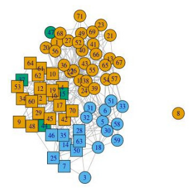

Attributes:

* A1: status ∈ { partner, associate } 
* A2: gender ∈ { male, female } 
* A3: office ∈ { Boston, Hartford, Providence } 
* A4: years with firm ∈ $\R$ 
* A5: age ∈ $\R$ 
* A6: practice ∈ { litigation, corporate } 
* A7: law school ∈ { Harvard, Yale, Ucon, Other }

**Example - User-Product Network**

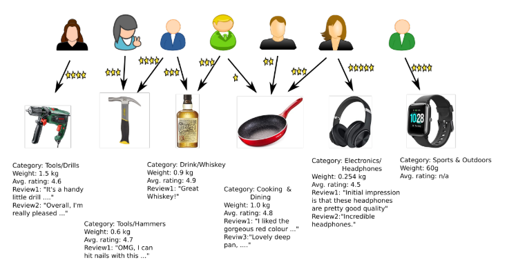

Attributes

* A1: type ∈ { user, product } 
* A2: gender ∈ { male, female } 
* A3: category ∈ { Tools, Cooking, Drink, . . . } 
* A4: weight ∈ $\R$ 
* A5: avg. rating ∈ $\R$ 
* A6: reviews ∈ *text∗*
    * All reviews as a sequence of text

### Class Label

Not all attributes have known values for all nodes. One incompletely known attribute is the designated **class label** Y. We can write:

$$
G=((V_l, V_u), E, \bold A, Y)
$$

with

* $V_l$: the *labeled* nodes (value of Y known)
* $V_u$: the *unlabeled* nodes (value of Y unknown)

We want to predict the value of Y for the unlabeled nodes.

**Schematic picture:**

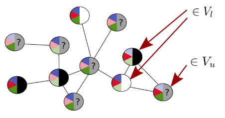

* Attributes: blue,red,green ∈ { light,dark }
* Class: Y ∈ { white, black }

### Inductive vs Transductive

#### Transductive

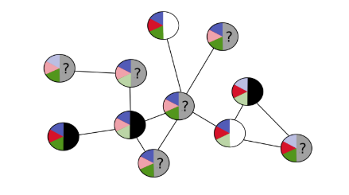

* The graph $((V_l, V_u), E, \bold A, Y)$ is fixed, and the same when learning and predicting
    * all nodes $V_u$ that need to be classified already known when learning the classifier
* Examples: techniques based on matrix factorization

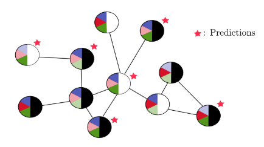

#### Inductive

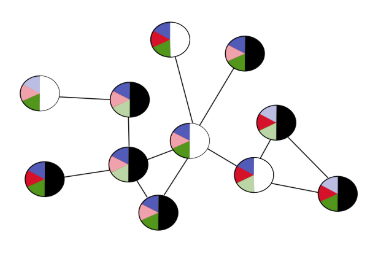

* Graph $G = ((V_l, V_u), E, \bold A, Y)$ used for training (possibly $V_u = ∅$, as in figure).
* Nodes that are classified can be new nodes added to G, or even nodes in a different graph G'

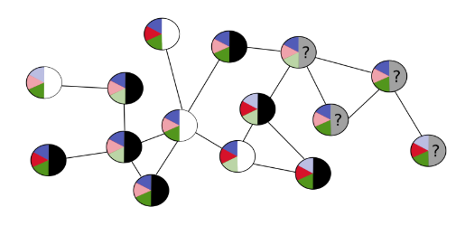

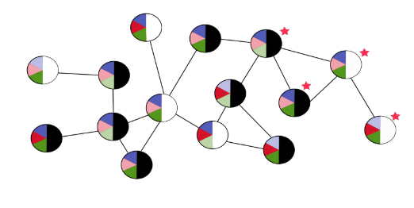

### Independent vs Collective

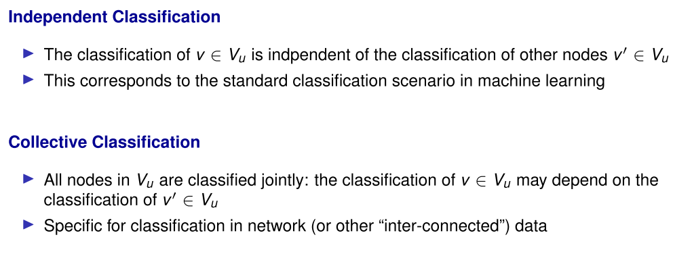

## Homophily

*Homophily, also known informally as “birds of a feather”, is when a link between individuals (such as friendship or other social connection) is correlated with those individuals being similar in nature. For example, friends often tend to be similar in characteristics like age, social background, and education level.*

> [S. Bhagat, G. Cormode, S. Muthukrishnan: Node Classification in Social Networks]

Mechanisms leading to homophily:

* *Social influence*: This indicates that people tend to follow the behaviors of their friends. The social influence effect leads people to adopt behaviors exhibited by their neighbors
* *Selection*: This indicates that people tend to create relationships with other people who are already similar to them;
* *Confounding variables:* Other unknown variables exist, which may cause friends to behave similarly with one another.

> [J. Sun and J. Tang: A Survey of Models and Algorithms for Social Influence Analysis]

### Homophily in Lazega Network

Collaborating lawyers are more likely to have the same Practice:

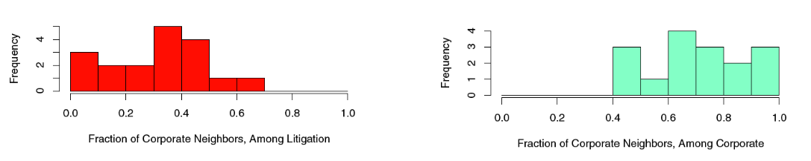

> Image from: E.D. Kolaczyk: Statistical Analysis of Network Data

Prediction

$$
Practice(i) = mode\{Practice(j) \mid j : Collaborate(i,j)\}
$$

only makes 5/34 errors assuming that when predicting Practice(i), the Practice of all other nodes j is known.

* Class memberships of nodes $u ∈ V_l$ can be a strong predictor for class membership of $v ∈ V_u$

## Independent Classification

**A generic approach**

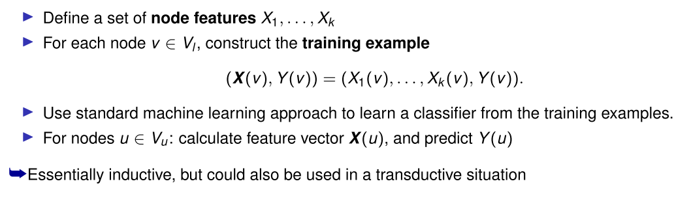

**Node feature constructions**

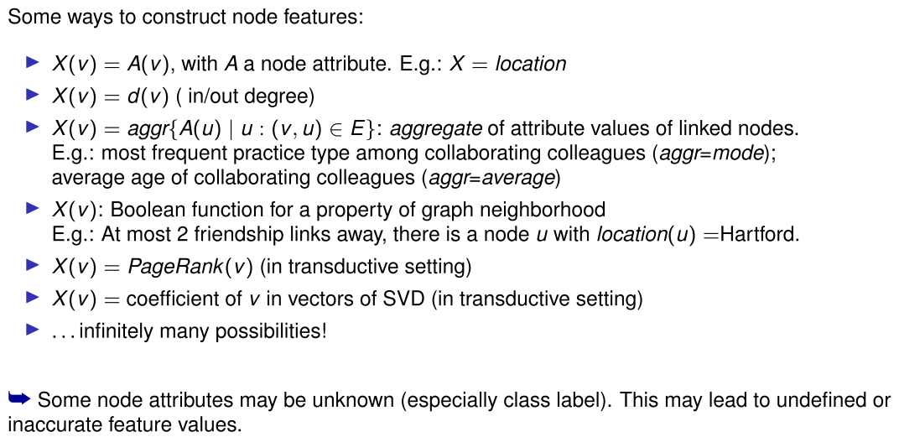

