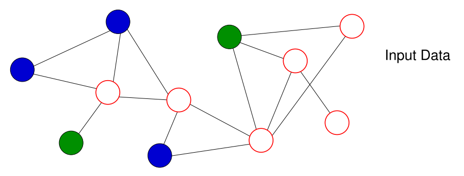
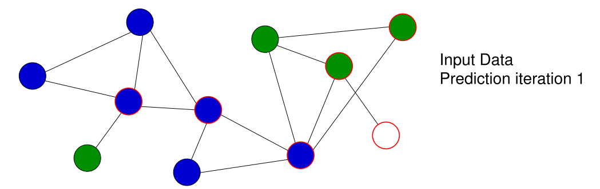
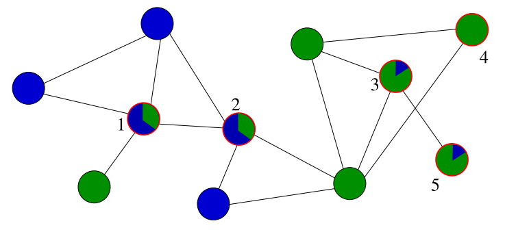

# Node Classification - Part 2

## Collective Classification

Nodes with class label black or white (no further attributes):

* Looking only at node a, predict it to be black or white?
* Looking only at node b, predict it to be black or white?
* Looking at all unlabeled nodes together, which color to predict?

### Iterative Independent Classification

Recall [Independent Classification](./09-node-classification.md#independent-vs-collective)

We assume a transductive scenario

**Given**

* $((V_l, V_u), \bold A, Y): \bold A$ observed for all nodes, class label Y observed for nodes in $V_l$
* Set of node features $\bold X_i$
    * May include features dependent on Y
* Classifier for predicting $Y(v)$ given $\bold X(v)$

* We use $\hat Y(v)$ to denote the predicted value for the true but unknown value $Y(v)\quad (v\in V_u)$
* The iterative method only makes sense if the features $\bold X(v)$ include features dependent on labels $Y(u)$ for some nodes $u \neq v$

#### Example

$\color{darkblue} \text{Blue}$: *Practice*=*corporate*, 

$\color{darkgreen}\text{Green}$: Practice=*litigation*

White: *Practice*=?, 

Red border: node in $V_u$.

#### Adding Learning to the Loop

**Given**

!!! example
    Example on slides 10.7

## Label Propagation

Similar to iterative independent classification based on neighbor majority vote. Difference:

* maintain predictions as probability distribution over all class label values

Probability distribution over labels for unlabeled nodes:

> [S. Bhagat, G. Cormode, S. Muthukrishnan: Node Classification in Social Networks, in: C.C. Aggarwal Ed.: Social Network Data Analytics, 2011.]

> [S.A. Macskassy, F. Provost: A Simple Relational Classifier. Workshop on Multi-Relational Data Mining (MRDM-2003)]

### Algorithm

!!! note
    finish notes!

## Word Embeddings

Embeddings so far:

* Texts $\to$ vector space model (observable features: tf, idf)
* User/products:
    * $\to$ (product) feature space
    * $\to$ latent space (latent features: SVD)
* (Social) network nodes $\to$ latent space (SVD)

Embeddings to come:

* Word embeddings: word2vec
* Node embeddings: node2vec

> Literature:
> Mikolov, Tomas, et al. "Distributed representations of words and phrases and their compositionality." Advances in neural information processing systems. 2013.

A word embedding maps the words of a vocabulary (or dictionary) into n-dimensional space of reals:

$$
e: \textit{Vocabulary} \to \R^n
$$

E.g. $n=100$ or $n=1000$

Goal: embedding encodes semantic meanings and relationships and supports multiple applications in natural language processing.

### Example

2-d projection of 1000 dimensional embeddings of countries and capitals:

> Source: [Mikolov et al., 2013]

$$
e(Berlin)- e(Germany) \approx e(Paris) - e(France)
$$

Application for analogical reasoning: to answer *“Berlin is for Germany what ??? is for France”*, compute:

$$
e(Berlin) - e(Germany) + e(France)
$$

and find the nearest word to this vector

