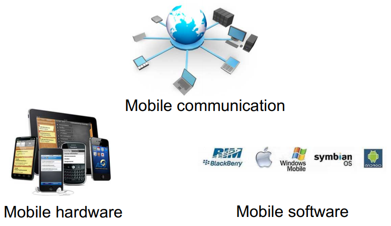

# Introduction

## What is Mobile Computing?

* Technology that allows **transmission of data**, **voice and video** via a computer or any other **wireless enabled device** without having to be connected to a fixed physical link. 

