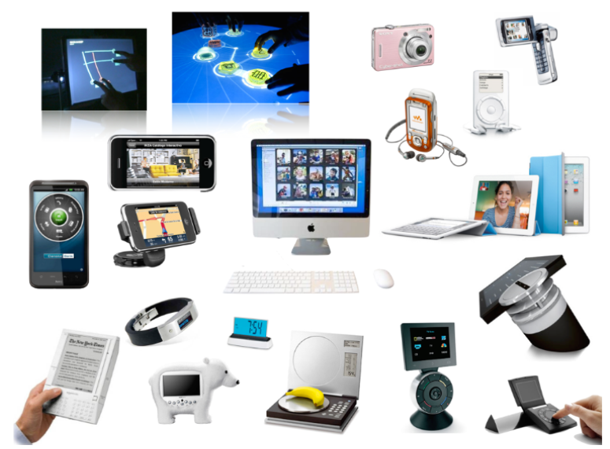
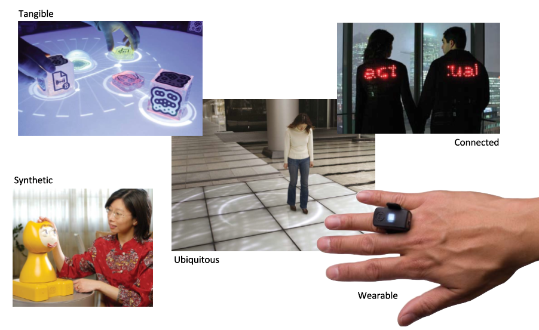
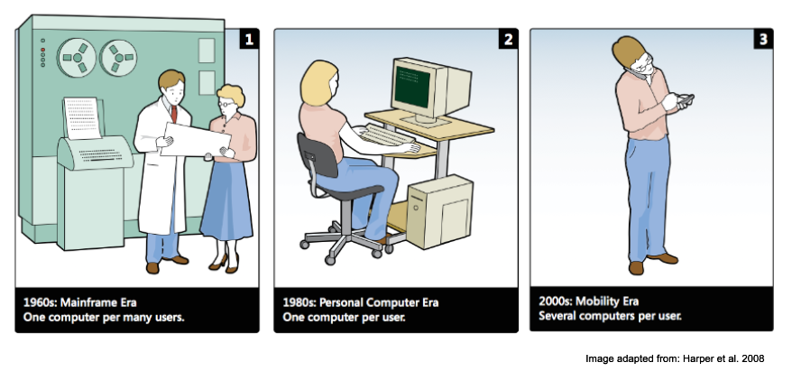
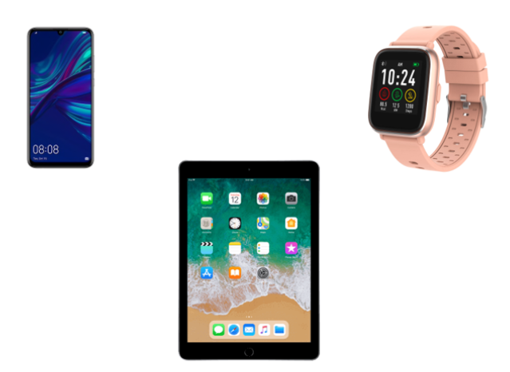
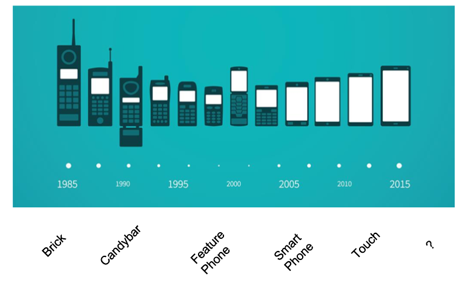
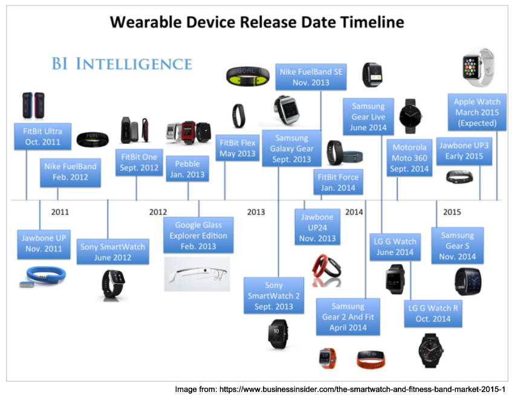

# mHCI Introduction

## What is HCI?

* Human Computer Interaction

Deals with the design and use of computers.

HCI Researchers and practitioners **observe** how people **interact** with computers and **design** technologies that allow humans to interact with computers.

HCI Research mainly produces/uses methods:

* for designing computer interfaces
* for developing interfaces
* for **evaluating** and comparing interfaces with respect to their **usability** and **other desirable** properties
* for studying their use and ther sociocultural implications

## History

### The Mainframe Era

1960

* Diffucult/impossible for normal people to use computers
* Must be effective to use, and small amount of errors

### Personal Era

1980

* Computers move into houses
* We use computers in other ways
    * Gaming consoles
    * Entertainment
* Computers should be easy to learn

## Design is not Trivial

* It is important how buttons are placed

### Computers are Evolving

* In every use-case there is a context

### Where are we Heading?

* Tangible interaction
    * We can touch the interfaces
* Synthetic HCI
    * "Human Robot Interaction"
    * How do we design robot interfaces
* Ubiquitious Interaction
    * Computers are everywhere
* Connected
* Wearable Computing
    * In Mobile HCI it is important

## What is MobileHCI?

Three eras of interaction

## What are we designing for?

Different devices

### Mobile Phones Timeline

### Wearables Timeline

### Why Mobiles

* People bring their mobile devices with them
    * Easy to notify them through your design
    * E.g. Google Maps asking how you trip was
* Designing for Mobile devices can offer more personal experiences
    * Deliver more personal information to people
* Mobile devices holds most of the features that other devices also have (and even perform better in some cases)
    * More sensors
* People spend more time in front of their smartphones than other personal devices