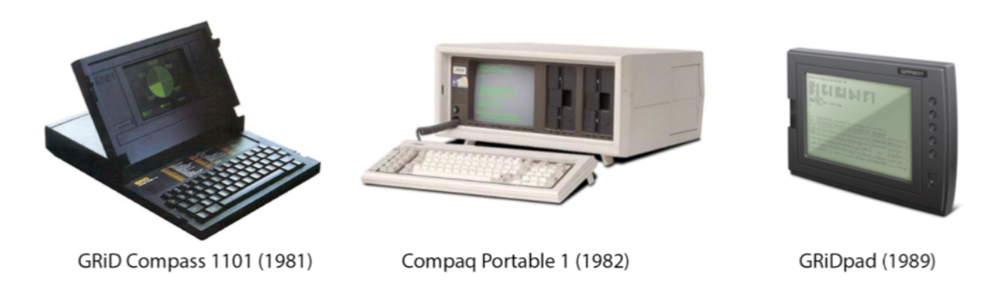
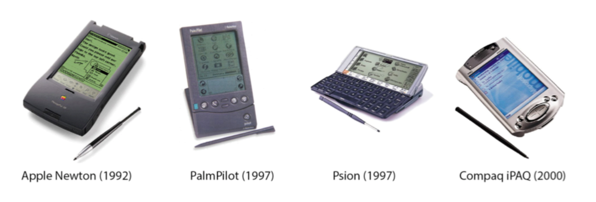
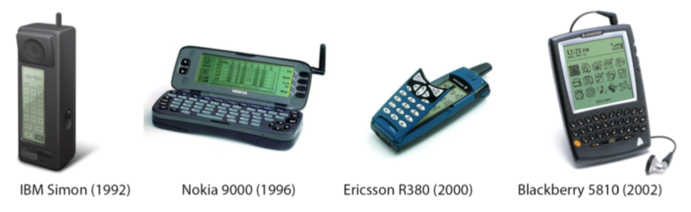
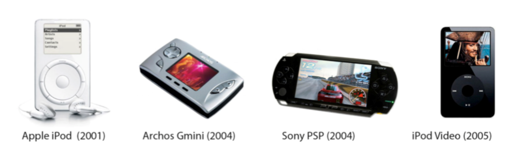
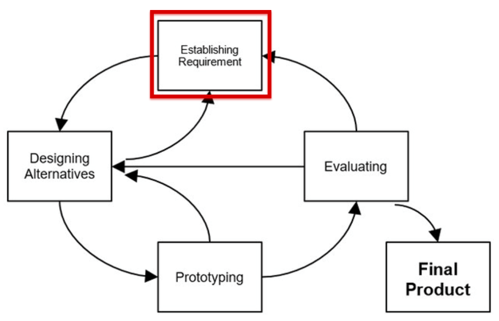
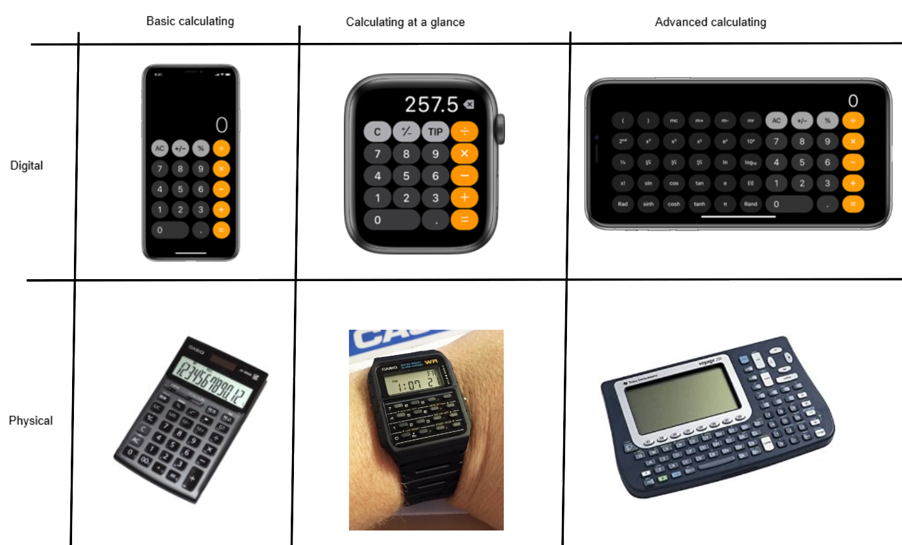
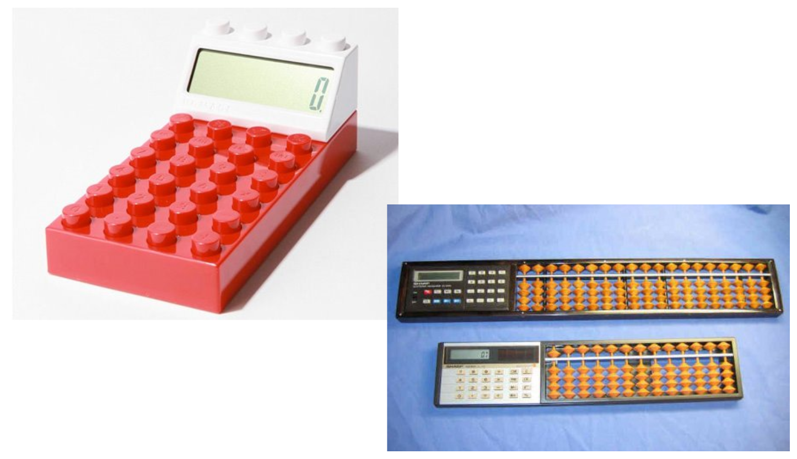
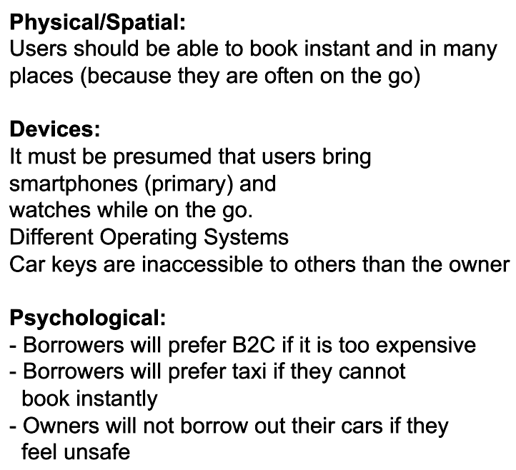

# MCHI Concepts and Understanding Context

## Characterising Mobile Computing

* Portability
* Miniturization
* Connectivity
* Convergence
* Divergence
* Apps
* Digital Ecosystems

### Portability

### Miniturization

### Connectivity

* Devices are getting connected
* Phone network
* Bluetooth and infrared

### Convergence

* Not just a phone or computer any more
* You can now play and do spreadsheets on the phone (Nokia 9000)

### Divergence

* Doing one thing well

### Apps

* In the beginning, only the manifactures made apps
    * limited selection
* Then came Developing kits and app stores

### Digital Ecosystems

## Defining the Context for our Design

### Establishing Requirements (understanding the context)

### What is important for your users?

### Calculator / Non Calculator?

### Who are your users and what is the context of use?

### Context (C) and context (c)

> The intent is to define the circumstances, or thetoric, of how communicate and understand ideas.
>
> -Mobile Design and Development

#### Context (big C)

> "Context enables us to better understand a person, a place, a thing, a situation, or even an idea by adding information to it"
>
> -Mobile Design and Development

**The Problem**

* What problems are you trying to design a solution for?
* What value do you want to bring for your users?

**Users and their situation**

* Who are your users and what do you know about them?
* How are they able to or how will they interact with your design?

**Location**

* What and where is it happening?

**Markets**

* How is your idea different from other design already available?

##### Example - Car Next Door

**The problem:**

* Little utilisation of private car park

**The Users:**

* Car owners, non-car owners

**Location:**

* Private cars scattered around town, same with users often on the go

**Other markets:**

* B2C car sharing
    * often more expensive

**The idea:** A mobile P2P platform for sharing privately owned cars

#### Context (small c)

> "The mode, medium, or environment in which we perform a task or the circumstances of understanding"
>
> -Mobile Design and Development

**Which requirements / constraints lies in the context?**

**Physical and spatial considerations**

* Are there any restrictions in the physical environment or the location?
    * (e.g will I be able to use the design all the time)

**Technological considerations**

* How are different devices present in different situations?
    * (e.g. why smart watches might be better than smartphones when running or swimming)

**Psycological/demographical considerations**

* Does users mental models and prerequisites for interacting with certain devices
    * (e.g. knowledge, common conceptions in the community)

##### Example - Car Next Door

**The Idea:** A mobile P2P platform for sharing privately owned cars safely. Instantly through wireless locks, and at a low price, compared to B2C solutions