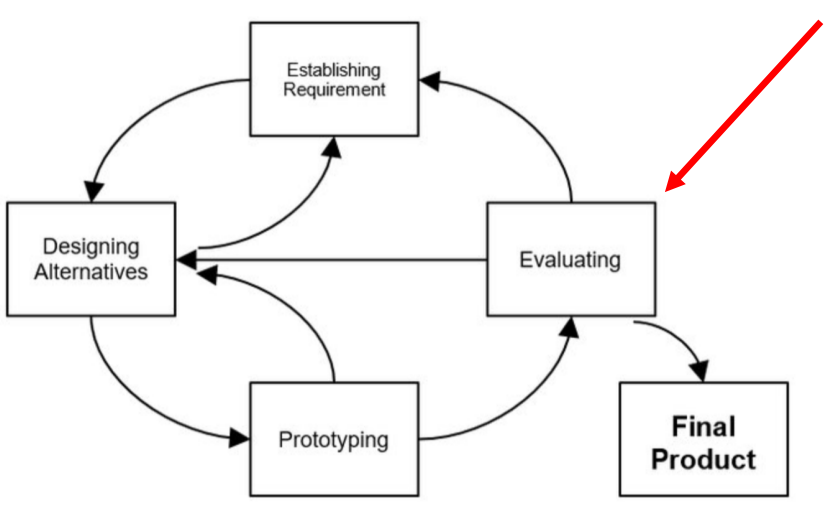
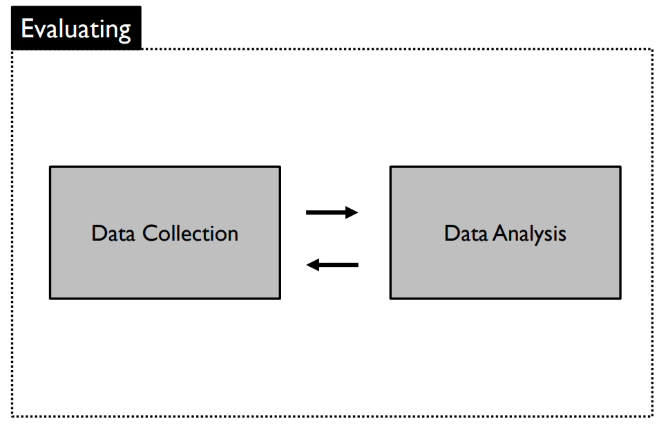
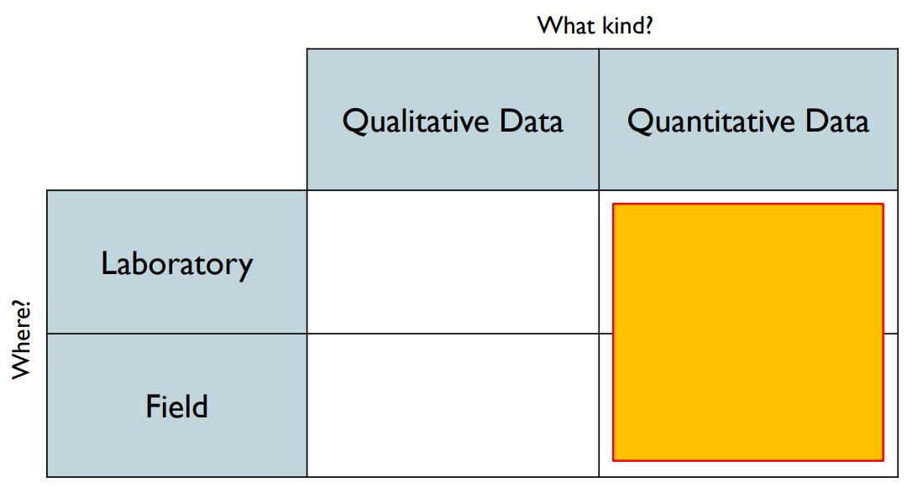
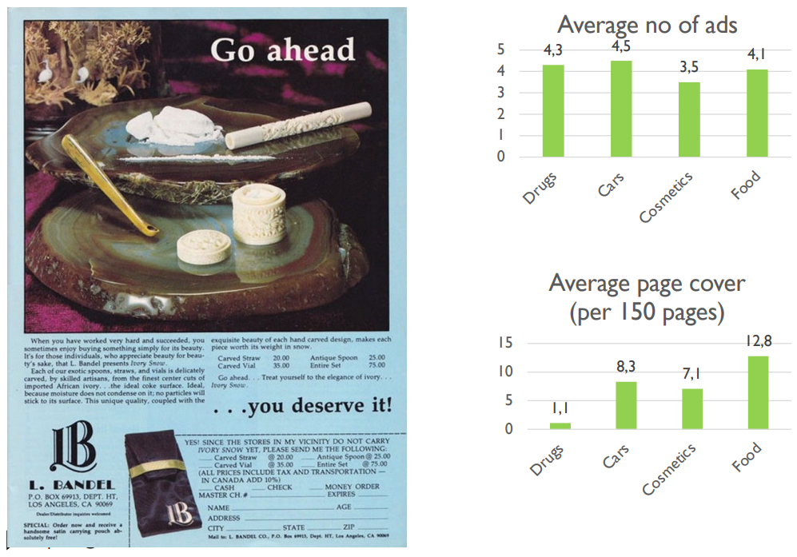
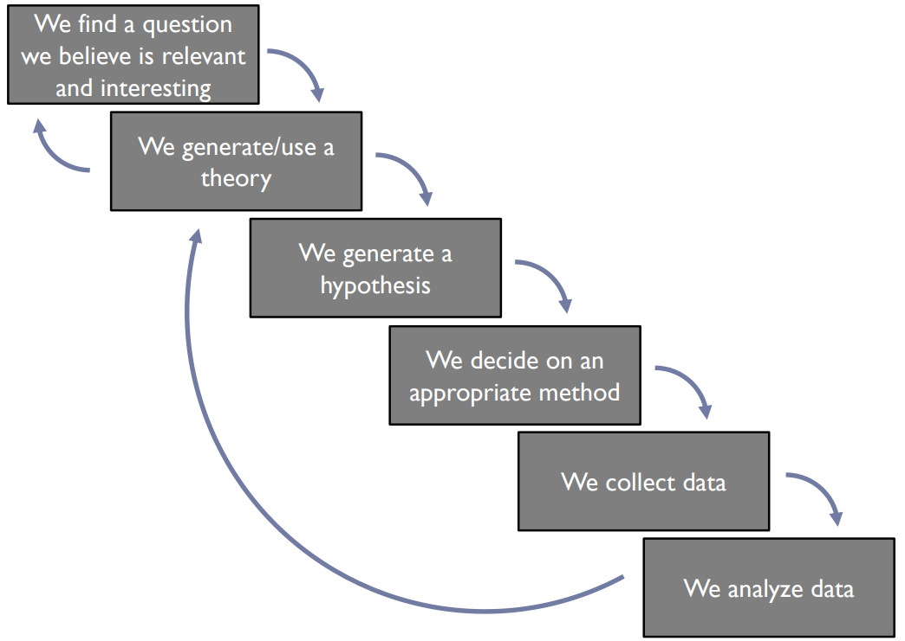
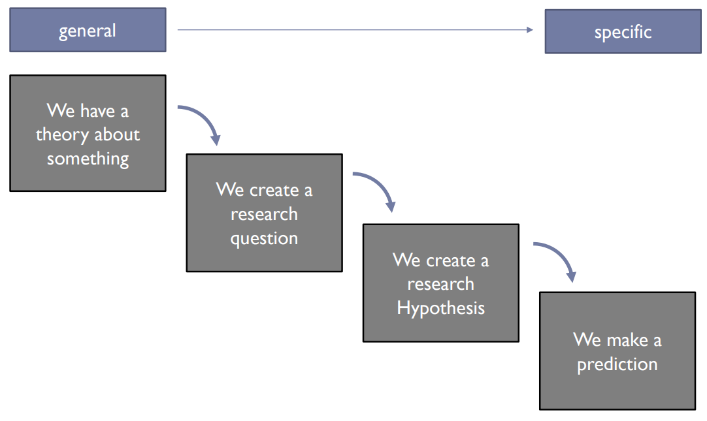
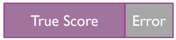

# 	Introduction to Quantitative Studies

Where are we in the Process?

## Data Collection

Typically takes place in a laboratory

* Able to control everything

Typed of collected data:

* Anything that can be understood as a number
    * Time 
    * Performance metrics
    * Success rates
    * Answers to questionnaires
* The difference is that data is structured and we usually collected them in order to answer a question!

### Examples of interesting questions across different fields

* Why sometimes people behave like idiots? (psychology)
* What’s the difference between Denmark and Germany in relation to racism (sociology/anthropology)
* What is the effect of smart phone usage to eye-sight? (medicine)
* What is the relation between sleep and athletic performance (sports studies)
* Which platform is fastest and why? (software)
* How can we make more money out of product X? (business)
* Why prototype A is better than prototype B? (Interaction Design)
* Why people like Donald Trump? (political science)

### How do we often get answers to our questions?

**Case 1: We use our *Intuition***

Or the “common sense”: We make general conclusions about the world around us based on anecdotal evidence (for example our own experiences/our cultural background).

* “Samsung is better than Apple”
* “All Arabs are terrorists”

More stuff (optional): 

* [List of cognitive biases](https://en.wikipedia.org/wiki/List_of_cognitive_biases)

**Case 2: We trust *Authority***

We tend to believe people or organizations because we assume they are credible.

* “Danes do not care about refuges” (European media?)
* “Gay couples are terrible parents” (Church?)

### Examples of wrong answers - Intuition

* “Since the first appearance of Rihanna, bacon sales have increased” $\to$ Listeners of Rihanna eat bacon
* “Since Kill Bill, yellow uniform sales have increased drastically” $\to$ More people want to look like Uma Thurman
* "If the Redskins win their last home game before the election, the party that won the previous election wins the next election and that if the Redskins lose, the challenging party's candidate wins.” $\to$ Fulfilled in 17 our of 19 US presidential elections since 1937

More stuff (optional):

* [Lying with statistics](http://www.stat.columbia.edu/~gelman/bag-of-tricks/chap10.pdf)
* [Correlation does not imply causation](https://en.wikipedia.org/wiki/Correlation_does_not_imply_causation)

### Examples of wrong answers - Authority

### How do we get valid answers to our questions?

* We use the *Scientific Approach*
    * Intuition and/or authority are used to generate ideas about a phenomenon/behavior
    * *Skepticism*: ideas must be evaluated on the basis of careful logic and results from scientific investigations
    * *Empiricism*: knowledge is based on observations and the study of reality

Example

* We believe mobile application X is more usable than Z
* we need to run an experiment in order to observe representative user’s and acquire scientific knowledge
* Even if we prove we are wrong, this knowledge is useful (*falsifiability*)

### Questions and answers, opinions and claims

* Which questions are scientific?
    * The ones that can be **tested** by collecting and analyzing quantitative data!

* Which answers are evidence based and not opinions? 
    * The ones that emerged by applying the Scientific approach!

### How are all these related to HCI and mHCI?

* Because HCI and mHCI is about studying users’ behaviors/feelings/emotions when they interact with technological artifacts.
* We study Interactions to:
    * *Describe* users’ behaviors
    * *Predict* their behavior in the future
    * Determine the *cause* of their behaviors
    * *Explain* their behavior

## Quantitative methods in mHCI

**Quantitative methods** emphasize **objective** measurements and the statistical, mathematical, or numerical analysis of data collected through polls, questionnaires, surveys, or logfiles, using computational **techniques**. 

**Quantitative research** focuses on gathering numerical data and generalizing it across groups of people, or to explain a particular phenomenon

### Quantitative Research Methods in mHCI

**Case studies**

* Intensive empirical investigations of contemporary phenomena within small size entities such as groups, organizations, individuals, systems or tools in real-life context with the researcher distinct from the phenomena being studied.

**Field studies**

* Characterized by taking place in “the real world” covering a range of quantitative approaches in which a number of independent variables are manipulated.

**Usage Studies**

* Large-scale log-file based test-scenario in which a newly designed system is exposed to its target users in order to test its resilience under real-use conditions, and if and how it is employed for the tasks for which it was intended.
    * A/B testing

**Lab experiments/studies**

* Characterized by taking place in a controlled environment created for the purpose of research or in dedicated laboratories allowing a detailed focus on specific phenomena of interest with a large degree of experimental control.

**Surveys**

* Informs research gathers large amounts of data through various techniques such as questionnaires and interviews from a known sample of selected respondents assumed to be independent of their environment.

### Quantitative Research Methods Purposes in mHCI

**Understanding**

* The purpose of research focusing on finding the meaning of studied phenomena through, for example, frameworks or theories developed from collected data.

**Engineering**

* The purpose of research focused towards developing new systems or parts of systems, for example an interaction technique for a mobile device, or a mobile application or device.

**Re-engineering**

* The purpose of research focusing on improving existing systems by redeveloping them such as, for example, adapting a web browser to a small display

**Evaluating** 

* The purpose of research assessing or validating products, theories or methods, for example, the usability or user experience of a specific application, or a theory of interaction.

**Describing**

* The purpose of research focusing on defining desirable properties of products, for example, a mobile guide system.

### Quantitative Research Process

1. Theory 
2. Hypothesis
3. Research Design
4. Devise measures
5. Select research sites
6. Select research subjects
7. Collect Data
8. Prepare and Process Data
9. Analyze Data
10. Derive Findings
11. Write up findings
12. Go back to 1

#### Initial Steps

Theory:

* An explanation of a situation/phenomenon

Research Question

* A description of the broad topic of study

Hypothesis

* A specific idea or question which can be tested through empirical investigation (using the scientific approach)

Prediction

* A deliberate guess to answer the Hypothesis

#### Example

**Theory**

* “There are differences among groups of people on how they perceive the mobile Facebook Interface”

**Research Question**

* “Are there any differences among groups of people on how they perceive the mobile Facebook Interface?"

**Hypothesis**

* “Males perceive the mobile Facebook Interface as more usable than Females”

**Prediction**

* “Males are more likely to perceive the mobile Facebook Interface as more usable”

#### Research Question vs Hypotheses

**Research Question:** “Are there any differences among groups of people on how they perceive the Facebook Interface?"

* **Hypothesis A**: “Males perceive the mobile Facebook Interface than as more usable than Females”
* **Hypothesis B**: “Rich perceive the mobile Facebook Interface as more usable than Poor”
* **Hypothesis C**: “Europeans perceive the mobile Facebook Interface as more usable than Asians”
* **Hypothesis D**: “Experts perceive the mobile Facebook Interface as more usable than Novices”
* ...
* **Hypothesis N**: ...

### Null and Alternative Hypothesis

* **Null hypothesis**: There is no difference between the conditions
* **Alternative hypothesis:** There is difference between the conditions
* They have to be mutually exclusive

**Example**

* Null hypothesis “ H~0~: Males do not perceive the mobile Facebook Interface as more usable than Females”

* Alternative hypothesis “H~1~: Males perceive the mobile Facebook Interface as more usable than Females”

#### Why do we have null and alternative hypothesis?

* Long tradition in experimental research
* In statistics we **do not** test if two conditions are different
* We **do** test if there are the same!

**Example**

We take a random sample of mobile Facebook users. We assume there is **no difference** between sexes in relation to usability (null hypothesis, H~0~, is true).

Through a statistical test we check if there are **significant differences** between sexes.

 If there are no statistically significant differences, then we **accept** the H~0~ as true.

 If there are differences then we **reject** H~0~, and we can conclude that the alternative hypothesis (H~1~) is true.

**Significance**: there is a very low probability that the result is occurring by chance

#### Variables

**H~1~**: “Males perceive the mobile Facebook Interface as more usable than Females”

* In order to test our hypothesis we need to measure or manipulate something. All the things we can measure or manipulate are called **variables**.
* Any variable must have more than two levels

#### Operational Definitions

For every variable we need a defined procedure to measure or manipulate it.

If there are many options, we need to select one. The selected procedure is called the **operational definition** of the variable

Example: **Aggression**

* The number of times a kid hits a toy
* The number of times a kid fights with another kid
* A score on a aggression questionnaire
* The number of times a kid cursed, etc.

Example: **Usability**

* Perceived usability
* Task completion times/rates, etc.

#### Adequacy of our Operational Definitions: Types of Construct Validity

* **Construct Validity:** The adequacy of our operational definition
    * **Content Validity**: The content of our measure is linked to the true meaning of the variable
    * **Convergent Validity**: Scores of our measure are related to other measures of the same construct
    * **Discriminant Validity:** Scores of our measure are not related to other measures that are theoretically different
    * **Other types:** face validity, predictive validity, concurrent validity

### Measuring

* Every time we measure a variable there is an error
* The smaller the error, the better (obviously!)
* Standard units of measurement ensure the error is minimal

* Any examples of standard units of measurement? What about within software?

!!!todo
    fill in from slides 32-46

