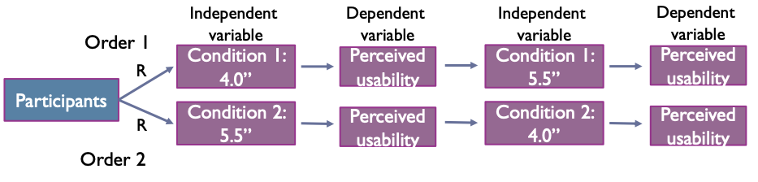

# Lab Experiments

## Basic Experiment

Our case: H~1~: "The screen size of a mobile phone has an effect on the perceived usability of mobile Facebook Interface"

**Manipulating the independent variable**

**Defining the levels/conditions/groups/treatments**

### Narrowing down the number of levels

* We select the extreme cases - in our example 2.4’’ and 5.5’’
* We select most common conditions with the largest possible distance - in our example 4.0" and 5.5"
* We group the cases into two categories - in our example *small screens* and *large screens*
* Other ways that are meaningful in the context of our experiment

Using THE RULE

* The two conditions must differ only in relation to the independent variable

### Selecting participants

* We need to select a **sample** that will participate in our experiment that is representative of the **population**
* The population is defined as all the individuals of interest
* With proper sampling we assume the results we will get from the sample will also apply to the population

#### Sampling Techniques

* **Probability sampling**
  * Each member of the population has a specifiable probability of being chosen to participate in our experiment
* **Nonprobability sampling**
  * The probability of any particular member of the population to be chosen is unknown

### Assigning Participants to Conditions

#### Within-group designs

* The **same** participants experience both conditions
* Often called **repeated measures design**

**Advantages**

* We need **less** participants
* The systematic error caused by the participants will be the **same** in both conditions - easier to get better results

**Disadvantages**

* Hard to control the **practice**, **order**, and **fatigue** effects

##### Counterbalancing

* All possible orders of conditions are included in the experiment

#### Between-group designs

* **Different** participants experience the conditions
* Often called **independent groups design**

**Advantages**

* Easier to control the **practice, order**, and **fatigue** effects - often do not exist

**Disadvantages**

* We need **many** participants
* The systematic error caused by the participants' characteristics is more **difficult** to control

### Statistical Technique

* **Within-group** design => Paired samples t-tes

* **Between-group design** => Independent t-test

**Reporting**

We conducted an independent samples t-test to locate possible interaction effects.

Results showed a **statistically significant different** in the perceived usability scores for the participants that used the large phone (M=XX, SD=XX) and the ones that used the small one (M=XX, SD=XX).

$t(58)=1.329,\quad p=.013$

**The rule for every statistical test**

* Make sure you follow the test's assumptions!

### What if we have more than two conditions?

Which statistical technique to use?

* More than two conditions
* One categorical independent variable
* One continuous dependent one

**Reporting**

In order to test if the three groups were affected in their perceptions on usability by the screen size, we conducted oneway independent ANOVA 

Having one independent variable (screen size) and one dependent variable (perceived usability). 

No significant effects were observed: $F(2,57)=1.532,\quad p=.225$.

## Complex experiment

...

### Interpretation of Factorial Designs

* We can have two types of results
  1. Results about the effect of **each** independent variable on the dependent variable (**main effect**)
     * The effect of the independent variable on the dependent by itself
  2. Results about the **interaction** between the two independent variables (the effect of one independent variable **depends** on the particular level of the other one)

**Result**

**Possible outcomes of experiment**

* There may or may not be a **significant main effect** for screen size
* There may or may not be a **significant main effect** for weight
* There may or may not be a **significant interaction** between screen size and weight

### Assigning Participants in Factorial Designs

* All participants are different in each condition
  * Independent groups (between-subjects) factorial design
* The same subjects participate in all conditions
  * repeated measures (within-subjects) factorial design
* Combinations of the above
  * mixed factorial design

**Example**

Independent variable A (two levels A1, A2), Independent Variable B (B1, B2) have an effect on a Dependent Variable

### Which statistical technique to use?

More than 2 experimental conditions, more than 2 categorical independent variables, one continuous dependent one

