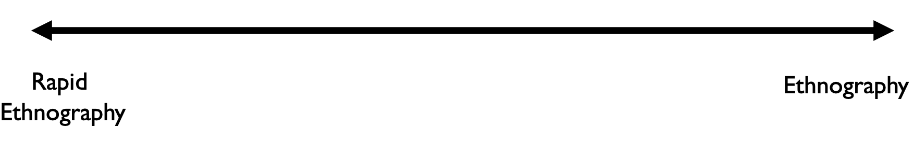
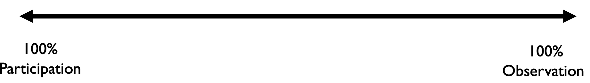
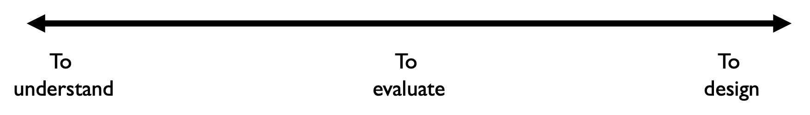
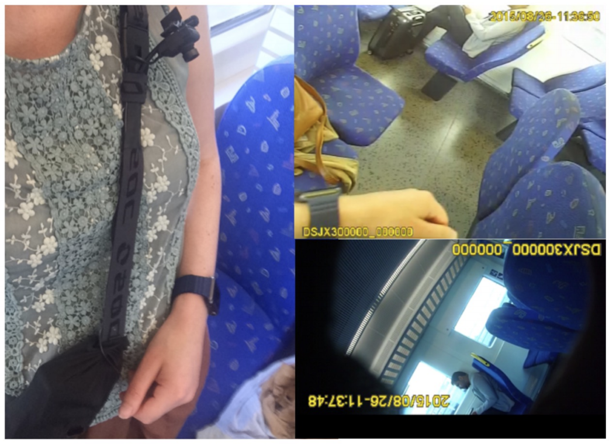

# Field Experiments

**What is the Field?**

* We refer to as Field studies the studies that occur in **natural** settings
* They started as long-term studies of people mainly within the fields of anthropology and health
* Often, they are called ***in the wild*** studies
* Contrary to the lab settings where we want almost everything under our control, in the field we need things to be out of control, natural, authentic
* We often collect both quantitative and qualitative data

**Why?**

* We need to get info about interactions that we wouldn’t be able to get otherwise 
  * e.g. some of the participants might not even realize what they are doing
* To see how our product/prototype fits users’ **’natural habitat’**
* To understand the complex practices of our users in general

## Three Axes of Field Work

* **Time**! - How much time will we spend to study a phenomenon/situation?
* **Engagement**! - How much will we interfere?
* **Purpose**! - What is our purpose with the study? 
* All three are interconnected and we can have different combinations

### Time

In other domains, field studies are extensive (ethnography). Within HCI and mHCI we usually have narrower time frames

### Engagement

How much are we willing to interfere?

### Purpose

Why are we doing this?

## Some challenges in conducting field work

* Challenge 1: How can we **collect data** of what is going on **all the time**?
* Challenge 2: How can we make people **talk/reflect**, even if we are not there?

### Challenge 1 - Collect data all the time

We need to find innovative ways for collecting data

* When the situation unfolds (real time)
* Without interfering too much (unobtrusively)
* In ways that allow us to find out what is going on (informatively)

#### An example: How do people use smartwatches and why?

> Stefania Pizza, Barry Brown, Donald McMillan, and Airi Lampinen. 2016. Smartwatch in vivo. In Proceedings of the 2016 CHI Conference on Human Factors in Computing Systems (CHI ’16). Association for Computing Machinery, 5456–5469. https://doi.org/10.1145/2858036.2858522

Research Area: 
“Yet it is not clear how smartwatches are used and integrated into everyday life differently from mobile phones” 

Method: 
“We used wearable cameras to record twelve participants’ daily use of smartwatches, collecting and analysing incidents where watches were used from over 34 days of user recording”

**Some of the research questions**

* For example, what does a wrist worn technology support in contrast to the screen of a mobile phone?
* How does the stream of notifications received on a smartwatch and mobile phone compare in this regard? (distraction) 
* How are these functions [Health tracking] actually used and in what way do they integrate themselves with daily practice? 
* What limitations and possibilities can we identify from closely studying smartwatches [...] for future design and innovation?

**Data collection**

> We had participants wear multiple portable wearable cameras that recorded their actions relatively unobtrusively, while allowing us to see and understand smartwatch use in vivo. We made a small ‘sensor bag’ which contained two cameras with long-life batteries that allowed them to record for eight hours each. One of the cameras was directed to record the scene around the participant (pointing forward).
>
> The second camera was connected to a small ‘stalk’ camera that was mounted at the shoulder of the participant (looking downwards), so as to capture the participant’s body and wrist.This angle captured interactions with the watch.

**Data analysis**

* Our analysis started by watching the video and extracting clips where there was any interaction around or with the watch. 
* All authors collectively watched all ‘watch use event’ clips, around 8 hours of video in total
* We selected for closer analysis clips that were particularly revealing of smartwatch use
* This smaller corpus of 110 clips was used for a more lengthy analysis of the interaction around the watch to examine patterns of talk, device, and bodily interaction

**What was a smartphone used for?**

* Time
* Notifications
* Activity tracking
* Talking to the Watch
* Other Interactions

**What can the smartwatch be used for in the future?**

* Distractions
  * The watch may simply reduce the need, or temptation, to take the phone out.
* Time and sociality
  * The watch can serve as a way of reducing time spent on the phone, and to also balance availability to others with one’s own concerns and demands
* Design and smartwatch:
  * Similarly, we might think about applications that allow for retrospection. A simple application might, for example, record times spent in different places, or time spent in different activities (such as conversation)

### Challenge 2 - Making people talk/reflect, even if we are not there?

We need to find ways for collecting data:

* When the situation unfolds (real time)
* In ways were people will want to provide us with their knowledge (engagement)
* In ways that allow us to find out what is going on (informatively)

#### An example: Engaging tools for data collection

> Interaction Research Studio (2019) ProbeTools: Unconventional Cameras and Audio Devices for User Research. Interactions, March-April 2019. https://interactions.acm.org/archive/view/march-april2019/probetools

* ProbeTools are fully self-contained digital devices robust enough to be used in the field. Each one offers a unique and engaging way for people to tell you about themselves and their everyday lives
* They can be used in a variety of settings to allow us to have access in data from the field
* They can be combined with other data collection techniques , such as questionnaires, log data, etc.

**What kind of ProbeTools are available?**

* TaskCam lets people take pictures in response to prompts (tasks) displayed on a small screen on the back of the camera. Participants can scroll through tasks, select one, and take a picture in response.
* VisionCam captures time-lapse images when it is activated, using computer vision to retain only contour animations— similar to line drawings—to protect privacy and enhance aesthetic interest. It is designed to be a non-invasive way to record events over time at home or in public spaces.
* Interviewer asks people questions that you record, then pauses for a short time to record their answers. Digital audio processing is used to change both the questions and the answers to anonymize voices

**What can we get out of ProbeTools?**

There are no right answers when it comes to probes. They are designed to be empirically grounded, yet open to interpretation. They rely on imagination and provisional speculations. Their purpose is not to produce validated, detailed accounts of participants’ lives, but rather hints and clues that can be a starting point for design
