# Exam Questions

## :white_check_mark: Question 1

* How can we define and characterize mobile computing? 
  * Give examples of the different eras. 

* What is context and why is important for mobile computing? 
  * What is Big C and Small C? 
  * How can we communicate context to others?

----

**Mobile computing**

* *Mobile computing can be divided into a number of eras, or waves, each characterized by a particular technological focus, interaction design trends, and by leading to fundamental changes in the design and use of mobile devices*

* Divided into eras - characterized by

  * particular technological focus
  * interaction design trends
  * by leading to fundamental changes in design and use of mobile devices

* **Eras**

  * **Portability**

    * 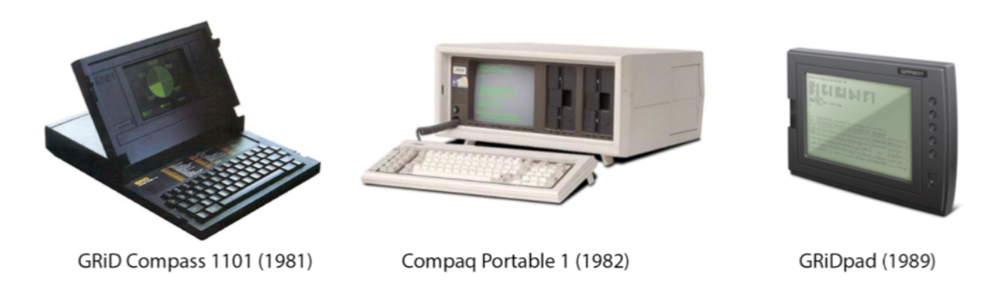

  * **Miniturization**

    * 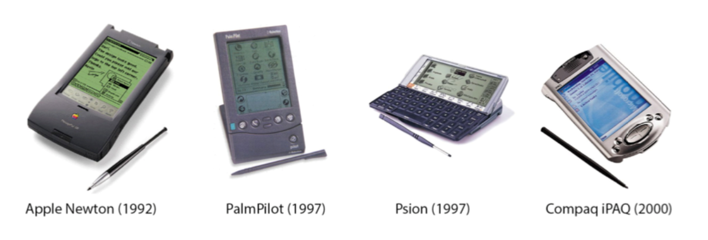

  * **Connectivity**

    * 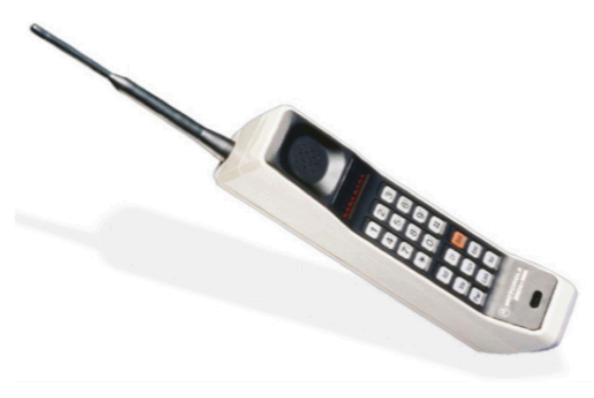

  * **Convergence**

    * "doing many things"
      * Not just phone or computer anymore
      * You can now play and do spreadsheets on the phone (Nokia 9000)
    * 

  * **Divergence**

    * "Doing one thing well"

    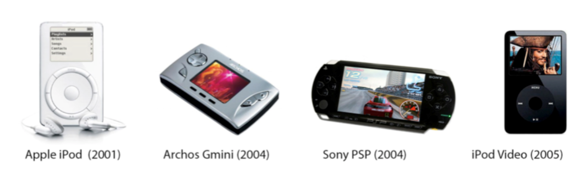

  * **Apps**

    * In the beginning, only the manifactures made apps
      * limited selection
    * Then came Developing kits and app stores
      * Google Play - Apple App Store

  * **Digital Ecosystems**

    * 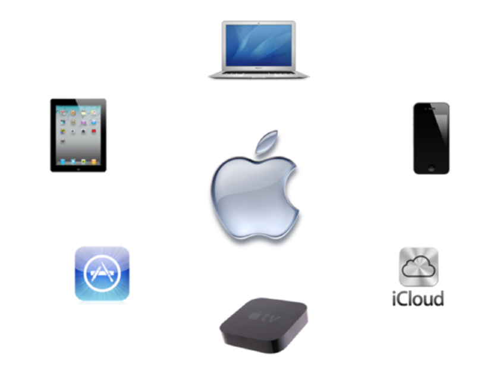

**Context**

* Everything about how something is used, who uses it, where, when and how
  * What is important to the users, which can depend on different external factors
* *The circumstances that form the setting for an event, statement, or idea, and in terms of which it can be fully understood*
* Context is important for mobile computing
  * The context can easily change because of mobility
  * Car vs train vs at home
    * Example - Spotify Car Mode
* Context can be defined in two ways
  * Big C - Context
  * Small c - context

**Big C**

* *“Context enables us to better understand a person, a place, a thing, a situation, or even an idea by adding information to it”*
* "How the users will derive value from something they are currently doing" / "the understanding of circumstance"
  * "standing in front of Berlin Wall and reading about it on Wiki" => adding Context to task
* "This information is providing me Context or better understanding of what this moment in time means to me"
* **Some Questions**
  * **The Problem**
    * What problems are you trying to design a solution for?
    * What value do you want to bring for your users?
  * **Users and their situation**
    * Who are your users and what do you know about them?
    * How are they able to or how will they interact with your design?
  * **Location**
    * What and where is it happening?
  * **Markets**
    * How is your idea different from other designs already available?

**Small c**

* "the mode, medium, or environment in which we perform a task" / "the circumstances of understanding"
* Using phone in car    => more private information, but restricted because driving
* Using phone in train => less private information, but not restricted
* Understanding how the location changes a users behavior and what they want from their device
* **Which requirements / constraints lies in the context**
  * **Physical and spatial considerations**
    * Are there any restrictions in the physical environment or the location?
      * e.g. will I be able to use the design all the time?
  * **Technological considerations**
    * How are different devices present in different situations?
      * e.g. why smart watches might be better than smartphones when running or swimming
  * **Psycological/demographical considerations**
    * Users mental models and prerequisites for interacting with certain devices
      * e.g. knowledge, common conceptions in community etc.

**Communicate Context:**

* **Personas**
  * Helps maintain **perspective** of **users**
  * **Fictional** - created based on **research** - **never** of **assumptions**
  * Represent different **user types**
  * Helps understand users’ **needs**, **experiences**, **behaviors** and **goals**.
* **4 types**
  * **Goal oriented**
    * Users' goals - workflow, contexts, attiturdes
    * Based in **in-depth ethnographic research**
    * Provides focused design and communication tool to finish discussions 
  * **Role based**
    * Users roles in organization 
    * **data-driven** - incorporate data from both qualitative and quantitative sources
    * efficient design tool - our cognitive ability to use fragmented and incomplete knowledge to form complete vision of people who surround us
  * **Engaging**
    * Designers seeing users as stereotypes -> actively involved in the lives of personas
    * Requires **broad knowledge** of users
      * Data should include information about - social background, psychological characteristics, emotional relationship with the focus area.
  * **Fiction based**
    * To explore and design - generate discussion and insights
    * Based on intuition and experience
    * Creates an empathetic focus in the design process
    * Originate from brainstorming and workshops - participation from company
* **How - 11 steps**
  1. Collect extensive data on target users.
  2. Determine the qualities of and differences between users.
  3. Develop a hypothesis from the research, determining the qualities of and differences between users.
  4. Ensure stakeholders agree on the hypothesis about the users.
  5. Determine a number of personas – more than one per project, but focus *especially* on one
  6. Name and describe each persona in 1-2 pages, including:
     * A picture.
     * (CONTEXT): User’s values, interests, education, lifestyle, needs, attitudes, desires, limitations, goals and behavior patterns.
     * Extra details about the persona (e.g., interests) – anything to make him/her more real and relevant and help build empathy. A written story is better than bullet points.
  7. Describe several situations/scenarios prompting the persona to use your product – put him/her in contexts with problems to overcome.
  8. Include everyone involved in the project so they’ll accept the persona or advise revisions.
  9. Send them the persona to use in their work
  10. Ensure everyone develops scenarios – these should expose the persona optimally to potential use cases
  11. Make continuous adjustments – revisit the persona; add new features; add required new personas; discard outdated personas.

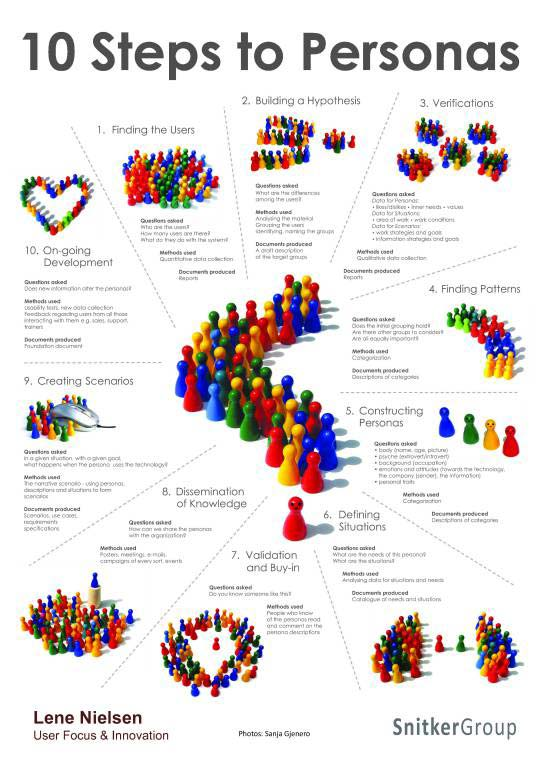

## :white_check_mark: ​Question 2

* How can we collect data about the context of our idea? 
  * Give examples of the different ways of communicating your idea to other team members/costumers/users?

-----

**Collect** data:

* **Contextual** Inquiry
  * **Interviews** (deep)
    * **Structured** - almost questionare - Replicable - lacks richness
    * **Semi-structured** - loose script - balance between richness and replicability
    * **Unstructured** - no script - rich - not replicable
    * **Focus groups** - group interview
    * 
    * **Interview tips**
      * Open questions
      * Avoid Leading questions that make assumptions
      * Learn the participants language
      * Use probe questions
        * *Tell me more about...You said “desperate.” What do you mean by that?*
      * Accept awkwardness (*pregnant pauses*)
  * **Questionaries** (general)
* **Inspection **- **Observation**
  * **Roles**:
    * **Observer Participant** - fly on the wall
    * **Participant Observer** - field worker is full participant in activities studied
  * [**Technology Tours**](https://www.moodle.aau.dk/pluginfile.php/2233097/mod_resource/content/1/mHCI%20Lecture%202.pdf)
    * **What to Observe**:
      * **Space** - physical space - actors: names and relavant details of people involved
      * **Activities** - what are actors doing and why?
      * **Objects** - physical objects present (eg. furniture) - Acts: specific individual actions
      * **Events** - Observing part of special event?
      * **Time** - Sequence of events
      * **Goals** - Actors trying to accomplish?
      * **Feelings** - Mood of group and individuals
* **The challenge** - *what people **say** and what they **do** are **not** the same.*
  * **Combine** interview and observation - **triangulation**

**Communicate** idea:

* **Storyboard**
  * *"A storyboard communicates a story through images displayed in a sequence of panels that chronologically maps the story’s main events."*
  * Used to gain common ground
  * Research and usability
  * **Parts**
    1. **Scenario**
       * Who is persona?
       * Short text describing scenario
         * E.g. *Corporate buyer, James, needs to replenish office supplies*
    2. **Visuals**
       * Each step in scenario is represented visually in a sequence - sketches, illustrations, photos
       * Include details relevant to the story
         * what the users environment looks like
         * speech bubbles with quoutes from the user
         * sketch of the screen user is interacting with
       * 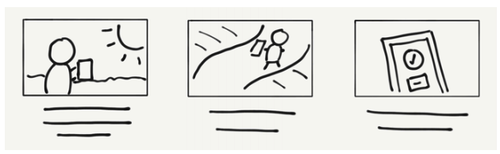
    3. **Captions**
       * Each visual has corresponding caption
       * Caption describes user's actions, environment, emotional state, device, and so on
       * Captions are concise and dont typically exceed two bullet points
  * **Steps**
    1. Gather your data (ie. interviews)
    2. Choose fidelity level (ie. sketches, photos)
    3. Define basicsx (persona and scenario)
    4. Plan out steps (which steps will storyboard contain)
    5. Create visuals and add captions (create you storyboard - stick figures are okay)
    6. Distribute and Iterate (ie. to audience, stakeholders)
* **Wireframes**
  * *Wireframes are used early in the development process to establish the basic structure of a page before visual design and content is added*
  * Demonstrates **key** elements of a **design**
  * Demonstrates **key** structure of a page/app
  * Low-fidelity: Quicker and cheaper to make changes to
* **Mock-ups**
  * *Mock-ups are used by designers mainly to acquire feedback from users about designs and design ideas early in the design process. Mock-ups are 'very early prototypes' made of cardboard or otherwise low-fidelity materials.*
  * Visualises the key elements of a design
  * Still not final design, but conveys more design than wireframes
  * Low-fidelity: made quicker and dirty - easy to make changes to
    * Example in cardboard

## :white_check_mark: Question 3

* What is a digital ecosystem? 
  * How can we classify interaction with multiple mobile devices in a digital ecosystem? 

* Give short examples of the four categories of interaction (Collaboration, Communality, Complementarity, Continuity)

----

**Digital Ecosystem**

* **Theoretical Framing**
  * A network of **nodes** interacting - consists of users and digital artifacts, bound dynamically by the users' actions
* When a user interacts with not just one, but multiple devices at once
  * or multiple users interact with a single device
* Example:
  * Google Cast
  * Apple's announced Universal Control - move cursor from Mac to iPad

**Classify interaction with multiple mobile devices in ecosystem**

With a **focus on interaction** 4 structures emerges - like a database

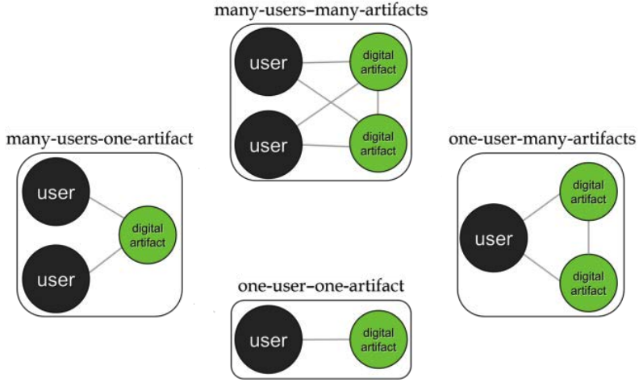

* The interesting structures are the three with either **many users** or **many artifacts**
* We can further divide interactions with several artifacts into two
  * **Sequential **- users first interact with one device - then continues with another device
    * Example: Checking emails on phone - then moving to desktop to read specific one or answer
  * **Simultanious** - users uses several devices at once
    * Example: Overview of calendar on large screen while sending meeting invitation from phone
* This leads us to the **4C Framework**
  * Combines the structural relationships of many users and many artifacts with the differentiation between sequential or simultaneous in a 2x2 matrix

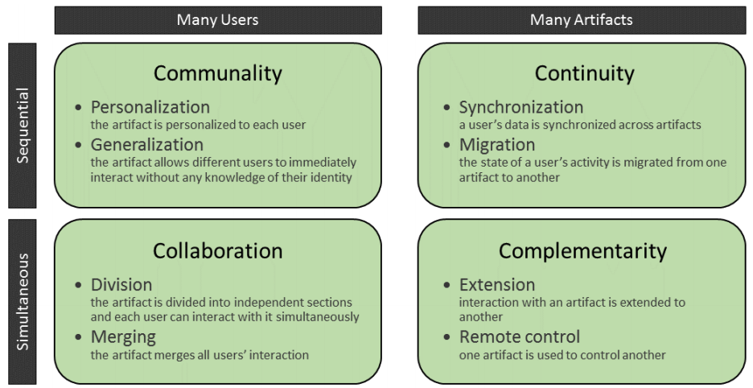

**4 Categories of interaction**

* **Communality**
  * Artifacts are shared between users, but only one user interacts at a time
  * **Subcategories**
    * **Personalization** - relationship between users and artifacts are individual and tailored to each person	
      * Example: Accounts on social media on shared tablet
    * **Generalization** - relationship is same for everyone
      * Example: Ticket booth at train station - automatic passport photobooth
  * Might seem trivial - but decision can have great impact on system
    * Eg. login can be irrelevant
* **Collaboration**
  * Simultaneous interaction by many users
  * **Subcategories**
    * **Division** - interaction with artifact is split between users
      * Indiviual parallel points of attention
      * Example: Split-screen gaming
      * Can also be done by other means such as different sound channels
    * **Merging** - several users's simultaneous interaction with an artifact
      * Example: multi-user board games on single tablet - mixing desk
* **Continuity**
  * Sequential interaction with several artifacts
  * Interaction starts on one device and continues on another
  * **Subcategories**
    * **Synchronization **- data and data structures is kept consistent across all devices
      * When artifact synchronizes with ecosystem - content and its organization is replicated
      * Example: Cloud based storage (Dropbox, Google Drive, etc.) - email and calendar services
    * **Migration** - users switch between artifacts by transfering state of their activity - partially or completely
      * Example: Amazon Kindle - continue reading,  Google Cast - continue playback on large screen
* **Complementarity**
  * Simultaneous interaction with multiple arifacts
  * Interaction with one artifact adds to the interaction with another
    * Jointly makes up a larger whole
  * **Subcategories**
    * **Extension** - One digital artifact directly adds to another
      * Example: Using several smartphones and tables to create large display
      * Example: Companion apps - Adobe Nav - Digitizer app
    * **Remote control** - One digital artifact controls another
      * Examples: TV Remote apps - Home automation

## :white_check_mark: ​Question 4

* Why is it important for designers know the difference between devices and platforms when we design for them? 
* What is skeuomorphism? 
* How do we ensure that our design will fit into the mobile platform that we design for (e.g., Android, iOS)? 

----

**Different devices and platforms**

* Different things are possible on different platforms
  * Performance, screen size, operating system
* Different contexts
  * Smartphones can show more details than smartwatches
* Following the design guidelines makes the app familiar
  * Using same icons lets users know what buttons do
    * Example: share icon is different on iOS and Android
  * We can take advantage of platform features - such as widgets
    * Notification actions on Android
* Devices says something about the users
  * People using Android may be "more powerusers"
  * Linux vs Mac/Windows

**Skeuomorphism**

* Interface objects that mimics their real-world counterparts
    * Recycle bin - floppy disk - toggles - buttons - dials
    * sounds - animations
    * Volume icon where the speaker outputs more or less sound
* Makes users know what they can do with interfaces
    * Example: Folders in a file system - users know they can put files into it even though its a new concept

**Design Guidelines**

* Follow design guidelines provided by platforms - Apple - Google
* **iPhone** - purpose
    * **Clarity** - Functionality motivates design
    * **Deference** - Content fills the entire screen
    * **Depth** - Go into depth with content
* **iOS** - **guidelines**
    1. **Aesthetic Integrity**
        * How appearance and behavior integrate with its functions
            * Productivity vs Fun/Gaming
    2. **Consistency**
        * Familiar standards and paradigms
            * system provided interface elements
            * well-known icons
            * standard text styles
            * uniform terminology
        * Example: pull down to refresh
    3. **Direct Manipulation**
        * Rotating device - using gestures to affect content
        * Example: pinch to zoom - swiping
    4. **Feedback**
        * acknowledges actions and shows results
        * Example: Shutter sound - vibration
    5. **Metaphors**
        * metaphors for familiar experiences - either rooted in real world or digital world
    6. **User Control**
        * People - not apps - are in control
        * Apps suggest course of action or warn about dangerous consequences

* **Apple watch** - purpose
    * **Lightweight interactions** - short interaction time
    * **Holistic design** - not just on screen interaction
        * "*Holistic design takes into account the person, the device, the moment, the ethnographic environment, the physical space as well as human behavior and psychology*..."
    * **Personal communication** - Meant to be worn
* **watchOS** - guidelines
    1. **Glanceable**
        * Interactions occur over short periods of time
        * apps must convey most important information up front - clearly and without distraction
    2. **Actionable**
        * anticipates user's needs - ensuring onscreen is always current and relavant
        * custom notification interface include custom actions without opening app
    3. **Responsive**
        * interactions should be quick
        * responds to user interaction with immediate feedback
            * what the app is gonna do
        * notifications to deliver progress updates later

## :white_check_mark: ​Question 5

* What is a prototype? 
    * When in the design process do, we introduce prototypes? 
    * Give examples of the different prototypes and their strengths and weaknesses.

----

**Prototype**

* simple experimental model of proposed solution
* used to test or validate ideas, design assumptions and other aspects of conceptualization
* cheap and quick

* **Why?**
    * reveal assumptions and biases
    * uncover insights about users
* **Attention points:**
    * **People** - those whom you are testing and observers
    * **Objects** - static and interactive - prototype and objects people and/or prototype interacts with
    * **Location** - places and environments 
    * **Interactions** - Digital or physical - between people, objects and location

**Prototypes - When**

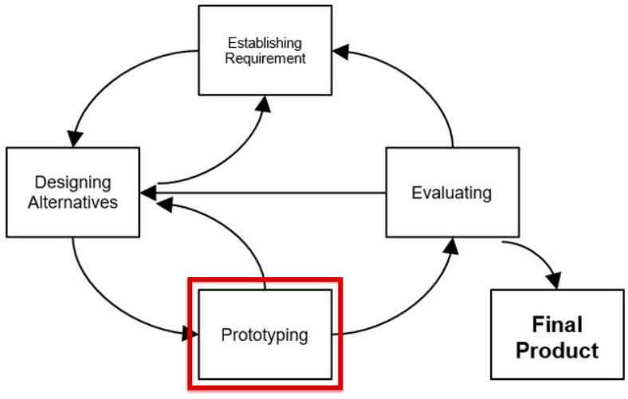

...

**Different Prototypes**

* **Low fidelity**
    * Medium unlike final medium - e.g. paper, cardboard
    * Quick, cheap, easily changed
    * **Examples**:
        * Sketches of screens
        * task sequences
        * post-its
        * storyboards
        * Wizard of Oz
            * Simulating actual functionality - combine different tools - tablets, email systems, PowerPoint with human intervention
    * **Pros**
        * quick, inexpensive
        * instant changes and new iterations
        * disposable/throw-away
        * minimal time and effort
        * Available to all
        * Encourages and fosters design thinking
    * **Cons**
        * lack of realism
            * results may lack validity
        * may not be appropriate for intended users
        * removes control from the user

* **High fidelity**
  * Materials expected to be in final product
  * Looks more like final product
  * **Example** - software prototyping
  * **Pros**
    * Engaging - stakeholders see vision realised
      * can judge how it meets expectations, wants, and needs
    * User testing - high validity and applicability
  * **Cons**
    * Takes time to produce
    * Test users more inclined to focus and comment on superficial characteristics
    * Designers often are often loathed to make changes
    * Gives test users a false impression
    * Making changes can take long time - delaying project
* low-fi during early stages - high-fi during later stages

## :construction: Question 6

* What kind of data can we collect in mHCI evaluations and how? 
  * Why do we collect such data, what is our purpose? 
  * Are there any differences between conducting evaluations in a lab and the field? 

----

**Data**

* **Qualitative data**
  * **What**
    * Audio and video recordings
    * Notes
    * Materials produced by participants - sketches, drawings, pictures, etc.
    * Usage data
    * Online comments and articles
    * ...
  * **How**
    * Interviews and focus groups
    * Observations
    * Photo/Video/Voice Elicitation
    * Diaries/journaling
      * Participants write down while working - can be talked about later
    * Re-enactment Videos
    * Cultural/Mobile Probes
      * 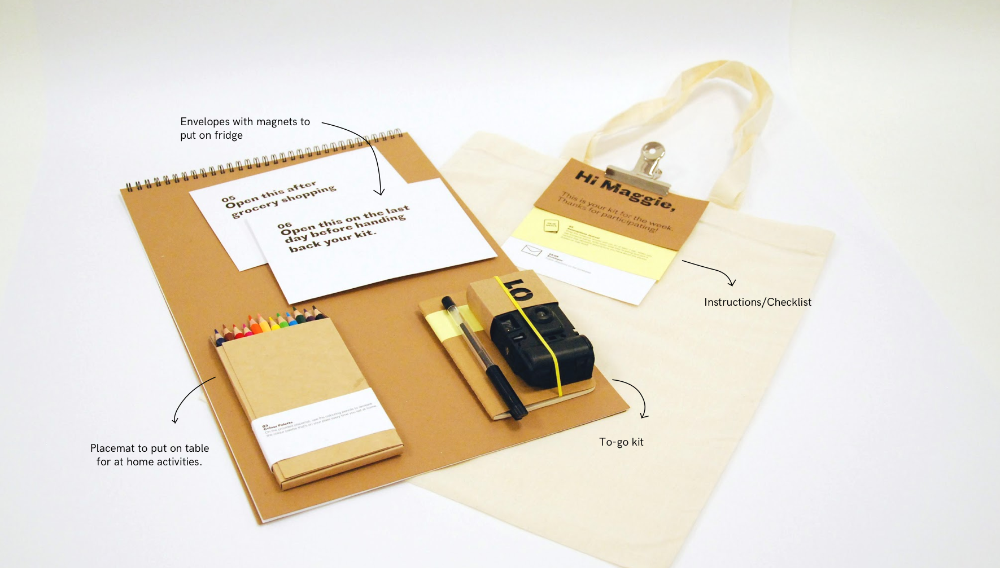
    * Online videos (e.g.Youtube)
  * **Why**
    * Explores attitudes, behaviors, and context in-depth
    * Encourages discussion
    * More opportunities for asking - people can explain answers
* **Quantitative data**
  * **What**
    * Anything that can be understood as a number
      * Time
      * Performance metrics
      * Success rates
      * Answers to questionnaires
    * Data is structured
  * **How** - *scientific approach*
    * Intuition and/or authority to generate ideas about phenomenon/behavior
    * **Skepticism**: ideas must be evaluated on the basis of careful logic and results from scientific investigations
    * **Empiricism**: knowledge is based on observations and the study of reality
    * **Methods**
      * **Case studies**
        * Intensive empirical investigations of contemporary phenomena within small size entities such as groups, organizations, individuals, systems or tools in real-life context with the researcher distinct from the phenomena being studied.
      * **Field studies**
        * taking place in “the real world” covering a range of quantitative approaches in which a number of independent variables are manipulated.
      * **Usage studies**
        * Large-scale log-file based test-scenario in which a newly designed system is exposed to its target users in order to test its resilience under real-use conditions, and if and how it is employed for the tasks for which it was intended.
      * **Lab experiments/studies**
        * taking place in a controlled environment created for the purpose of research or in dedicated laboratories allowing a detailed focus on specific phenomena of interest with a large degree of experimental control.
      * **Surveys**
        * Informs research gathers large amounts of data through various techniques such as questionnaires and interviews from a known sample of selected respondents assumed to be independent of their environment.
  * **Why**
    * **Understanding** -  finding the meaning of studied phenomena
      * ex: frameworks or theories developed from collected data
    * **Engineering** - developing new systems or parts of systems
      * ex: an interaction technique for a mobile device, or a mobile application or device
    * **Re-engineering** - improving existing systems by redeveloping them
      * ex: adapting a web browser to a small display
    * **Evaluating** - assessing or validating products, theories or methods
      * ex: the usability or user experience of a specific application, or a theory of interaction
    * **Describing** - defining desirable properties of products
      * ex: a mobile guide system

**Lab vs Field**

!!!todo

## :white_check_mark: ​Question 7

* Assume you have collected qualitative data. 
  * What is the process that you need to follow to conduct an analysis of this data? 
  * What are the two approaches for coding qualitative data, and what are their differences? 

---

**Qualitative data analysis**

* Transform unstructured data into something meaningful/useful for design
* To gain deep/detailed knowledge of a situation/problem
*  To know how our prototype/product is embedded into everyday life

**Process**

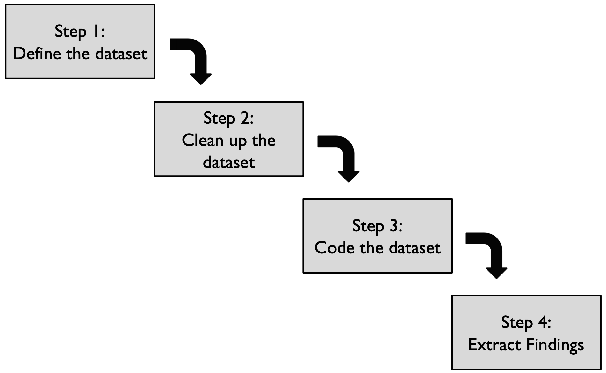

1. **Define** the dataset
   * Where do we collect data?
2. **Clean** the dataset
   * Is everything relevant?
3. **Code** the dataset
   *  Assigning categories and descriptors to blocks of text - qualitative data in general
   * **2** approaches:
     * **Emergent coding**
       * Extract structure of data from dataset
       * No preconceptions exist
       * **Objectivity** is **important**
       * Often combined with grounded theory
         * objective is to create a theory
       * **Process**
         1. Code data
         2. Develop concepts
         3. Group concepts into categories
         4. Produce a theory
       * 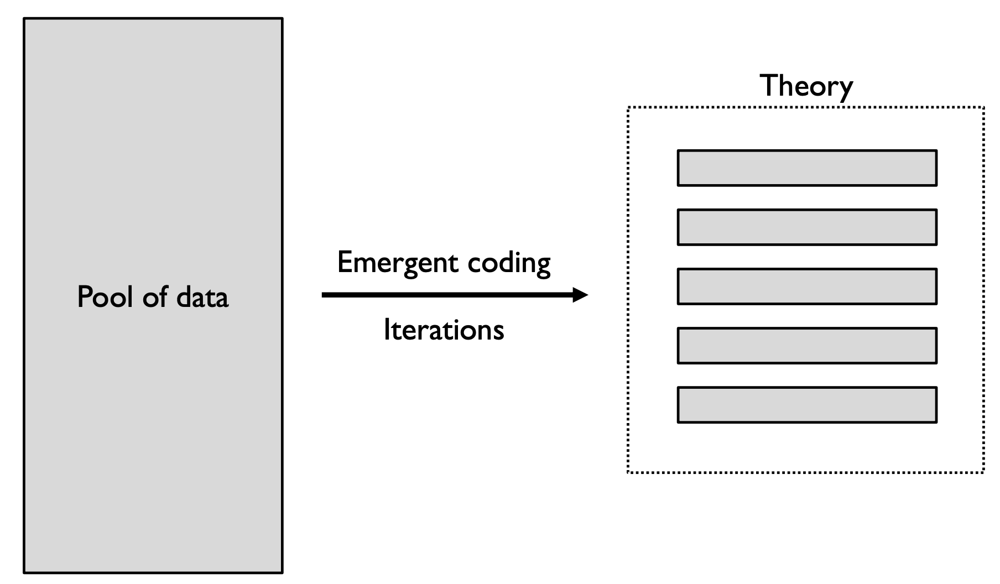
     * **A priori coding**
       * Apply **existing** theory (taxonomy/framework) to structure data
       * **Some** **preconceptions** on what we will identify
       * Again, **objectivity** is important
       * 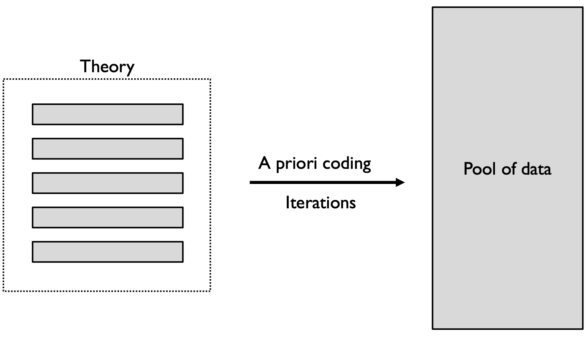
       * **Process**
         1. **Identify** a **relevant** **theory**/taxonomy
         2. **Code** the data (a priori coding)
         3. **Identify** how much theory explains situation
         4. If necessary, **feed** back to theory
   * **How to code:**
     * **Look** for key items
     * **Assign** codes
     * **Reflect** and (**redesign**) codes - **iteratively**
     * **Reflect** on the **relationship** between the codes
     * **Afterwards**, may compare with:
       * similar studies/evaluations
       * results of previous version of product/prototype
       * different target groups
4. **Extract** Findings

## :white_check_mark: ​Question 8

* What is a research hypothesis, and are there different types? 
* What is the difference between independent and dependent variables?
* What is the operational definition of a variable?
* How can we assess the quality of operational definitions?

----

**Research Hypothesis**

* A specific idea or question which can be tested through empirical investigation (using the scientific approach)
* **Null hypothesis **- "no difference between conditions"
* **Alternative hypothesis** - " is difference between the conditions"
* They have to be mutually exclusive
* Why null and alternative?
  * Long tradition in experimental research
  * In statistics we **do not** test if two conditions are **different**
    * We **do** test if there are the **same**!

**Variables**

* All the things we can **measure** or **manipulate** are called **variables**.
  * must have more than 2 levels
* **Independent vs Dependent**
  * **Independent variable**
    * Variable we think is the **cause**
    * Variable that is **independent** of a **participant’s behavior**
    * Variable that we **manipulate** in our experiment
  * **Dependent variable**
    * Variable we think is the **effect**, as it **depends** on the **cause**
    * Variable that is **dependent** on a **participant’s behavior**
    * The **variable** that we **measure** in our experiment
  * **Examples**
    * 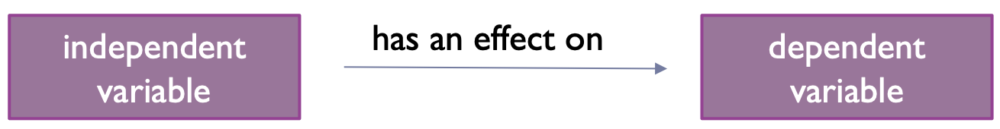
    * **Sex** has an effect on **perceived usability**
    * **Income** has an effect on **happiness**
    * **Education** has an effect on **IQ level**
    * **Input devices** have an effect on **efficiency**

* **Operational definition**
  * defined procedure to measure or manipulate variable
  *  If **many** options, we **select one**
  * **selected** procedure is called the **operational definition** of the variable
  * Example - Aggression
    * number of times a kid hits a toy
    * score on a aggression questionnaire
    * number of times a kid cursed, etc.
  * **Adequacy**
    * **Construct validity** - adequacy of operational definition
      * **Content Validity** - content of measure is linked to true meaning of variable
      * **Convergent Validity** - scores of measure are related to other measures of the same construct
      * **Discriminant Validity** - scores of measure are not related to other measures that are theoretically different
      * **Other types**
        * face validity - it "looks like" it is going to measure what it is supposed to measure
        * predictive validity -
        * concurrent validity - how well a new test compares to an well-established test.

## :white_check_mark: Question 9

* What can be the sources of systematic errors in an experiment?
  * What can we do in order to minimize/eliminate them?
* Why is it important to pilot test?

---

**Systematic Errors**

* THE rule in experiments
  * All **confounding/external** variables that may have an effect on our conditions must be **controlled**
    * Either through randomization
    * Or by keeping them constant
  * **THE RULE**
    * Our aim is that all the conditions differ **only** on the independent variable and nothing else
  * If we are successful, our experiment has high **internal validity**
* **Systematic error** - due to confounding/external variables that covary with our independent variable
  * Strong negative effect on **internal validity**
  * Usually systematic errors push the true scores at the same direction
* **Sources of systematic errors**
  * **Participants**
    * carry their own experiences and expectations, and have different characteristics
    * get tired if kept a long time - **fatigue effect**
    * **Tips**
      * Select participants that **fit** target group - representative of the **population**
      * Track, based on experience and literature, all the characteristics that can influence experiment
      * Try to **minimize** the **fatigue effect** either by having breaks or by introducing fun, irrelevant activities 
        * (i.e. ask them to play a game for a while)
      * Keep participants **blind** regarding experiments purpose - **manipulate** them
  * **Researchers**
    * We can influence by simply being there
    * By commenting on participants' performance
    * **Tips**	
      * **Same** researcher always communicates with the participants
      * **Same** instructions provided to all - video good solution
      * **Never** **comment** on their behaviour
      * **Always** be **prepared** and **polite**
      * **Always** have a talk after the experiment - **debriefing session**
      * **Often** we keep the **moderator blind** for the purpose of our experiment - **double blind experiment**
  * **Digital artifacts**
    * Digital artifacts might have characteristics that can influence the experiment 
    * screen sizes, keyboards, brands, etc.
    * **Tips**
      * Carefully select digital artifacts participants will interact with and try to **remove** any influential characteristics
      * Keep **same** digital artifacts throughout experiment
  * **Environment**
    * Pysical environment can influence experiment
    * **Tips**
      * Prepare a **nice** (suitable) environment
      * **Never** change the physical conditions 
        * (i.e. keep the noise at the same level, have the lights always on, etc.)
      * **Never** change the position/placement of the participants 
        * (i.e. ask them all to sit the same way)
  * **Procedure**
    * **Framing** of tasks can influence results
    * Order of tasks influences results - **order effect**
    * Practice gained in one task will influence the rest - **practice effect**
    * Experience they will have from a task will influence the rest - **carryover effect**
    * **Tips**
      * **Meaningful** and **clear** tasks
      * Always **randomize** the sequence of the tasks
  * **Measurement tools**
    * Tools used to measure dependent variable will influence result
    * **Tips**
      * Always use measurement tools that are **reliable**
      * Always **test** their performance
      * **Never change** measurement tools during the experiment 

**Pilot test**

* It is is **important** to pilot test to
  * make sure that everything is working as expected
  * make sure that the participants are **influenced** **only** by the **independent** variable among the **conditions**
  * have **preliminary** **findings** that will tell us if we need more conditions, or a different setup
  * check the tasks we have designed for:
    * **Ceiling effect**: too easy tasks and all the participants reach the maximum performance
    * **Floor effect**: too difficult tasks and hardly anyone performs well

## :white_medium_square: ​Question 10

* What is the difference between basic and complex experiments in terms of number of variables and used statistical techniques?
* What are the differences between between-subjects and within-subjects designs?
  * What are their advantages and disadvantages? 

---

!!!todo