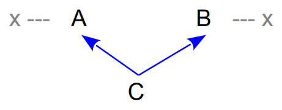
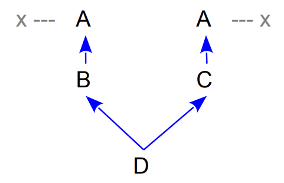
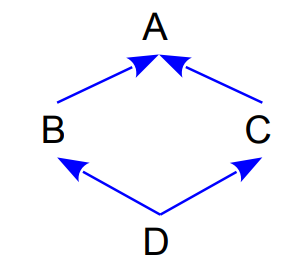
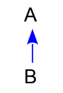

# PIMPL Idiom and Dynamic Polymorphism

## PIMPL Idiom

C++ relies on compiler performing a lot of work

* Compilation can get pretty slow if many headers are included
* Clients may need to be recompiled whenever **private/protected** implementation details change in the header...

PIMPL Idiom:

1. Collect implementation details in an implementation class
2. Only *forward declare* it in the header, move its definition to the cpp file.
3. In the main(interface) class have a (smart) pointer to an implementation object
4. Have all the definitions of the methods, that access the implementation object, in the cpp file

[timeseries_pimpl.h](http://people.cs.aau.dk/~simas/sp2021/lecture5/timeseries_pimpl.h.html)
[timeseries_pimpl.cpp](http://people.cs.aau.dk/~simas/sp2021/lecture5/timeseries_pimpl.cpp.html)


### Issues

* Propagation of **const**
    * A *pimpl* pointer that is constant, but is not a "const pointer"!
    * Solution: use accessor methods everywhere instead of a direct *pimpl* pointer

```c++
private:
	class TimeSeriesImpl;  // Just a declaration

	const TimeSeriesImpl* Pimpl() const { return pimpl.get(); }
				TimeSeriesImpl* Pimpl()				{ return pimpl.get(); }

	std::unique_ptr<TimeSeriesImpl> pimpl;
```


## Inheritance in C++

* **Multiple inheritance**
    * But no concept of interfaces (as in Java and C#): fully compensated by multiple inheritance and *abstract classes*
* **Polymorphism** (dynamic binding) is not automatic
    * Methods should be declared **virtual**
    * Objects should be accessed via pointers or references 
* Shared or replicated base classes
    * Shared base classes are called virtual base classes
* Access control to base classes
    * **private**, **protected**, and **public** base classes 
    * Related to *interface* and *implementation inheritance.*


### Constructors and Destructors

Some rules for constructors and destructors

* A subclass constructor invokes the superclass constructors – implicitly or explicitly
    * Constructors with parameters must be invoked explicitly
    * Default constructors can be invoked implicitly
* Bottom-up construction and top-down destruction:
    * First base class constructors, then derived class constructors
    * Multiple base classes are constructed in their declaration order
* C++ allows for inheritance of constructors
    * Makes sense if a derived class does not add data members.

[Example of constructors/destructors in a hierarchy](http://people.cs.aau.dk/~simas/sp2021/lecture5/inheritance1.cpp.html)


### Polymorphism: Virtual Functions

* If a member is **virtual**, the dynamic type of the object controls which function to call – true OOP
    * Destructors may also be virtual.
* Conditions for getting polymophic behavior in C++:
    * A virtual member function **f** must be called
    * The object must be accessed via a (smart) pointer or a reference:
        * `o->f()`
* Avoiding polymorphic behavior with a virtual function **f**:
    * Activate **f** with a scope resolution operation: `o->A::f()`

* `std::unique_ptr<A> o = std::make_unique<B>();`
    * $A \to B$


[Example with virtual functions](http://people.cs.aau.dk/~simas/sp2021/lecture5/virtual.cpp.html)

What to remember when doing OOP with virtual functions in C++:

* The function in the base class must be virtual
* The base class function and the derived class functions must have the same name
* Their parameters must be identical
* Their **constness** must be the same
* Their return types must be **compatible**
* The object must be accessed via a pointer or a reference
    * Recommendation: use (a container of) smart pointers
    * For example: `std::vector<std::unique_ptr<Point>>`

It is recommended to use the (contextual) keyword **override** to state your intension of overriding a virtual member function

* Not using **override** + one of the above errors = a silent *overload* in the derived class


#### Virtual Destructors

* A class with virtual functions should always have a **virtual destructor**

```c++
using namespace std;
class Data {
	int id;
public:
	Data(int i): id{i} {};
	virtual ~Data()
	{ cout << "Data destructor" << endl; }
};
```

```c++
class TimeSeries : public Data {
	int *ts;
public:
	TimeSeries(int i, int sz) : Data{i}, ts(new int[sz]) {};
	~TimeSeries() {
    cout << "Timeseries destructor" << endl;
    delete[] ts;
  }
};

int main() {
	TimeSeries t{1, 10};
	Data *d = new TimeSeries{2, 20};
	delete d;
}
```


### Abstract Classes

* **Pure virtual functions**
    * Marked with `= 0`
* A class is **abstract** if it has one or more pure virtual functions
    * No objects can be created from an abstract class
    * Used as a base class in a hierarchy
    * Corresponds to *interfaces* in Java and C#


### Multiple Inheritance



**Concrete problem:**

* If `ac` is an object of `C`, which `x` does `ac.x` refer to?

**In general**

* **Replication:** Is there one or two x pieces in C?
    * *There are two x variables in a C object*
* **Name clash**: Does `x` in `C` refer to the `x` in `A` or `x ` in `B`? Do we have means to select one or another?
    * *Use the scope resolution operator:* `A::x` or `B::x`
* **Combination:** Can `x` in `A` and `x` in `B` be combined to a single `x` in `C`?
    * *No - but some control is possible via virtual bases*


#### Replicated Base Class



* There are two copies of A!
* If `d` is an object of `D`, `d.x` is ambiguous
    * But there are `d.B::x` and `d.C::x`


#### Virtual Base Classes



* It is also possible to share a base (usual case)
    * The constructor of A is called only once

```c++
class B : public virtual A
{ /* */ };
class C : public virtual A
{ /* */ };
class D : public B, public C
{ /* */ };
```


### Member Access Control

* `public`, `private`, and `protected`
    * Similar to other object-oriented programming languages
    * Access control is applied uniformly to names:
        * Functions
        * Variables
        * Types
        * *and others*
* Access control via private/public/protected can be augmented with use of **friends**

#### Base-class Access Control

* A base class can be defined either **public**, **private**, or **protected**.
* Idea: restrict access to inherited members (with private and protected base classes)
* *When is more restricted access control to base classes useful?*
    * `A` is used internally in `B` and `A` should not affect the interface of `B`
        * `B` *is implemented in terms of* `A`
        * `B` *is not an* `A`



**Rules**

* `class B: private A`
    * Public and protected members in A become private in B
    * The default case for classes!
* `class B: protected A`
    * Public members in A become protected in B
* `class B: public A`
    * Public members in A will also be public in B
    * The "normal" case - but not the default.
        * Default for **structs**!
    * Only in this case implicit up-casting works:

```c++
B  b;
A& a = b;
```


### Interface/implementation Inheritance

Multiple inheritance and the inheritance access modifiers are useful when inheritance is used for different purposes:

* Inheriting **implementation** details, which we may want to hide (**private**)
    * Possibly hide just from the outside, but not from the derived classes (**protected**)
    * Another option is to *aggregate* implementation details (PIMPL idiom) 
* Implementing an **interface**, by inheriting from an (abstract) class (**public**).
    * Derived class “is a” Base class 


### Navigating the Hierarchy

* Given a pointer to a base class you want to check if this is a pointer to an instance of some derived class
* `dynamic_cast<T*>(a)`
    * Returns a pointer of type `T*` if `a` points to an object of type `T` or a type derived from `T`. Otherwise returns `nullptr`
* `dynamic_cast<T&>(a)`
    * Analogous, but throws exception if not successful.
* [Example](http://people.cs.aau.dk/~simas/sp2021/lecture5/dynamic_cast.cpp.html)
* Can also be used to navigate to siblings in the hierarchy:
    * `class ElectricGuitar: public MusicInstrument, public ElectronicDevice`
    * Then, for each member of a vector of `MusicInstruments`, try to see which can be casted to `ElectronicDevice`


#### Smart Pointers and Hierarchy

* Downcasting:
    * Obviously, it is not possible to created a downcasted copy of `unique_ptr`

```c++
void do_something(shared_ptr<Measurement> m) {
	auto stock_m = dynamic_pointer_cast<StockMeasurement>(m);
	// ...
}
void take_ownership(unique_ptr<Measurement>&& m) { 	// special case: taking ownership of m
	if (dynamic_cast<StockMeasurement*>(m.get())) { 	// check if we can really do this
		auto sm = unique_ptr<StockMeasurement>{dynamic_cast<StockMeasurement*>(m.release())};
		// ...
	}
}
```

* *Advice: use `unique_ptr` as much as possible as well as passing by reference.*