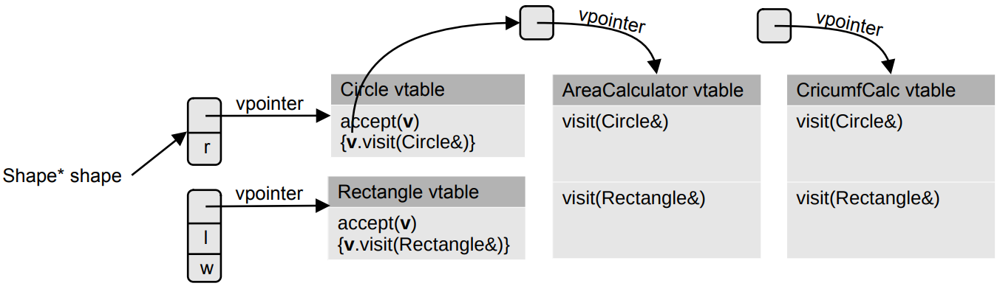

# Double Dispatch

Not a good idea to define virtual operator overloads

* `virtual MathObject* operator+(const MathObject& b) const;`
    * `C = *A + *B`
* First, inconvenient: have to work with pointers, rather than values (or a mix of pointers and references to values...)
* Second, the operation performed is determined only by the type of the first argument (`*this`)
    * ... and no dynamic polymorphism at all if defined outside the class (e.g. `operator<<`)

**Double dispatch** addresses the second point:

* The operation performed is determined by the types of both arguments


## Visitor Pattern

* Double dispatch can be achieved:
    * One virtual function, chosen according to the type of `*this`, (first argument) delegates to another virtual function called on the second argument of the “operation.”
* Used by the classical *visitor* pattern
    * What is performed by the visit operation depends on the type of the object visited and the type of the visitor.

[shapes.h](http://people.cs.aau.dk/~simas/sp2021/lecture6/shapes.h.html)
[visitors.h](http://people.cs.aau.dk/~simas/sp2021/lecture6/visitors.h.html)
[main.cpp](http://people.cs.aau.dk/~simas/sp2021/lecture6/main.cpp.html)




## Copying an Object into a Member

* How to copy a (large) object into a class member?
    1. Accept as const lvalue reference parameter 
    2. Add an overload for rvalue reference parameter (optional, for performance)
    3. *Have a template method (pass by universal reference)*
    4. Pass by value (and then moving)!
* Cost of it:
    * First: argument is copied/moved
    * Then: the parameter is moved
    * In total: copy+move for lvalues and move+move for rvalues
* When to doo:
    * If cheap to move (e.g. std::array - not cheap to move)
    * If always copied (the first copy/move is done before the call - should not be wasted)
* See solution to exercise 5.2 (constructors of class *Simple*)


## Returning from Functions/Methods

* Possible return types of functions?
    * Value: `Type f()`
        * Standard/preferred. 
        * Use out parameter ( `f(Type& out)` ) if the Type is large and expensive to move and copy elision/(N)RVO does not help or you want to reuse the same object (see `std::getline(std::istream& , std::string&)`)
    * Pointer: `Type* f()`
        * Only to indicate position in a long-lived object. 
        * Never as a memory resource handle. 
        * Danger of a dangling pointer.
    * (const) Lvalue reference: `const Type& f(…)`
        * If the function selects among alternatives: `Type& f(Type& op1, Type& op2)`
        * As a return type of a getter/accessor method in a class (or *should it return by value?*)
    * Rvalue reference: almost never
    * Smart pointer: `std::unique_ptr f()`
        * Return ownership of a newly created object on a heap 
* Returning several values
    * The code is more intuitive if `std::pair`, `std::tuple`, or your own structure is returned.
    * Use structured bindings on the caller side:
        * [structured_binding.cpp](http://people.cs.aau.dk/~simas/sp2021/lecture6/structured_binding.cpp.html)
* When returning a special *null/invalid/void* is an option:
    * Use: `std::optional<Type> f()`
    * Can have `std::nullopt` value
    * It stores the value directly inside
        * [optional.cpp](http://people.cs.aau.dk/~simas/sp2021/lecture6/optional.cpp.html)


## STL

### std::string and std::string_view

* `std::string` wraps good old `char*`:
    * Provides ownership
    * Rich manipulation API
* But could be expensive if we need to construct many temporary strings (just for read)
    * Example: [stringviews.cpp](http://people.cs.aau.dk/~simas/sp2021/lecture6/stringviews.cpp.html)
* `std::string_view` gives a ***lightweight, non-owning, read-only*** view into a string: just a pointer and a size
    * Rich interface
    * Passed by value
    * Can be converted from `std::string`s and C strings
* Caution:
    * Returning an `std::string_view` - similar dangers to returning a raw pointer!
    * *As a constructor parameter to initialize a field of an object?* - No!


### Types of Data Objects

* Objects with **value semantics** (**deep copy**)
    * On the heap (**cheap to move**) e.g. `std::vector`, long `std::string`
    * In-place (**move=copy**) e.g. `std::array`, `std::string` with SSO
* "Pointer-like" objects (**shallow copy**): `std::string_view`, `std::initializer_list`
    * Small and passed by value
* "Handles" to heap allocated memory (**shallow/no copy**): smart pointers
    * Own the object pointed to


### Iterators

***Iterators*** *are generalized pointers*

* The main role is to connect **algorithms** and **containers**
* Most important operators:
    * Access to the current element: `*` and `->`
    * Go to the next element: `++`
    * Equality and inequality: `==` and `!=`
* The start of a sequence `s`: `s.begin()`
* The end of a sequence `s`: `s.end()`
    * Designates a non-existing *one past the last element*

For **range-for** loop, the compiler automatically looks for iterators `vd.begin()` and `vd.end()`, or `begin(vd)` and `end(vd)`.

* Defined in multiple versions in `<iterator>`

* One of very few places where *language depends on the standard library!*


#### Categories of Iterators

C++ iterators are classified in a number of different dimensions:

* Const and non-const iterators
    * Use constant iterators, whenever possible
* Reverse and forward iterators
    * For a reverse iterator, `++` moves backward.
* Insert iterators
    * Inserting, instead of overwriting, elements in a container
* Input, output, forward, bidirectional, random-access iterators
    * Input and output iterators have relatively few operators defined
    * Random access iterators have many operators defined
    * Looks like a class hierarchy, but it is not:
        * Instead use generic programming techniques supported by *iterator tags* – the so-called *tag dispatch* technique is used to implement compile-time polymorphism.

#### Operations

* All iterators: `++`, `*`
* Input iterator `p`
    * Single read (`x = *p`), no write, `==`, `!=`
* Output iterator `p`
    * Single write (`*p = x`), no read
* Forward iterator 
    * Like input and output iterator, but can read and write repeatedly
* Bidirectional
    * Like forward iterator, with an addition of `--`
* Random-access
    * Like bidirectional iterator, but can add and subtract integers to/from iterators
    * Can compare iterators with `<` , `<=` , `>`, and `>=`


#### Insert Iterators

* Insertion is normally done by the container operations `push_back()`, `push_front()`, and `insert()`
* What if I want to make my algorithm independent of of the underlying container?
* **Insert iterators** a special type of *output* iterators that can be created by the template factory functions `back_inserter`, `front_inserter`, and `inserter`.
* [Example](http://people.cs.aau.dk/~simas/ap2017/lecture5/inserters.cpp.html)


### Containers

Three most important types of containers:

* Sequences:
    * `vector`, `list`, `forward_list`, `dequeue`
    * `stack`,`queue`, `priority_queue` via *adapters* on other sequences - restricting interfaces
* Associative containers
    * Based on *balanced trees*: `map`, `multimap`, `set`, `multiset`
    * Based on *hash tables*: `unordered_map`, `unordered_multimap`, `unordered_set`, `unordered_multiset`
* Almost containers
    * `string`, `valarray`, `bitset`
    * `array`: Contains it elements directly (not a handle to its elements), fixed size - the size is a constant expression. Move is not more efficient than copy


#### Properties of Containers

* No common base class for the standard containers
    * However, each container provides standard operations with standard names and semantics
* Non-intrusive containers
    * Elements of containers do no need to be instances of certain classes
    * An object is not aware of being an element of a particular container
    * Values of built-in types can be elements in a container
* Standard containers rely heavily on templates, operator overloads

* Small example: [using map](http://people.cs.aau.dk/~simas/sp2021/lecture6/maps.cpp.html)


### Digression: Exceptions

Every STL operation provides one of the three guarantees:

* **Basic guarantee**: Basic invariants of objects are maintained (i.e., objects remain in valid state) and no resources are leaked.
* **Strong guarantee**: Basic guarantee + either the operation succeeds, or it has no effect. 
    * For example `push_back()` provides it.
* **Nothrow guarantee**: Basic guarantee + not throwing an exception.


#### noexcept

Let’s look at `std::vector`’s `push_back()` providing the strong guarantee.

* *What happens when the vector has to be expanded, by relocating and copying it to a new space?*
* For efficiency the copying can be replaced by moving, but only if the moves do not emit exceptions
* That is why it is important to declare your move operations **noexcept** (as well as other operations, you can guarantee not to throw exceptions)

```c++
TimeSeriesH(TimeSeriesH&& tsh) 						noexcept = default;
TimeSeriesH& operator=(TimeSeriesH&& tsh) noexcept = default;
```


### Container Member Types

Each standard container defines a number of types - via `using` type aliases. For example:

* `value_type` 
* `iterator`, `const_iterator`, `reverse_iterator`, `const_reverse_iterator`
* `size_type`, `difference_type`
* `pointer`, `const_pointer`
* `reference`, `const_reference`

It is often possible to avoid use of container member type names - because **auto** can be used instead


### Algorithms

The advantages of using STL algorithms:

* Raise the level of **abstraction** – code is easier to read and maintain! 
* Avoid common mistakes:
    * Off-by-one errors
    * Special cases (like empty collection)
* High quality implementations
* Best algorithmic complexity:
    * For example: `std::nth_element` in `O(n)` time.

#### Overview

Wide variety of algorithms – simple building blocks:
(see [Fluent C++ blog](https://www.fluentcpp.com/getthemap/) for an alternative classification into 7 categories)

* Non-modifying sequence algorithms
    * `for-each()`: Applies a function on each element of a sequence
    * `find()`: Find the first element that compares equal to a given value. Return iterator to element
    * `find_if()`: Find the first element that satisfies a given predicate. Return iterator to element
* Modifying sequence algorithms
    * `transform()`: Applies a function on each element, and writes the result into another container.
    * `replace()`: Replace elements that satisfies a predicate with a another value

* Sorting and searching algorithms (on sequences):
    * `sort`
    * `binary_search`
* Set algorithms
    * `set_union`, `set_intersection`, `set_difference`
* Heap algorithms
    * `make_heap`, `push_heap`, and `pop_heap`
* Min and max algorithms
    * `min` and `max` for pairs of elements
    * `max_element` and `min_element`: generalization to sequences of elements
* Permutation algorithms
    * `next_permutation` and `prev_permutation`: systematic creation of permutations of a sequence
* Numeric algorithms

#### Principles

* Generalization by *function* parameters
    * Pointers to functions, function objects, or lambda expressions
    * Function object is an object for which an application operator, `operator()`, has been defined 
* A sequence is defined by two iterators
    * Beginning at the first element
    * Ended by the one-beyond-the-last element
* Failure to find an element in a sequence:
    * Return the (off by one) end-of-sequence iterator
* The time complexities of the algorithms are specified by the C++ standard


#### for_each Example

* Let's find out if a sequence is sorted
    * Note that `for_each` returns its third parameter: the function (object)
    * [Example](http://people.cs.aau.dk/~simas/sp2021/lecture6/for_each.cpp.html)
        * Use of objects as functions via an overload of the application operator
        * A function surrounded by private, mutable state
* A Stroustrup advice: *“before using `for_each()`, consider if there is a more specialized algorithm that would do more for you”*
    * Such as `accumulate()`, `find()`, or `adjacent_find()`
    * [Simpler example](http://people.cs.aau.dk/~simas/sp2021/lecture6/adjacent_find.cpp.html)
        * `greater<T>` is a wrapper around the `>` operator

### Use of Function Objects in STL

* Wrapping operator predicates
    * Predicates such as `==` , `<` and `>`
    * Available as `equal_to`, `less`, and `greater`
* Wrapping arithmetic operators
    * Operators such as `+` and `-`
    * Available as `plus` and `minus`
* Binding one argument of a two argument function
* Allowing a member function to be used as a function
* Negating a predicate