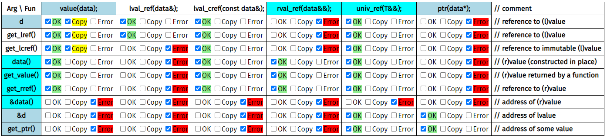

# Rvalue and Forwarding References

 Consider the following data and function declarations:

```c++
struct data {
    int x, y;
};

data d{};
data get_value(){ return data{}; }
data* get_ptr(){ return &d; }
data& get_lref(){ return d; }
const data& get_lcref(){ return d; }
data&& get_rref(){ return std::move(d); }

void value(data d){}
void ptr(data* d){}
void lval_ref(data& d){}
void lval_cref(const data& d){}
void rval_ref(data&& d){}
template <typename T>
void univ_ref(T&& d){}
```

The table below combines various functions and arguments into function calls. Expressions in `light-blue` are valid in both C and C++, whereas expressions in `cyan` have new meaning since C++11.

Fill out each table cell for each combination what should happen: should the compiler issue an Error? should the expression be allowed (OK)? Should the expression create an extra Copy? Why do you think so?


You may consult with the compiler: for example, the cell at row `&d` and column `ptr(data*);` is OK, because the expression `ptr(&d)` compiles fine.

