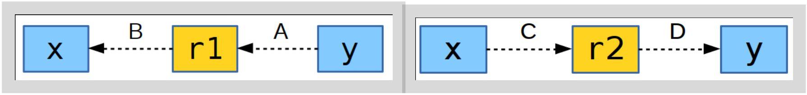

# Concurrency


## Threads - Low Level API

* **Default** constructed std::thread has no function
* **Moved** std::thread transfers ownership
* **Joined** std::thread does not correspond to any
* **Detached** std::thread does not have connection to the executing thread
* **Deleting a joinable** thread is forbidden
  * Before deleting make it unjoinable
    * Either **join**,
    * or **detach**


### Mutex

`std::mutex`

* With *multiple* mutexes it is easy to fall into *circular dependency* leading to **deadlock**
* To avoid the *circular dependency*:
  * Release locks in *reverse order* they were acquired.
  * *Don't reacquire* a mutex while still holding another;
  * Maintain two phases: *acquire all*, *release all*.
  * Use [recursive_mutex](https://en.cppreference.com/w/cpp/thread/recursive_mutex) if the same thread may lock the *same* mutex *multiple times*.
* `lock(), ... , unlock()` use RAII: [`std::lock_guard`](https://en.cppreference.com/w/cpp/thread/lock_guard), [`unique_lock`](https://en.cppreference.com/w/cpp/thread/unique_lock).


#### C++17: Scoped Lock

```c++
std::scoped_lock lock(mutex1, mutex2); // easy!
```

* Deduces the mutex types (unlike [`lock_guard`](https://en.cppreference.com/w/cpp/thread/lock_guard) and [`unique_lock`](https://en.cppreference.com/w/cpp/thread/unique_lock))
* May use multiple mutexes at once (no need to think about order!)

Equivalent C++11:

```c++
std::lock(mutex1, mutex2);
std::lock_guard<std::mutex> lk1(mutex1, std::adopt_lock);
std::lock_guard<std::mutex> lk2(mutex2, std::adopt_lock);
```

```c++
std::unique_lock<std::mutex> lk1(mutex1, std::defer_lock);
std::unique_lock<std::mutex> lk2(mutex2, std::defer_lock);
std::lock(lk1, lk2);
```


### Atomic

Use atomic for concurrency

* Atomic read-modify-write operations:

```c++
std::atomic<int> ai{0}; // initialization (C++11/14)
auto cpp17 = std::atomic<int>{17}; // C++17
ai = 10; 						// write, what may happen here?
ai = 20; 						// write again
5 std::cout << ai; 	// read, output may interleave
++ai; 							// guarantees no lost updates
```

* Compiler *may optimize* writes.
* Atomic operations *guarantee no lost* updates.


#### Volatile

Use volatile for special memory

```c++
volatile int x = 0;
auto y = x; 	// read x, what is the type of y?
y = x;				// what if y is not volatile?
x = 10;				// what if x is not volatile?
x = 20;				// write again
++x;					// what may happen if threads share?
```

* Compiler will not optimize writes
* No protection against lost updates


#### Atomic and Auto

* **auto** drops **const** and **volatile** (why?)
* **auto** deduces `std::atomic`
* `std::atomic` has no copy-assignment (no AAA).

```c++
std::atomic<int> x;
auto broken = x; 										// copying is not allowed
std::atomic<int> y{x.load()}; 			// assign, but not atomic
std::atomic<int> cpp17 = x.load(); 	// C++17, not atomic
y.store(x.load());									// read may get optimized:
reg = x.load();											// load again(!) into reg
std::atomic<int> y(reg);						// init from reg
y.store(reg);												// store again from reg	
```

Atomic and volatile cannot be optimized away:

```c++
volatile std::atomic<int> vai;
```


#### Atomic Operations

* Use `atomic::load()` and `	store()` to emphasise specialty.
* `std::atomic::compare_exchange_weak(ptr)` for lock-free algorithms


#### Controlling Memory Order

```c++
// thread 1:
r1 = y.load(memory_order_relaxed); // A
x.store(r1, memory_order_relaxed); // B
```

```c++
// thread 2:
r2 = x.load(memory_order_relaxed); // C
y.store(r2, memory_order_relaxed); // D
```



```c++
enum memory_order { 		// from namespace std
  memory_order_relaxed, // no guarantees, only atomicity
  memory_order_consume, // no read reordering, no optimization
  memory_order_acquire, // ensure read of released
  memory_order_release, // ensure writes are visible
  memory_order_acq_rel, // both acquire and release
  memory_order_seq_cst 	// both + total order – default
};
```


## Tasks - Higher Level API

```c++
auto fut = std::async(doAsyncWork, args); // schedule a task
auto res = fut.get(); 										// retrieve results
```

* Shifts the thread management to system/library.
* May be executed asynchronously *or* synchronously.
* *Effortless* result synchronization.


### Launch Policies

```c++
int doSomeWork(Args args) { ... }
auto fut = std::async(policy, doSomeWork, args);
```

* `std::launch::async` - run on a different thread
* `std::launch::deferred` – run when `get()`/`wait()` called
* **Default**: `std::launch::async` | `std::launch::deferred`
  * May even *not run* if `get()/wait()` are not called
  * May *block* other threads waiting with `wait_for()`
  * Defer *missed* at testing, *appear* in production.
  * *Not clear* which `thread_local` variables will be used.


#### Async Policy Check

```c++
auto fut = std::async(someWork, args); // async or deferred?
if (fut.wait_for(0s) == std::future_status::deferred) {
  ... // use wait()/get() on fut to call f
} else {
  while (fut.wait_for(100ms) != std::future_status::ready) {
    ... // do something else
    ... // fut will be ready when someWork terminates
  }
  ... // fut is ready
}
```

* Otherwise just use `std::launch::async`
  * (see "realAsync" in EMC++)


### Future and Promises

```c++
void consumer(std::future<int>& fut) {
	int x = fut.get(); 			// block and wait for promised delivery
	std::cout << "Got " << x << std::endl;
}

int main() {
  std::promise<int> prom; 			// creates a shared state
  auto fut = prom.get_future(); // prepare the receiving end
  auto thread = std::thread(consumer, fut); // launch thread
  prom.set(42); 								// produce what has been promised
  thread.join();
}
```


#### Varying Future-Promise Destructor

* `std::future` can be converted to `std::shared_future` and be read *multiple times*
* Where is the *promised* result stored?
  * `std::future` `std::promise` share the state
  * Destructor of the last `std::future` destroys the shared state
    * like reference counting in `shared_ptr`
  * Destructors of other futures simply destroy the `std::future` objects
  * Threads are made unjoinable *cleanly* (i.e. never terminates the program)


### Packaged Tasks

* `std::packaged_task`

```c++
int calcValue(int arg); // task to be computed async
std::packaged_task<int(int)> task{calcValue};
auto fut = task.get_future();
std::thread th{std::move(task), 42};
... // potentially do something else
int result = fut.get(); // gather the result
```

* Holds `std::future` and `std::promise` pair
* Calls `promise::set_value()` with return value
* If an exception is thrown, then it is passed to `promise::set_exception()` and rethrown at `future::get()`


## Latency Numbers

[Latency Numbers Every Programmer Should Know (2012)](https://gist.github.com/jboner/2841832)

```
L1 cache reference ......................... 0.5 ns
Branch mispredict ............................ 5 ns
L2 cache reference ........................... 7 ns
Mutex lock/unlock ........................... 25 ns
Main memory reference ...................... 100 ns
Compress 1K bytes with Zippy ............. 3,000 ns	= 3 μs
Send 2K bytes over 1 Gbps network ....... 20,000 ns = 20 μs
SSD random read ........................ 150,000 ns = 150 μs
Read 1 MB sequentially from memory ..... 250,000 ns = 250 μs
Round trip within same datacenter ...... 500,000 ns = 0.5 ms
Read 1 MB sequentially from SSD* ..... 1,000,000 ns = 1 ms
Disk seek ........................... 10,000,000 ns = 10 ms
Read 1 MB sequentially from disk .... 20,000,000 ns = 20 ms
Send packet CA->Netherlands->CA .... 150,000,000 ns = 150 ms
```

* Note the cost of mutex operations.